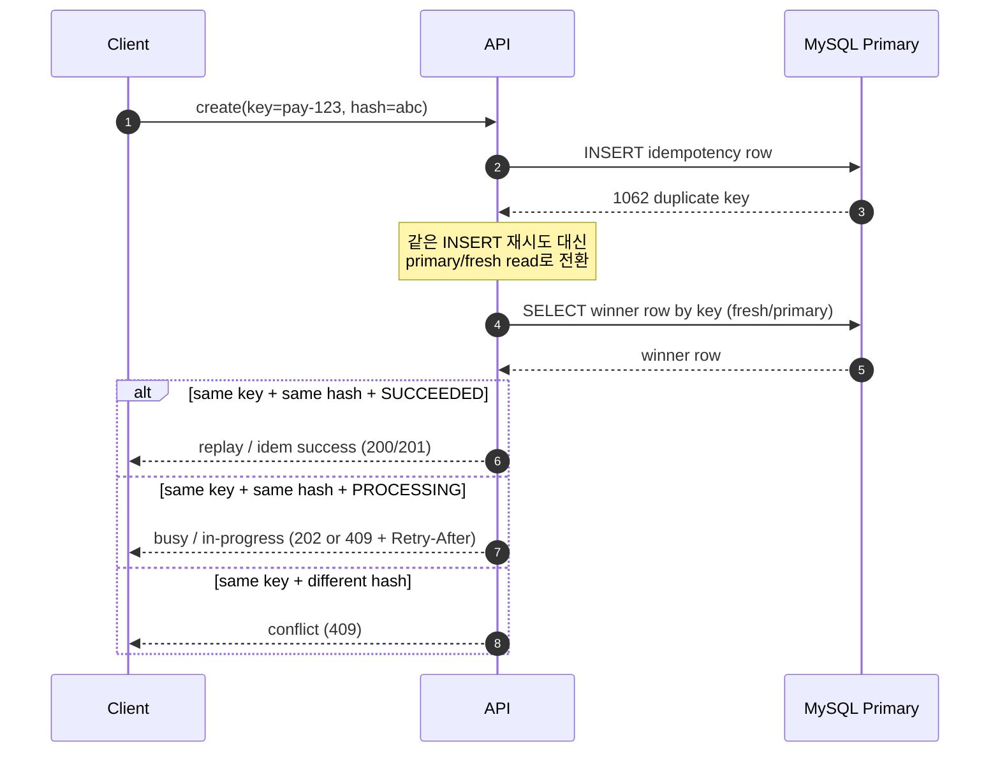

# MySQL `1062` 후 Fresh-Read 경로 미니 시퀀스 다이어그램

> 한 줄 요약: MySQL `1062 duplicate key`는 끝이 아니라 시작이다. `INSERT`를 다시 던지기보다 **primary/fresh read로 winner row를 확인해 `replay` / `busy` / `conflict`로 재분류**하는 것이 초보자 기본 흐름이다.

**난이도: 🟢 Beginner**

관련 문서:

- [Primary Read-After-Duplicate Checklist](./primary-read-after-duplicate-checklist.md)
- [DuplicateKeyException 이후 Fresh-Read 재분류 미니 카드](./duplicate-key-fresh-read-classifier-mini-card.md)
- [MySQL Duplicate-Key Retry Handling Cheat Sheet](./mysql-duplicate-key-retry-handling-cheat-sheet.md)
- [Insert-if-Absent Retry Outcome Guide](./insert-if-absent-retry-outcome-guide.md)
- [Read-Your-Writes와 Session Pinning 전략](./read-your-writes-session-pinning.md)
- [database 카테고리 인덱스](./README.md)

- [우아코스 백엔드 CS 로드맵](../../JUNIOR-BACKEND-ROADMAP.md)

retrieval-anchor-keywords: mysql 1062 fresh read sequence diagram, duplicate key fresh read flow, mysql duplicate primary read replay busy conflict, 1062 duplicate key winner row diagram, duplicatekeyexception sequence diagram beginner, duplicate key primary fresh read visual, same key same hash replay same key different hash conflict, processing busy duplicate key, mysql 1062 after insert what next, duplicate key not blind retry, mysql duplicate key one page visual, 중복키 fresh read 시퀀스 다이어그램, mysql 1062 이후 뭐함, primary read 후 replay busy conflict, mysql 1062 fresh read mini sequence diagram basics

## 한 장으로 먼저 잡기

이 문서는 아래 한 문장만 머리에 남기면 성공이다.

> `1062`는 "다시 넣어라"가 아니라 "이미 생긴 winner를 fresh read로 확인하라"는 신호다.

`1062` 직후 `SELECT`가 `null`이라면 [Primary Read-After-Duplicate Checklist](./primary-read-after-duplicate-checklist.md)로 바로 넘어가면 된다. 이 장면은 winner 부재보다 replica lag나 오래된 snapshot인 경우가 많다.

초보자용 3버킷 번역:

| 지금 본 것 | 초보자 번역 | 다음 행동 |
|---|---|---|
| `1062 duplicate key` | 내가 insert 경쟁에서 졌다 | blind retry 말고 winner row를 다시 읽는다 |
| primary/fresh read | 누가 이겼는지 확인한다 | same hash인지, processing인지 본다 |
| `replay` / `busy` / `conflict` | 서비스 응답을 고른다 | 이전 성공 재사용 / 잠시 후 재시도 / 409 |

여기서 `busy`는 3버킷의 가운데 칸이고, `replay` / `conflict`는 둘 다 "winner가 이미 있다"는 뜻에서 `already exists` 쪽으로 읽는다.

## 먼저 잡을 그림

초보자는 이렇게만 보면 된다.

- `1062`: "내가 졌다"는 신호다.
- primary/fresh read: "누가 이겼고, 그 승자가 내 요청과 같은지"를 확인하는 단계다.
- 최종 답: 보통 `replay`, `busy`, `conflict` 셋 중 하나다.

즉 `1062` 뒤의 기본 액션은 **blind `INSERT` retry가 아니라 winner read**다.

## 1페이지 미니 시퀀스

시퀀스를 한 줄로 읽으면 이렇다.

1. `INSERT`는 졌다.
2. 그래서 `SELECT winner`로 질문을 바꾼다.
3. winner가 내 요청과 같은지 확인한 뒤 `replay` / `busy` / `conflict`를 고른다.

## 30초 해석표

| fresh read에서 본 winner | 서비스 해석 | 보통의 응답 |
|---|---|---|
| 같은 key + 같은 hash + `SUCCEEDED` | `replay` | 이전 성공 결과 재사용 |
| 같은 key + 같은 hash + `PROCESSING` | `busy` | `202`, `409 in-progress`, `Retry-After` |
| 같은 key + 다른 hash | `conflict` | `409 Conflict` |

작은 기억법:

- `same key + same hash`면 먼저 replay/busy를 본다.
- `same key + different hash`면 conflict를 본다.

## 왜 분기가 이렇게 갈리나

| winner row에서 확인할 것 | 뜻 | 결과 |
|---|---|---|
| `request_hash`가 같다 | 같은 요청이 다시 온 것 | `replay` 또는 `busy` 후보 |
| `request_hash`가 다르다 | 같은 key를 다른 의미로 재사용했다 | `conflict` |
| `status=SUCCEEDED` | 먼저 온 요청이 이미 끝났다 | `replay` |
| `status=PROCESSING` | 먼저 온 요청이 아직 안 끝났다 | `busy` |

## 아주 짧은 예시

예: `idempotency_key = pay-123`

| DB winner row | 내 요청 hash | 결과 |
|---|---|---|
| `key=pay-123`, `hash=abc`, `status=SUCCEEDED` | `abc` | `replay` |
| `key=pay-123`, `hash=abc`, `status=PROCESSING` | `abc` | `busy` |
| `key=pay-123`, `hash=xyz`, `status=SUCCEEDED` | `abc` | `conflict` |

## 왜 primary/fresh read인가

`1062` 직후 row가 안 보인다고 winner가 없는 것은 아니다.

- replica read면 복제가 아직 안 왔을 수 있다.
- 같은 트랜잭션의 오래된 snapshot이면 방금 생긴 winner를 못 볼 수 있다.
- rollback-only 상태나 꼬인 read path면 follow-up read를 그대로 믿기 어렵다.

그래서 beginner 기본 규칙은 아래 한 줄이다.

> `1062` 뒤에는 stale 경로를 벗어나 primary/read-your-writes가 보장되는 fresh read로 winner를 다시 본다.

### stale read와 fresh read를 아주 짧게 비교

| read 경로 | 초보자식 해석 | 여기서의 위험 |
|---|---|---|
| replica / 오래된 snapshot | "조금 전 승자를 아직 못 볼 수 있는 경로" | winner가 있는데도 없다고 착각 |
| primary / read-your-writes 보장 경로 | "방금 정해진 winner를 다시 확인하는 경로" | 분류 근거가 더 안정적 |

즉 이 문서에서 fresh read는 "더 최신일 수도 있다" 정도가 아니라, **`1062`를 해석하기 위한 기본 확인 경로**라는 뜻이다.

## winner row가 바로 안 보이면

처음 fresh read에서 row가 안 보일 때 초보자가 바로 "없네, 다시 insert"로 점프하면 다시 꼬인다.

작은 기본 규칙:

| 장면 | 먼저 할 일 | 피할 것 |
|---|---|---|
| `1062` 직후 follow-up read가 `null` | read 경로가 stale인지 확인하고 fresh read를 짧게 한 번 더 시도 | 같은 `INSERT`를 바로 다시 던지기 |
| fresh read에서도 계속 안 보임 | read path/transaction 경계를 의심하고 상위 문서로 이동 | winner가 없다고 단정 |

여기서 "fresh read"는 보통 아래 둘 중 하나를 뜻한다.

- 새 트랜잭션에서 primary로 다시 읽기
- read-your-writes/session pinning이 보장된 경로로 읽기

## 자주 하는 오해

- "`1062`면 무조건 `409 conflict`다"
  - 아니다. 같은 요청 재전송이면 `replay`가 더 자연스럽다.
- "duplicate 뒤에는 같은 `INSERT`를 다시 retry해야 한다"
  - 보통 아니다. retry할 것은 `INSERT`보다 winner read 분류다.
- "fresh read 결과가 바로 안 나오면 winner가 없는 것이다"
  - 아니다. replica lag나 stale snapshot일 수 있다.
- "`busy`와 `conflict`는 비슷하다"
  - 아니다. `busy`는 같은 요청이 아직 처리 중이고, `conflict`는 같은 key를 다른 뜻으로 재사용한 경우다.
- "primary/fresh read는 그냥 같은 트랜잭션에서 `SELECT` 한 번 더 하면 된다"
  - 꼭 아니다. 오래된 snapshot을 벗어나지 못하면 winner를 놓칠 수 있다.

## 어디로 이어서 읽나

- 같은 흐름을 표와 코드로 더 짧게 보려면 [DuplicateKeyException 이후 Fresh-Read 재분류 미니 카드](./duplicate-key-fresh-read-classifier-mini-card.md)
- MySQL `1062`를 `already exists` / `busy` 축까지 넓혀 보려면 [MySQL Duplicate-Key Retry Handling Cheat Sheet](./mysql-duplicate-key-retry-handling-cheat-sheet.md)
- duplicate 외 timeout/deadlock/`40001`까지 한 표로 보려면 [Insert-if-Absent Retry Outcome Guide](./insert-if-absent-retry-outcome-guide.md)

## 한 줄 정리

MySQL `1062 duplicate key`는 끝이 아니라 시작이다. `INSERT`를 다시 던지기보다 **primary/fresh read로 winner row를 확인해 `replay` / `busy` / `conflict`로 재분류**하는 것이 초보자 기본 흐름이다.
