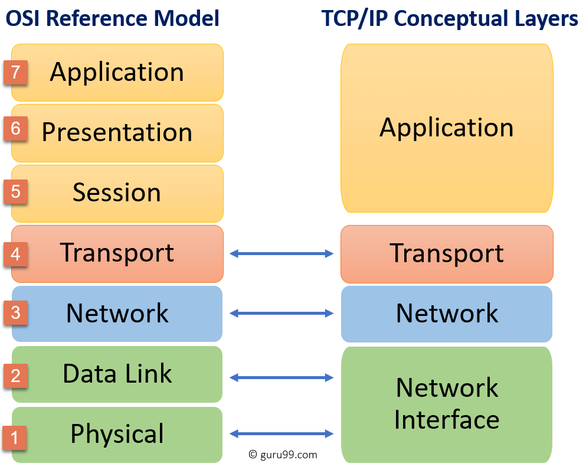
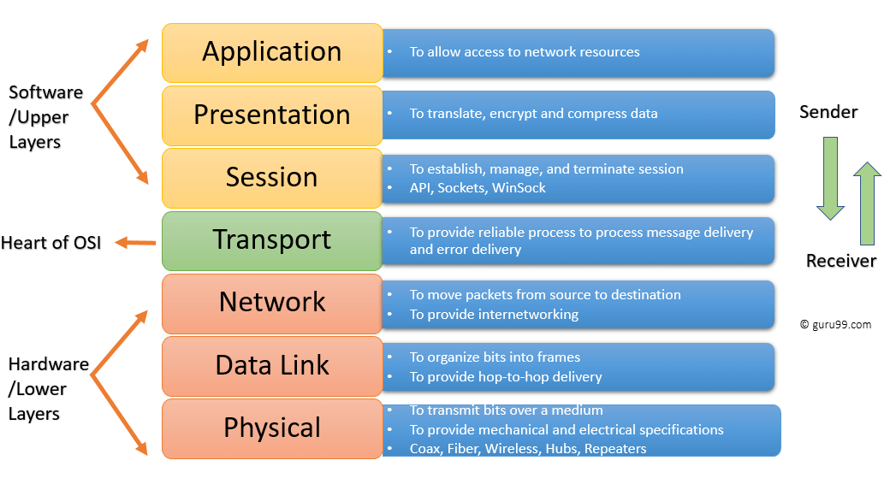
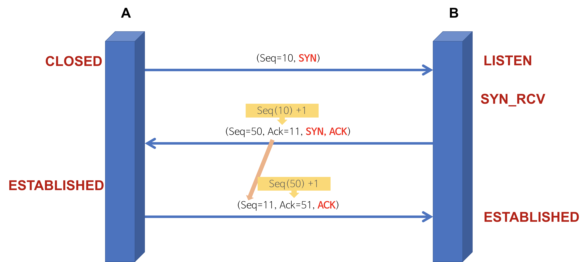
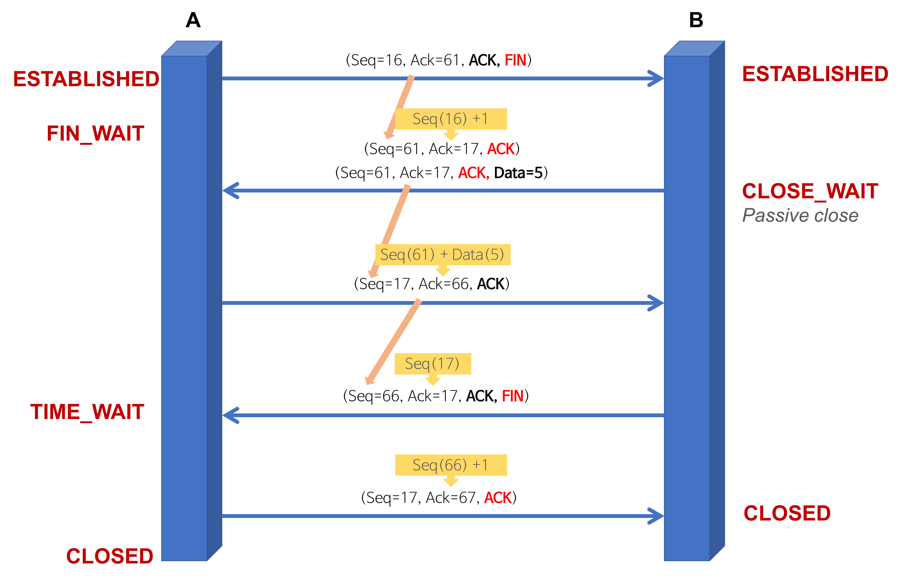

# Network (네트워크)

**난이도: 🟡 Intermediate**

> 작성자 : [권혁진](https://github.com/KimKwon), [서그림](https://github.com/Seogeurim), [윤가영](https://github.com/yoongoing)

> retrieval-anchor-keywords: network readme, network navigator, network primer, network survey, network catalog, network deep dive, network playbook, network runbook, network routing, network index guide, http request response basics, URL DNS TCP TLS flow, browser server basics, browser request lifecycle, status code basics, keep-alive basics, HTTP/1.1 vs HTTP/2 vs HTTP/3, beginner HTTP version comparison, browser protocol negotiation, connection reuse vs multiplexing, TCP HOL vs QUIC streams, QUIC basics, timeout retry backoff, proxy gateway, tls proxy, websocket, http2 http3, latency breakdown, dns ttl, cache control, conditional request basics, browser cache revalidation, browser devtools cache trace, chrome devtools cache, memory cache, disk cache, ETag, strong ETag, weak ETag, weak validator, strong validator, validator precision, If-Match, If-Range, range request validator, compressed variant ETag, Last-Modified, If-None-Match, If-Modified-Since, 304 Not Modified, Vary basics, content negotiation basics, response variant, Accept-Language, Accept-Encoding, language cache variation, compression cache variation, forwarded trust boundary, spring network bridge, spring + network route, request lifecycle timeout, webclient pool, 499 broken pipe, client disconnect, connection reset, proxy timeout, client closed request, 502, 504, bad gateway, gateway timeout, local reply, upstream reset, upstream prematurely closed, timeout mismatch, async timeout mismatch, idle timeout mismatch, deadline budget mismatch, edge 504 app 200, spring early reject, late write, request body drain, unread body observability, expect 100-continue, upload early reject, upload cleanup matrix, proxy to container upload cleanup, edge 401 413 499 mapping, request body bytes received vs consumed, gateway buffering expect cleanup, origin fast reject edge late upload, http2 upload reject, h2 upload early reject, RST_STREAM NO_ERROR upload, discard DATA after reset, connection flow control after reset, reactor netty, pending acquire timeout, servlet container abort, spring boot disconnect logging, disconnectedclienthelper, disconnect breadcrumb code example, disconnectedclienthelper breadcrumb wiring, mvc download disconnect breadcrumb, sse disconnect breadcrumb, async late write breadcrumb, client abort logging category, tomcat clientabortexception, jetty eofexception, undertow broken pipe, undertow request io logger, access log correlation recipe, tomcat jetty undertow access log, tomcat accesslog %X %F, jetty customrequestlog %O %X, undertow access log response time, undertow record request start time, access log partial response attribution, bytes sent duration disconnect bucket, multipart abort spring, request.getParts container difference, swallowAbortedUploads, maxSwallowSize, maxUnconsumedRequestContentReads, undertow connection terminated parsing multipart data, multipart auth reject boundary, MultipartFilter before Spring Security, DispatcherServlet checkMultipart, StandardServletMultipartResolver resolveLazily, unauthorized temp file upload, spring multipart exception translation, multipart exception matrix, MultipartException vs MaxUploadSizeExceededException, MissingServletRequestPartException 400, Failed to parse multipart servlet request, Could not access multipart servlet request, multipart observability fields, nginx request_completion, envoy response_code_details, envoy connection_termination_details, ALB 460, elb_status_code target_status_code, actions_executed, SSE disconnect, WebFlux cancel lag, reactor netty cancel lag, webflux prefetch cancellation, onBackpressureBuffer cancel lag, boundedElastic cancel lag, partial flush failure, last-event-id, SSE replay window, duplicate suppression, async onerror timeline, asyncrequestnotusableexception timeline, response not usable after response errors, response not usable after async request completion, committed response race, async listener onerror, SSE HTTP/1.1 HTTP/2 abort attribution, chunked flush failure, RST_STREAM cancel, 499 EOF crosswalk, http stateless bridge, cookie session spring security route, beginner auth bridge, savedrequest beginner route, 401 302 bounce starter, login redirect primer, 302 login flow, Set-Cookie on redirect response, post-login original URL, hidden session mismatch, hidden jsessionid route, why login state is kept, Set-Cookie Cookie browser flow, HttpOnly SameSite Secure basics, SameSite HttpOnly Secure matrix, cookie attribute matrix, SameSite Lax Strict None, Domain Path cookie scope, host-only cookie, Path is not security boundary, JWT authorization header vs cookie, fetch credentials mode, same-origin vs same-site, cross-origin cookie fetch, cross-site cookie SameSite None, CORS credentials cookie

Table of Contents

- [빠른 탐색](#빠른-탐색)
- [역할별 라우팅 요약](#역할별-라우팅-요약)
- [추천 학습 흐름 (category-local survey)](#추천-학습-흐름-category-local-survey)
- [연결해서 보면 좋은 문서 (cross-category bridge)](#연결해서-보면-좋은-문서-cross-category-bridge)
- [레거시 primer](#레거시-primer)
- [현대 topic catalog](#현대-topic-catalog)
- [보조 primer](#보조-primer)
- [OSI 7 계층](#osi-7-계층)
- [TCP 3-way-handshake & 4-way-handshake](#tcp-3-way-handshake--4-way-handshake)
- [TCP 와 UDP](#tcp-와-udp)
- [HTTP 요청-응답 기본 흐름](#http-요청-응답-기본-흐름)
- [TCP 혼잡 제어](#tcp-혼잡-제어)
- [TCP Zero Window, Persist Probe, Receiver Backpressure](#tcp-zero-window-persist-probe-receiver-backpressure)
- [HTTP 요청 방식 - GET, POST](#http-요청-방식---get-post)
- [HTTP 와 HTTPS](#http-와-https)
- [HTTP 메서드, REST, 멱등성](#http-메서드-rest-멱등성)
- [gRPC vs REST](#grpc-vs-rest)
- [HTTP/1.1 vs HTTP/2 vs HTTP/3 입문 비교](#http11-vs-http2-vs-http3-입문-비교)
- [브라우저의 HTTP 버전 선택: ALPN, Alt-Svc, Fallback 입문](#브라우저의-http-버전-선택-alpn-alt-svc-fallback-입문)
- [gRPC Status, Trailers, Transport Error Mapping](#grpc-status-trailers-transport-error-mapping)
- [HTTP/2 멀티플렉싱과 HOL blocking](#http2-멀티플렉싱과-hol-blocking)
- [h2c, Cleartext Upgrade, Prior Knowledge, Routing](#h2c-cleartext-upgrade-prior-knowledge-routing)
- [h2c Operational Traps: Proxy Chain, Dev/Prod Drift](#h2c-operational-traps-proxy-chain-devprod-drift)
- [HTTP/2 Flow Control, WINDOW_UPDATE, Stall](#http2-flow-control-window_update-stall)
- [HTTP/2 MAX_CONCURRENT_STREAMS, Pending Queue, Saturation](#http2-max_concurrent_streams-pending-queue-saturation)
- [HTTP/2 RST_STREAM, GOAWAY, Streaming Failure Semantics](#http2-rst_stream-goaway-streaming-failure-semantics)
- [DNS round robin 방식](#dns-round-robin-방식)
- [웹 통신의 흐름](#웹-통신의-흐름)
- [HTTP의 무상태성과 쿠키, 세션, 캐시](#http의-무상태성과-쿠키-세션-캐시)
- [Cookie / Session / JWT 브라우저 흐름 입문](#cookie--session--jwt-브라우저-흐름-입문)
- [Login Redirect, Hidden `JSESSIONID`, `SavedRequest` 입문](#login-redirect-hidden-jsessionid-savedrequest-입문)
- [Cookie Attribute Matrix: SameSite, HttpOnly, Secure, Domain, Path](#cookie-attribute-matrix-samesite-httponly-secure-domain-path)
- [Cross-Origin Cookie, `fetch credentials`, CORS 입문](#cross-origin-cookie-fetch-credentials-cors-입문)
- [HTTP 캐싱과 조건부 요청 기초](#http-캐싱과-조건부-요청-기초)
- [Strong vs Weak ETag](#strong-vs-weak-etag)
- [Browser DevTools Cache Trace Primer](#browser-devtools-cache-trace-primer)
- [Vary와 Content Negotiation 기초](#vary와-content-negotiation-기초)
- [TLS, 로드밸런싱, 프록시](#tls-로드밸런싱-프록시)
- [TLS Record Sizing, Flush, Streaming Latency](#tls-record-sizing-flush-streaming-latency)
- [TLS close_notify, FIN/RST, Truncation](#tls-close_notify-finrst-truncation)
- [Service Mesh, Sidecar Proxy](#service-mesh-sidecar-proxy)
- [Service Mesh Local Reply, Timeout, Reset Attribution](#service-mesh-local-reply-timeout-reset-attribution)
- [API Gateway, Reverse Proxy 운영 포인트](#api-gateway-reverse-proxy-운영-포인트)
- [HTTP Response Compression, Buffering, Streaming Trade-offs](#http-response-compression-buffering-streaming-trade-offs)
- [Compression, Cache, Vary, Accept-Encoding, Personalization](#compression-cache-vary-accept-encoding-personalization)
- [Cache, Vary, Accept-Encoding Edge Case Playbook](#cache-vary-accept-encoding-edge-case-playbook)
- [Expect 100-continue, Proxy Request Buffering](#expect-100-continue-proxy-request-buffering)
- [HTTP Request Body Drain, Early Reject, Keep-Alive Reuse](#http-request-body-drain-early-reject-keep-alive-reuse)
- [HTTP/2 Upload Early Reject, RST_STREAM, Flow-Control Cleanup](#http2-upload-early-reject-rst_stream-flow-control-cleanup)
- [Gateway Buffering vs Spring Early Reject](#gateway-buffering-vs-spring-early-reject)
- [Proxy-to-Container Upload Cleanup Matrix](#proxy-to-container-upload-cleanup-matrix)
- [Multipart Parsing vs Auth Reject Boundary](#multipart-parsing-vs-auth-reject-boundary)
- [Spring Multipart Exception Translation Matrix](#spring-multipart-exception-translation-matrix)
- [Client Disconnect, 499, Broken Pipe, Cancellation in Proxy Chains](#client-disconnect-499-broken-pipe-cancellation-in-proxy-chains)
- [SSE Failure Attribution Across HTTP/1.1 and HTTP/2](#sse-failure-attribution-across-http11-and-http2)
- [Network, Spring Request Lifecycle, Timeout, Disconnect Bridge](#network-spring-request-lifecycle-timeout-disconnect-bridge)
- [Spring MVC Async `onError` to `AsyncRequestNotUsableException` Crosswalk](#spring-mvc-async-onerror-to-asyncrequestnotusableexception-crosswalk)
- [Container-Specific Disconnect Logging Recipes for Spring Boot](#container-specific-disconnect-logging-recipes-for-spring-boot)
- [Access Log Correlation Recipes: Tomcat, Jetty, Undertow](#access-log-correlation-recipes-tomcat-jetty-undertow)
- [DisconnectedClientHelper Breadcrumb Wiring](#disconnectedclienthelper-breadcrumb-wiring)
- [SSE/WebFlux Streaming Cancel After First Byte](#ssewebflux-streaming-cancel-after-first-byte)
- [WebFlux Cancel-Lag Tuning](#webflux-cancel-lag-tuning)
- [WebFlux Request-Body Abort Surface Map](#webflux-request-body-abort-surface-map)
- [SSE Last-Event-ID Replay Window](#sse-last-event-id-replay-window)
- [gRPC Deadlines, Cancellation Propagation](#grpc-deadlines-cancellation-propagation)
- [Proxy Retry Budget Discipline](#proxy-retry-budget-discipline)
- [Servlet Container Abort Surface Map: Tomcat, Jetty, Undertow](#servlet-container-abort-surface-map-tomcat-jetty-undertow)
- [Proxy Local Reply vs Upstream Error Attribution](#proxy-local-reply-vs-upstream-error-attribution)
- [Vendor-Specific Proxy Symptom Translation: Nginx, Envoy, ALB](#vendor-specific-proxy-symptom-translation-nginx-envoy-alb)
- [Connection Keep-Alive, Load Balancing, Circuit Breaker](#connection-keep-alive-load-balancing-circuit-breaker)
- [Connection Pool Starvation, Stale Idle Reuse, Debugging](#connection-pool-starvation-stale-idle-reuse-debugging)
- [Queue Saturation Attribution, Metrics, Runbook](#queue-saturation-attribution-metrics-runbook)
- [Upstream Queueing, Connection Pool Wait, Tail Latency](#upstream-queueing-connection-pool-wait-tail-latency)
- [gRPC Keepalive, GOAWAY, Max Connection Age](#grpc-keepalive-goaway-max-connection-age)
- [Accept Queue, SYN Backlog, Listen Overflow](#accept-queue-syn-backlog-listen-overflow)
- [NAT, Conntrack, Ephemeral Port Exhaustion](#nat-conntrack-ephemeral-port-exhaustion)
- [Timeout, Retry, Backoff 실전](#timeout-retry-backoff-실전)
- [Timeout 타입: connect, read, write](#timeout-타입-connect-read-write)
- [Request Timing Decomposition: DNS, Connect, TLS, TTFB, TTLB](#request-timing-decomposition-dns-connect-tls-ttfb-ttlb)
- [Timeout Budget Propagation Across Proxy, Gateway, Service Hops](#timeout-budget-propagation-across-proxy-gateway-service-hops)
- [Load Balancer 헬스체크 실패 패턴](#load-balancer-헬스체크-실패-패턴)
- [HTTP/3와 QUIC 실전 트레이드오프](#http3와-quic-실전-트레이드오프)
- [HTTP/2, HTTP/3 Downgrade Attribution, Alt-Svc, UDP Block](#http2-http3-downgrade-attribution-alt-svc-udp-block)
- [CDN 캐시 키와 무효화 전략](#cdn-캐시-키와-무효화-전략)
- [Retry Storm Containment, Concurrency Limiter, Load Shedding](#retry-storm-containment-concurrency-limiter-load-shedding)
- [Adaptive Concurrency Limiter, Latency Signal, Gateway/Mesh](#adaptive-concurrency-limiter-latency-signal-gatewaymesh)
- [Mesh Adaptive Concurrency, Local Reply, Metrics Tuning](#mesh-adaptive-concurrency-local-reply-metrics-tuning)
- [WebSocket heartbeat, backpressure, reconnect](#websocket-heartbeat-backpressure-reconnect)
- [DNS TTL과 캐시 실패 패턴](#dns-ttl과-캐시-실패-패턴)
- [Cache-Control 실전](#cache-control-실전)
- [SSE, WebSocket, Polling](#sse-websocket-polling)
- [Forwarded / X-Forwarded-For / X-Real-IP 신뢰 경계](#forwarded--x-forwarded-for--x-real-ip-신뢰-경계)

---

## 빠른 탐색

이 `README`는 network category `navigator`다. 위쪽 `primer`와 아래 `추천 학습 흐름` survey로 진입하고, 중간 섹션들은 운영형 `deep dive catalog`, 즉시 대응은 `[playbook]` / `[runbook]` 문서로 내려가면 된다.

- 전체 흐름 `survey`가 먼저 필요하면:
  - [추천 학습 흐름 (category-local survey)](#추천-학습-흐름-category-local-survey)
  - [루트 README](../../README.md)
- 🟢 Beginner 입문 문서 (신규 추가):
  - [OSI 7계층 기초](./osi-7-layer-basics.md) — OSI 모델 개념과 계층별 역할
  - [TCP와 UDP 기초](./tcp-udp-basics.md) — 연결/신뢰성 차이와 사용 시나리오
  - [DNS 기초](./dns-basics.md) — 도메인 → IP 조회 흐름과 TTL 기초
  - [HTTP 메서드와 REST 멱등성 입문](./http-methods-rest-idempotency-basics.md) — GET/POST/PUT/DELETE와 멱등성
  - [HTTP 무상태성과 상태 유지 전략 입문](./http-stateless-state-management-basics.md) — stateless와 쿠키/세션/토큰
  - [TCP 3-way handshake 기초](./tcp-three-way-handshake-basics.md) — SYN/SYN-ACK/ACK 순서와 왜 3번인지
  - [HTTP와 HTTPS 기초](./http-https-basics.md) — TLS 역할, 암호화·인증·무결성 입문
  - [IP 주소와 포트 기초](./ip-address-port-basics.md) — IP, 포트, 소켓 개념과 well-known port
  - [HTTP 버전 비교 입문](./http-versions-beginner-overview.md) — HTTP/1.1 vs HTTP/2 vs HTTP/3 핵심 차이
  - [웹소켓 기초](./websocket-basics.md) — HTTP Upgrade, 양방향 통신, ws vs wss
- network `primer`부터 읽고 싶다면:
  - [레거시 primer](#레거시-primer)
  - [OSI 7 계층](#osi-7-계층)
  - [TCP 3-way-handshake & 4-way-handshake](#tcp-3-way-handshake--4-way-handshake)
  - [TCP 와 UDP](#tcp-와-udp)
  - [HTTP 요청-응답 기본 흐름: URL, DNS, TCP/TLS, 상태 코드, Keep-Alive](./http-request-response-basics-url-dns-tcp-tls-keepalive.md)
  - [HTTP/1.1 vs HTTP/2 vs HTTP/3 입문 비교](./http1-http2-http3-beginner-comparison.md)
  - [Cookie / Session / JWT 브라우저 흐름 입문](./cookie-session-jwt-browser-flow-primer.md)
  - [Login Redirect, Hidden `JSESSIONID`, `SavedRequest` 입문](./login-redirect-hidden-jsessionid-savedrequest-primer.md)
  - [Cookie Attribute Matrix: SameSite, HttpOnly, Secure, Domain, Path](./cookie-attribute-matrix-samesite-httponly-secure-domain-path.md)
  - [Cross-Origin Cookie, `fetch credentials`, CORS 입문](./cross-origin-cookie-credentials-cors-primer.md)
  - [HTTP 캐싱과 조건부 요청 기초: Cache-Control, ETag, Last-Modified, 304](./http-caching-conditional-request-basics.md)
  - [Strong vs Weak ETag: validator 정밀도와 cache correctness](./strong-vs-weak-etag-validator-precision-cache-correctness.md)
  - [Browser DevTools Cache Trace Primer: memory cache, disk cache, revalidation, 304 읽기](./browser-devtools-cache-trace-primer.md)
  - [Vary와 Content Negotiation 기초: 언어, 압축, 응답 variant](./vary-content-negotiation-basics-language-compression.md)
  - [보조 primer](#보조-primer)
  - cookie / session / JWT 기본에서 auth/security/spring 경계로 올라가려면 [Cookie / Session / JWT 브라우저 흐름 입문](./cookie-session-jwt-browser-flow-primer.md) -> [Login Redirect, Hidden `JSESSIONID`, `SavedRequest` 입문](./login-redirect-hidden-jsessionid-savedrequest-primer.md) -> [Cookie Attribute Matrix: SameSite, HttpOnly, Secure, Domain, Path](./cookie-attribute-matrix-samesite-httponly-secure-domain-path.md) -> [Cross-Origin Cookie, `fetch credentials`, CORS 입문](./cross-origin-cookie-credentials-cors-primer.md) -> [Browser Session Spring Auth](#network-bridge-browser-session-auth) anchor와 [Cross-Domain Bridge Map: HTTP Stateless / Cookie / Session / Spring Security](../../rag/cross-domain-bridge-map.md#bridge-http-session-security-cluster) route를 함께 탄다.
  - `SavedRequest`, `401 -> 302` bounce, `hidden session mismatch`까지 보이면 먼저 [Login Redirect, Hidden `JSESSIONID`, `SavedRequest` 입문](./login-redirect-hidden-jsessionid-savedrequest-primer.md)으로 browser redirect/cookie 흐름을 고정한 뒤 [Browser Session Spring Auth](#network-bridge-browser-session-auth) anchor에서 browser/session boundary ladder를 따라간다.
- 운영형 `deep dive catalog`에서 bucket을 먼저 고르려면:
  - [현대 topic catalog](#현대-topic-catalog)
  - [HTTP/2 멀티플렉싱과 HOL blocking](./http2-multiplexing-hol-blocking.md)
  - [TLS, 로드밸런싱, 프록시](./tls-loadbalancing-proxy.md)
  - [Timeout, Retry, Backoff 실전](./timeout-retry-backoff-practical.md)
  - [WebSocket heartbeat, backpressure, reconnect](./websocket-heartbeat-backpressure-reconnect.md)
  - [Forwarded / X-Forwarded-For / X-Real-IP 신뢰 경계](./forwarded-x-forwarded-for-x-real-ip-trust-boundary.md)
- 운영 복구 순서가 먼저 필요한 `playbook` / `runbook`으로 가려면:
  - `[playbook]` [Cache, Vary, Accept-Encoding Edge Case Playbook](./cache-vary-accept-encoding-edge-case-playbook.md)
  - `[runbook]` [Queue Saturation Attribution, Metrics, Runbook](./queue-saturation-attribution-metrics-runbook.md)
- upload `401/413/499` symptom `deep dive`로 바로 들어가려면:
  - [Expect 100-continue, Proxy Request Buffering](./expect-100-continue-proxy-request-buffering.md)
  - [Gateway Buffering vs Spring Early Reject](./gateway-buffering-vs-spring-early-reject.md)
  - [HTTP Request Body Drain, Early Reject, Keep-Alive Reuse](./http-request-body-drain-early-reject-keepalive-reuse.md)
  - cross-category upload / cleanup / Spring lifecycle bundle은 [Request Lifecycle Upload Disconnect](#network-bridge-request-lifecycle-upload-disconnect) anchor에서 이어 본다.
- disconnect / cancel symptom `deep dive`로 바로 들어가려면:
  - `499`, `broken pipe`, `client disconnect`, `connection reset`, `proxy timeout`처럼 같은 incident가 여러 hop에서 다른 surface로 보이면 아래 문서들을 한 묶음으로 본다.
  - [SSE/WebFlux Streaming Cancel After First Byte](./sse-webflux-streaming-cancel-after-first-byte.md)
  - [WebFlux Cancel-Lag Tuning](./webflux-cancel-lag-tuning.md)
  - [SSE Failure Attribution Across HTTP/1.1 and HTTP/2](./sse-failure-attribution-http1-http2.md)
  - [SSE Last-Event-ID Replay Window](./sse-last-event-id-replay-window.md)
  - [Client Disconnect, 499, Broken Pipe, Cancellation in Proxy Chains](./client-disconnect-499-broken-pipe-cancellation-proxy-chain.md)
  - Spring lifecycle / container logging / abort surface bundle은 [Request Lifecycle Upload Disconnect](#network-bridge-request-lifecycle-upload-disconnect) anchor에서 이어 본다.
- edge `502/504` symptom `deep dive`로 바로 들어가려면:
  - `502`, `504`, `bad gateway`, `gateway timeout`, `local reply`, `upstream reset`처럼 edge status owner가 헷갈리면 아래 문서들을 한 묶음으로 본다.
  - edge owner / vendor translation / mesh local reply bundle은 [Edge Status Timeout Control Plane](#network-bridge-edge-status-timeout-control-plane) anchor에서 이어 본다.
- timeout-mismatch symptom `deep dive`로 바로 들어가려면:
  - `timeout mismatch`, `async timeout mismatch`, `idle timeout mismatch`, `deadline budget mismatch`, `gateway는 504인데 app은 200`처럼 hop별 종료 순서가 흔들리면 아래 문서들을 한 묶음으로 본다.
  - timeout / Spring surface / lifecycle handoff bundle은 [Edge Status Timeout Control Plane](#network-bridge-edge-status-timeout-control-plane) anchor에서 이어 본다.
- [Spring + Network](../../rag/cross-domain-bridge-map.md#spring--network) route로 확장하려면:
  - [연결해서 보면 좋은 문서 (cross-category bridge)](#연결해서-보면-좋은-문서-cross-category-bridge)
  - request lifecycle / Spring handoff는 [Request Lifecycle Upload Disconnect](#network-bridge-request-lifecycle-upload-disconnect) anchor에서 시작한다.
  - edge / timeout / control-plane handoff는 [Edge Status Timeout Control Plane](#network-bridge-edge-status-timeout-control-plane) anchor에서 시작한다.
- 문서 역할이 헷갈리면:
  - [Navigation Taxonomy](../../rag/navigation-taxonomy.md)
  - [Retrieval Anchor Keywords](../../rag/retrieval-anchor-keywords.md)

## 역할별 라우팅 요약

| 지금 필요한 것 | 문서 역할 | 먼저 갈 곳 |
|---|---|---|
| network 전체 흐름과 추천 순서 | `survey` | [추천 학습 흐름 (category-local survey)](#추천-학습-흐름-category-local-survey), [루트 README](../../README.md) |
| TCP / HTTP / DNS 기본 축 복습 | `primer` | [레거시 primer](#레거시-primer), [보조 primer](#보조-primer) |
| URL 입력부터 request/response와 status code까지 한 번에 복습 | `primer` | [HTTP 요청-응답 기본 흐름: URL, DNS, TCP/TLS, 상태 코드, Keep-Alive](./http-request-response-basics-url-dns-tcp-tls-keepalive.md) |
| HTTP/1.1, HTTP/2, HTTP/3 차이를 connection reuse와 HOL blocking 중심으로 빠르게 비교 | `primer` | [HTTP/1.1 vs HTTP/2 vs HTTP/3 입문 비교](./http1-http2-http3-beginner-comparison.md) |
| 브라우저가 왜 첫 요청은 H2인데 다음엔 H3를 쓸 수 있는지, 언제 H1/H2로 fallback 되는지 이해 | `primer / browser protocol negotiation` | [브라우저의 HTTP 버전 선택: ALPN, Alt-Svc, Fallback 입문](./browser-http-version-selection-alpn-alt-svc-fallback.md), [HTTP/2, HTTP/3 Downgrade Attribution, Alt-Svc, UDP Block](./http2-http3-downgrade-attribution-alt-svc-udp-block.md) |
| 브라우저가 cookie를 저장/전송하고 session/JWT가 request에 어디 실리는지 이해 | `primer / auth bridge` | [Browser Session Spring Auth](#network-bridge-browser-session-auth), [Cross-Domain Bridge Map: HTTP Stateless / Cookie / Session / Spring Security](../../rag/cross-domain-bridge-map.md#bridge-http-session-security-cluster) |
| 브라우저 login redirect, `302`, 숨은 `JSESSIONID`, `SavedRequest` 복귀를 Spring deep dive 전에 묶어서 이해 | `primer / auth bridge` | [Login Redirect, Hidden `JSESSIONID`, `SavedRequest` 입문](./login-redirect-hidden-jsessionid-savedrequest-primer.md), [Browser Session Spring Auth](#network-bridge-browser-session-auth) |
| `SameSite`, `HttpOnly`, `Secure`, `Domain`, `Path`가 브라우저 동작과 CSRF 노출을 각각 어떻게 바꾸는지 이해 | `primer / cookie security boundary` | [Cookie Attribute Matrix: SameSite, HttpOnly, Secure, Domain, Path](./cookie-attribute-matrix-samesite-httponly-secure-domain-path.md), [Cookie / Session / JWT 브라우저 흐름 입문](./cookie-session-jwt-browser-flow-primer.md), [CSRF in SPA + BFF Architecture](../security/csrf-in-spa-bff-architecture.md) |
| same-origin, same-site, `fetch credentials`, CORS가 왜 서로 다른 답을 내는지 이해 | `primer / browser boundary` | [Cross-Origin Cookie, `fetch credentials`, CORS 입문](./cross-origin-cookie-credentials-cors-primer.md), [Cookie / Session / JWT 브라우저 흐름 입문](./cookie-session-jwt-browser-flow-primer.md), [CORS, SameSite, Preflight](../security/cors-samesite-preflight.md) |
| 브라우저 캐시 재사용과 `304` 재검증 흐름을 입문 수준에서 이해 | `primer` | [HTTP 캐싱과 조건부 요청 기초: Cache-Control, ETag, Last-Modified, 304](./http-caching-conditional-request-basics.md) |
| weak/strong ETag 차이, `If-Match` vs `If-None-Match`, range resume 안전성을 같이 이해 | `deep dive` | [Strong vs Weak ETag: validator 정밀도와 cache correctness](./strong-vs-weak-etag-validator-precision-cache-correctness.md), [HTTP 캐싱과 조건부 요청 기초: Cache-Control, ETag, Last-Modified, 304](./http-caching-conditional-request-basics.md) |
| DevTools에서 `memory cache`, `disk cache`, `304`를 실제 trace로 구분해 읽고 싶다 | `primer / troubleshooting entry` | [Browser DevTools Cache Trace Primer: memory cache, disk cache, revalidation, 304 읽기](./browser-devtools-cache-trace-primer.md), [HTTP 캐싱과 조건부 요청 기초: Cache-Control, ETag, Last-Modified, 304](./http-caching-conditional-request-basics.md) |
| 같은 URL의 언어/압축/표현 variant와 `Vary`가 왜 필요한지 입문 수준에서 이해 | `primer` | [Vary와 Content Negotiation 기초: 언어, 압축, 응답 variant](./vary-content-negotiation-basics-language-compression.md), [HTTP 캐싱과 조건부 요청 기초: Cache-Control, ETag, Last-Modified, 304](./http-caching-conditional-request-basics.md) |
| 증상 축별로 다음 문서를 고르기 | `catalog / navigator` | [현대 topic catalog](#현대-topic-catalog) 아래 각 섹션 |
| 장애 대응 순서나 메트릭 런북이 먼저 필요함 | `playbook` / `runbook` | [Cache, Vary, Accept-Encoding Edge Case Playbook](./cache-vary-accept-encoding-edge-case-playbook.md), [Queue Saturation Attribution, Metrics, Runbook](./queue-saturation-attribution-metrics-runbook.md) |
| 역할 라벨이나 검색 alias가 헷갈림 | `taxonomy` / `routing helper` | [Navigation Taxonomy](../../rag/navigation-taxonomy.md), [Retrieval Anchor Keywords](../../rag/retrieval-anchor-keywords.md) |

## 추천 학습 흐름 (category-local survey)

아래 흐름은 network 내부에서 `primer -> deep dive -> playbook`을 잇는 category-local survey다.

### 0. Browser Cookie / Auth Primer

[HTTP 요청-응답 기본 흐름: URL, DNS, TCP/TLS, 상태 코드, Keep-Alive](./http-request-response-basics-url-dns-tcp-tls-keepalive.md) -> [HTTP의 무상태성과 쿠키, 세션, 캐시](./http-state-session-cache.md) -> [Cookie / Session / JWT 브라우저 흐름 입문](./cookie-session-jwt-browser-flow-primer.md) -> [Login Redirect, Hidden `JSESSIONID`, `SavedRequest` 입문](./login-redirect-hidden-jsessionid-savedrequest-primer.md) -> [Cookie Attribute Matrix: SameSite, HttpOnly, Secure, Domain, Path](./cookie-attribute-matrix-samesite-httponly-secure-domain-path.md) -> [Cross-Origin Cookie, `fetch credentials`, CORS 입문](./cross-origin-cookie-credentials-cors-primer.md)

### 1. TCP / HTTP Version Progression

[OSI 7 계층](#osi-7-계층) -> [TCP 와 UDP](#tcp-와-udp) -> [HTTP 요청-응답 기본 흐름: URL, DNS, TCP/TLS, 상태 코드, Keep-Alive](./http-request-response-basics-url-dns-tcp-tls-keepalive.md) -> [HTTP 메서드, REST, 멱등성](./http-methods-rest-idempotency.md) -> [HTTP/1.1 vs HTTP/2 vs HTTP/3 입문 비교](./http1-http2-http3-beginner-comparison.md) -> [브라우저의 HTTP 버전 선택: ALPN, Alt-Svc, Fallback 입문](./browser-http-version-selection-alpn-alt-svc-fallback.md) -> [HTTP/2 멀티플렉싱과 HOL blocking](./http2-multiplexing-hol-blocking.md) -> [HTTP/3와 QUIC 실전 트레이드오프](./http3-quic-practical-tradeoffs.md)

### 2. Proxy / Mesh / Trust Boundary

[TLS, 로드밸런싱, 프록시](./tls-loadbalancing-proxy.md) -> [API Gateway, Reverse Proxy 운영 포인트](./api-gateway-reverse-proxy-operational-points.md) -> [Service Mesh, Sidecar Proxy](./service-mesh-sidecar-proxy.md) -> [Proxy Local Reply vs Upstream Error Attribution](./proxy-local-reply-vs-upstream-error-attribution.md) -> [Vendor-Specific Proxy Symptom Translation: Nginx, Envoy, ALB](./vendor-specific-proxy-symptom-translation-nginx-envoy-alb.md)

### 3. Timeout / Queueing / Overload

[Timeout, Retry, Backoff 실전](./timeout-retry-backoff-practical.md) -> [Request Timing Decomposition: DNS, Connect, TLS, TTFB, TTLB](./request-timing-decomposition-dns-connect-tls-ttfb-ttlb.md) -> [Upstream Queueing, Connection Pool Wait, Tail Latency](./upstream-queueing-connection-pool-wait-tail-latency.md) -> `[runbook]` [Queue Saturation Attribution, Metrics, Runbook](./queue-saturation-attribution-metrics-runbook.md) -> [Mesh Adaptive Concurrency, Local Reply, Metrics Tuning](./mesh-adaptive-concurrency-local-reply-metrics-tuning.md)

### 4. Streaming / Disconnect / Cancellation

[HTTP Response Compression, Buffering, Streaming Trade-offs](./http-response-compression-buffering-streaming-tradeoffs.md) -> [WebSocket heartbeat, backpressure, reconnect](./websocket-heartbeat-backpressure-reconnect.md) -> [SSE, WebSocket, Polling](./sse-websocket-polling.md) -> [SSE/WebFlux Streaming Cancel After First Byte](./sse-webflux-streaming-cancel-after-first-byte.md) -> [WebFlux Cancel-Lag Tuning](./webflux-cancel-lag-tuning.md) -> [Client Disconnect, 499, Broken Pipe, Cancellation in Proxy Chains](./client-disconnect-499-broken-pipe-cancellation-proxy-chain.md) -> [Network, Spring Request Lifecycle, Timeout, Disconnect Bridge](./network-spring-request-lifecycle-timeout-disconnect-bridge.md) -> [Container-Specific Disconnect Logging Recipes for Spring Boot](./container-specific-disconnect-logging-recipes-spring-boot.md) -> [Access Log Correlation Recipes: Tomcat, Jetty, Undertow](./access-log-correlation-recipes-tomcat-jetty-undertow.md) -> [Spring `DisconnectedClientHelper` Breadcrumb Wiring: MVC Download, SSE, Async Late Write](./spring-disconnectedclienthelper-breadcrumb-wiring-mvc-download-sse-async-late-write.md) -> [Spring MVC Async `onError` -> `AsyncRequestNotUsableException` Crosswalk](./spring-mvc-async-onerror-asyncrequestnotusableexception-crosswalk.md) -> [SSE Failure Attribution Across HTTP/1.1 and HTTP/2](./sse-failure-attribution-http1-http2.md) -> [SSE Last-Event-ID Replay Window](./sse-last-event-id-replay-window.md)

### 5. Cache / DNS / Edge Variation

[DNS TTL과 캐시 실패 패턴](./dns-ttl-cache-failure-patterns.md) -> [HTTP 캐싱과 조건부 요청 기초: Cache-Control, ETag, Last-Modified, 304](./http-caching-conditional-request-basics.md) -> [Strong vs Weak ETag: validator 정밀도와 cache correctness](./strong-vs-weak-etag-validator-precision-cache-correctness.md) -> [Browser DevTools Cache Trace Primer: memory cache, disk cache, revalidation, 304 읽기](./browser-devtools-cache-trace-primer.md) -> [Vary와 Content Negotiation 기초: 언어, 압축, 응답 variant](./vary-content-negotiation-basics-language-compression.md) -> [Cache-Control 실전](./cache-control-practical.md) -> [Compression, Cache, Vary, Accept-Encoding, Personalization](./compression-cache-vary-accept-encoding-personalization.md) -> `[playbook]` [Cache, Vary, Accept-Encoding Edge Case Playbook](./cache-vary-accept-encoding-edge-case-playbook.md) -> [HTTP/2, HTTP/3 Downgrade Attribution, Alt-Svc, UDP Block](./http2-http3-downgrade-attribution-alt-svc-udp-block.md)

## 연결해서 보면 좋은 문서 (cross-category bridge)

빠른 탐색에서는 symptom별 entrypoint만 남기고, 세부 cross-category bundle은 아래 anchor에서만 길게 유지한다.

### Browser Session Spring Auth

- cookie / session / JWT 입문 개념을 Spring auth 설계로 올리려면 [HTTP의 무상태성과 쿠키, 세션, 캐시](./http-state-session-cache.md) -> [Cookie / Session / JWT 브라우저 흐름 입문](./cookie-session-jwt-browser-flow-primer.md) -> [Login Redirect, Hidden `JSESSIONID`, `SavedRequest` 입문](./login-redirect-hidden-jsessionid-savedrequest-primer.md) -> [Cookie Attribute Matrix: SameSite, HttpOnly, Secure, Domain, Path](./cookie-attribute-matrix-samesite-httponly-secure-domain-path.md) -> [Cross-Origin Cookie, `fetch credentials`, CORS 입문](./cross-origin-cookie-credentials-cors-primer.md) -> [Signed Cookies / Server Sessions / JWT Tradeoffs](../security/signed-cookies-server-sessions-jwt-tradeoffs.md) -> [Spring Security 아키텍처](../spring/spring-security-architecture.md) -> [Spring `SecurityContextRepository` and `SessionCreationPolicy` Boundaries](../spring/spring-securitycontextrepository-sessioncreationpolicy-boundaries.md) -> [Browser / BFF Token Boundary / Session Translation](../security/browser-bff-token-boundary-session-translation.md) 순으로 보면 browser 자동 전송, redirect 응답의 cookie 저장, 원래 URL 복귀, cookie scope, same-origin vs same-site, `fetch credentials`, `Authorization` vs `Cookie`, Spring 인증 persistence 경계가 한 줄로 잡힌다.
- `SavedRequest`, `login loop`, `401 -> 302`, `hidden session mismatch`가 보이기 시작하면 [Login Redirect, Hidden `JSESSIONID`, `SavedRequest` 입문](./login-redirect-hidden-jsessionid-savedrequest-primer.md) -> [Spring Security `RequestCache` / `SavedRequest` Boundaries](../spring/spring-security-requestcache-savedrequest-boundaries.md) -> [Spring `SecurityContextRepository` and `SessionCreationPolicy` Boundaries](../spring/spring-securitycontextrepository-sessioncreationpolicy-boundaries.md) -> [Browser / BFF Token Boundary / Session Translation](../security/browser-bff-token-boundary-session-translation.md) 순으로 좁히면 login bounce, hidden session 생성, post-login 원래 URL 복귀, browser/BFF session translation이 같은 단계도로 이어진다.

### Request Lifecycle Upload Disconnect

- 애플리케이션 요청 생명주기와 함께 보려면 [Multipart Parsing vs Auth Reject Boundary](./multipart-parsing-vs-auth-reject-boundary.md), [Spring Multipart Exception Translation Matrix](./spring-multipart-exception-translation-matrix.md), [Proxy-to-Container Upload Cleanup Matrix](./proxy-to-container-upload-cleanup-matrix.md), [Network, Spring Request Lifecycle, Timeout, Disconnect Bridge](./network-spring-request-lifecycle-timeout-disconnect-bridge.md), [WebFlux Request-Body Abort Surface Map](./webflux-request-body-abort-surface-map.md), [Spring MVC Async `onError` -> `AsyncRequestNotUsableException` Crosswalk](./spring-mvc-async-onerror-asyncrequestnotusableexception-crosswalk.md), [Container-Specific Disconnect Logging Recipes for Spring Boot](./container-specific-disconnect-logging-recipes-spring-boot.md), [Access Log Correlation Recipes: Tomcat, Jetty, Undertow](./access-log-correlation-recipes-tomcat-jetty-undertow.md), [Spring `DisconnectedClientHelper` Breadcrumb Wiring: MVC Download, SSE, Async Late Write](./spring-disconnectedclienthelper-breadcrumb-wiring-mvc-download-sse-async-late-write.md), [Spring Request Lifecycle Timeout / Disconnect / Cancellation Bridges](../spring/spring-request-lifecycle-timeout-disconnect-cancellation-bridges.md), [Spring WebClient Connection Pool and Timeout Tuning](../spring/spring-webclient-connection-pool-timeout-tuning.md), [Servlet Container Abort Surface Map: Tomcat, Jetty, Undertow](./servlet-container-abort-surface-map-tomcat-jetty-undertow.md)을 이어 보면 좋다.

### Edge Status Timeout Control Plane

- edge `502/504` ownership을 가르려면 [Proxy Local Reply vs Upstream Error Attribution](./proxy-local-reply-vs-upstream-error-attribution.md), [Vendor-Specific Proxy Symptom Translation: Nginx, Envoy, ALB](./vendor-specific-proxy-symptom-translation-nginx-envoy-alb.md), [Service Mesh Local Reply, Timeout, Reset Attribution](./service-mesh-local-reply-timeout-reset-attribution.md)을 같이 보면 local reply, upstream reset, vendor translation이 한 줄로 잡힌다.
- timeout mismatch를 Spring surface까지 이어 보려면 [Timeout Budget Propagation Across Proxy, Gateway, Service Hops](./timeout-budget-propagation-proxy-gateway-service-hop-chain.md), [Idle Timeout Mismatch: LB / Proxy / App](./idle-timeout-mismatch-lb-proxy-app.md), [Network, Spring Request Lifecycle, Timeout, Disconnect Bridge](./network-spring-request-lifecycle-timeout-disconnect-bridge.md), [Spring Request Lifecycle Timeout / Disconnect / Cancellation Bridges](../spring/spring-request-lifecycle-timeout-disconnect-cancellation-bridges.md)을 같이 본다.
- latency / retry / queueing을 교차 도메인으로 묶으려면 [Latency Debugging Master Note](../../master-notes/latency-debugging-master-note.md), [Retry, Timeout, Idempotency Master Note](../../master-notes/retry-timeout-idempotency-master-note.md), [Timeout Budget Propagation Across Proxy, Gateway, Service Hops](./timeout-budget-propagation-proxy-gateway-service-hop-chain.md)을 같이 보면 좋다.
- control plane / global routing으로 확장하려면 [Service Discovery / Health Routing](../system-design/service-discovery-health-routing-design.md), [Service Mesh Control Plane](../system-design/service-mesh-control-plane-design.md), [Global Traffic Failover Control Plane](../system-design/global-traffic-failover-control-plane-design.md)을 이어 읽으면 network symptom이 orchestration 문제로 번지는 지점을 잡기 쉽다.

## 레거시 primer

아래 구간은 네트워크 입문 설명과 기본 개념 복습용 primer다.

## OSI 7 계층

> 개방형 시스템 상호 연결을 위한 기초 참조 모델(Open Systems Interconnection Reference Model)

OSI 7 계층이란, 국제표준화기구(ISO)에서 개발한 모델로, 컴퓨터 네트워크 프로토콜 디자인과 통신을 계층으로 나누어 설명한 것이다.

쉽게 말하면 **네트워크에서 통신이 일어나는 과정을 7단계로 나눈 것**을 말한다. 계층 모델에 의해 **프로토콜도 계층별로 구성**된다. 현재 네트워크 시스템의 기반이 된 모델이며 다양한 시스템은 이 계층 모델을 기반으로 통신한다. (현재의 인터넷은 각 계층의 역할들이 합쳐지면서 TCP/IP 4 계층 모델(링크 계층, 인터넷 계층, 전송 계층, 응용 계층)을 기반으로 한다.)

> 현재의 인터넷 계층 모델 참조 : [RFC1122 공식 문서 - Internet Protocol Suite](https://tools.ietf.org/html/rfc1122)

OSI 7 계층을 나눈 이유는 **통신이 일어나는 과정을 단계별로 알 수 있고, 7단계 중 특정한 곳에 이상이 생기면 다른 단계와 독립적으로 그 단계만 수정할 수 있기 때문**이다.

OSI 7 계층은 **물리 계층, 데이터 링크 계층, 네트워크 계층, 전송 계층, 세션 계층, 표현 계층, 응용 계층**으로 구성되어 있다.

### 프로토콜이란

위에서 프로토콜이 계층별로 구성된다고 언급하였다. 이 프로토콜이란 메시지를 주고 받는 양식이나 규칙을 의미하는 **통신 규약**이다.

시스템 간 메시지를 주고 받기 위해서는 한쪽에서 보낸 메시지를 반대쪽에서 이해할 수 있어야 한다. 한쪽에서 '안녕' 이라는 메시지를 보냈을 때 
인사로 알아듣고 대답으로 '안녕' 이라는 메시지를 보낼 수 있어야 한다는 뜻이다. 통신 모델에서도 메시지를 주고 받으며 통신할 때 그 언어와 대화 방법에 
대한 규칙이 있어야 의사소통을 할 수 있을 것이다. 이 규칙을 정의한 것이 프로토콜이고 이 규칙은 계층별로 다르게 존재한다.

### OSI 7 계층의 구조

 

#### \[7] 응용 계층 (Application Layer) : 데이터 단위 message | 프로토콜 HTTP, SMTP, FTP, SIP 등

- 통신의 최종 목적지로, 응용 프로그램들이 통신으로 활용하는 계층이다.
- 사용자에게 가장 가까운 계층이며 웹 브라우저, 응용 프로그램을 통해 사용자와 직접적으로 상호작용한다.
- 많은 프로토콜이 존재하는 계층으로, 새로운 프로토콜 추가도 굉장히 쉽다.

#### \[6] 표현 계층 (Presentation Layer) : 데이터 단위 message | 프로토콜 ASCII, MPEG 등

- 데이터의 암호화, 복호화와 같이 응용 계층에서 교환되는 데이터의 의미를 해석하는 계층이다.
- 응용 프로그램 ⇔ 네트워크 간 정해진 형식대로 데이터를 변환, 즉 표현한다.
- 인터넷의 계층 구조에는 포함되어있지 않으며 필요에 따라 응용 계층에서 지원하거나 어플리케이션 개발자가 직접 개발해야 한다.

#### \[5] 세션 계층 (Session Layer) : 데이터 단위 message | 프로토콜 NetBIOS, TLS 등

- 데이터 교환의 경계와 동기화를 제공하는 계층이다.
- 세션 계층의 프로토콜은 연결이 손실되는 경우 연결 복구를 시도한다. 오랜 시간 연결이 되지 않으면 세션 계층의 프로토콜이 연결을 닫고 다시 연결을 재개한다.
- 데이터를 상대방이 보내고 있을 때 동시에 보낼지에 대한 전이중(동시에 보냄, 전화기), 반이중(동시에 보내지 않음, 무전기) 통신을 결정할 수 있다.
- 인터넷의 계층 구조에는 포함되어있지 않으며 필요에 따라 응용 계층에서 지원하거나 어플리케이션 개발자가 직접 개발해야 한다.

#### \[4] 전송 계층 (Transport Layer) : 데이터 단위 segment | 프로토콜 TCP, UDP, SCTP 등

- 상위 계층의 메시지를 하위 계층으로 전송하는 계층이다.
- 메시지의 오류를 제어하며, 메시지가 클 경우 이를 나눠서(Segmentation) 네트워크 계층으로 전달한다. 그리고 받은 패킷을 재조립해서 상위 계층으로 전달한다. 
- 대표적으로 TCP, UDP 프로토콜이 있다. TCP는 연결 지향형 통신을, UDP는 비연결형 통신을 제공한다.

#### \[3] 네트워크 계층 (Network Layer) : 데이터 단위 datagram, packet | 프로토콜 IP, ICMP, ARP, RIP, BGP 등

- 패킷을 한 호스트에서 다른 호스트로 라우팅하는 계층이다. (여러 라우터를 통한 라우팅, 그를 통한 패킷 전달)
- 전송 계층에게 전달 받은 목적지 주소를 이용해서 패킷을 만들고 그 목적지의 전송 계층으로 패킷을 전달한다.
- 인터넷의 경우 IP 프로토콜이 대표적이다.

#### \[2] 데이터 링크 계층 (Data Link Layer) : 데이터 단위 frame | 프로토콜 PPP, Ethernet, Token ring, IEE 802.11(Wifi) 등

- 데이터를 frame 단위로 한 네트워크 요소에서 이웃 네트워크 요소로 전송하는 계층이다. (물리 계층을 이용해 전송)
- 인터넷의 경우 Ethernet 프로토콜이 대표적이다. Ethernet은 MAC 주소를 이용해 Node-to-Node, Point-to-Point로 프레임을 전송한다.
- 이 계층의 장비로 대표적인 것은 스위치, 브릿지이다.

#### \[1] 물리 계층 (Physical Layer) : 데이터 단위 bit | 프로토콜 DSL, ISDN 등

- 장치 간 전기적 신호를 전달하는 계층이며, 데이터 프레임 내부의 각 bit를 한 노드에서 다음 노드로 실제로 이동시키는 계층이다.
- 인터넷의 Ethernet 또한 여러가지 물리 계층 프로토콜을 갖고 있다.
- 이 계층의 장비로 대표적인 것은 허브, 리피터이다.

---

## TCP 3-way-handshake & 4-way-handshake

> 참고 : [[Network] TCP 3-way handshaking과 4-way handshaking](https://gmlwjd9405.github.io/2018/09/19/tcp-connection.html)

TCP는 네트워크 계층 중 **전송 계층에서 사용하는 프로토콜** 중 하나로, **신뢰성을 보장하는 연결형 서비스**이다.

TCP의 **3-way-handshake**란 TCP 통신을 시작하기 전에 논리적인 경로 **연결을 수립 (Connection Establish)** 하는 과정이며, **4-way-handshake**는 논리적인 경로 **연결을 해제 (Connection Termination)** 하는 과정이다. 이러한 방식을 Connect Oriented 방식이라 부르기도 한다.

### TCP 3-way-handshake : Connection Establish

3-way-handshake 과정을 통해 양쪽 모두 데이터를 전송할 준비가 되었다는 것을 보장한다.

#### A 프로세스(Client)가 B 프로세스(Server)에 연결을 요청

1. **A**(CLOSED) **→ B**(LISTEN) **: SYN(a)**
    - 프로세스 A가 연결 요청 메시지 전송 (SYN)
    - 이 때 Sequence Number를 임의의 랜덤 숫자(a)로 지정하고, SYN 플래그 비트를 1로 설정한 segment를 전송한다.
2. **B**(SYN_RCV) **→ A**(CLOSED) **: ACK(a+1), SYN(b)**
    - 연결 요청 메시지를 받은 프로세스 B는 요청을 수락(ACK)했으며, 요청한 A 프로세스도 포트를 열어달라(SYN)는 메시지 전송
    - 받은 메시지에 대한 수락에 대해서는 Acknowledgement Number 필드를 (Sequence Number + 1)로 지정하여 표현한다. 그리고 SYN과 ACK 플래그 비트를 1로 설정한 segment를 전송한다.
3. **A**(ESTABLISHED) **→ B**(SYN_RCV) **: ACK(b+1)**
    - 마지막으로 프로세스 A가 수락 확인을 보내 연결을 맺음 (ACK)
    - 이 때, 전송할 데이터가 있으면 이 단계에서 데이터를 전송할 수 있다.

최종 PORT 상태 : A-ESTABLISHED, B-ESTABLISHED (연결 수립)

### TCP 4-way-handshake : Connection Termination

#### A 프로세스(Client)가 B 프로세스(Server)에 연결 해제를 요청

1. **A**(ESTABLISHED) **→ B**(ESTABLISHED) **: FIN**
    - 프로세스 A가 연결을 종료하겠다는 FIN 플래그를 전송
    - 프로세스 B가 FIN 플래그로 응답하기 전까지 연결을 계속 유지
2. **B**(CLOSE_WAIT) **→ A**(FIN_WAIT_1) **: ACK**
    - 프로세스 B는 일단 확인 메시지(ACK)를 보내고 자신의 통신이 끝날 때까지 기다린다.
    - Acknowledgement Number 필드를 (Sequence Number + 1)로 지정하고, ACK 플래그 비트를 1로 설정한 segment를 전송한다.
    - 그리고 자신이 전송할 데이터가 남아있다면 이어서 계속 전송한다. (클라이언트 쪽에서도 아직 서버로부터 받지 못한 데이터가 있을 것을 대비해 일정 시간동안 세션을 남겨놓고 패킷을 기다린다. 이를 TIME_WAIT 상태라고 한다.)
3. **B**(CLOSE_WAIT) **→ A**(FIN_WAIT_2) **: FIN**
    - 프로세스 B의 통신이 끝나면 이제 연결 종료해도 괜찮다는 의미로 프로세스 A에게 FIN 플래그를 전송한다.
4. **A**(TIME_WAIT) **→ B**(LAST_ACK) **: ACK**
    - 프로세스 A는 FIN 메시지를 확인했다는 메시지를 전송 (ACK)
    - 프로세스 A로부터 ACK 메시지를 받은 프로세스 B는 소켓 연결을 해제한다.

최종 PORT 상태 : A-CLOSED, B-CLOSED (연결 해제)
    
---

## TCP 와 UDP

아래의 자료에서 자세한 설명과 코드를 볼 수 있다.

- 작성자 권혁진 | [TCP 와 UDP](https://nukw0n-dev.tistory.com/10)

## HTTP 요청-응답 기본 흐름

> URL 입력부터 DNS 조회, TCP/TLS handshake, HTTP request/response, 상태 코드, keep-alive, 브라우저-서버 역할까지 한 번에 잡는 입문 primer

- [HTTP 요청-응답 기본 흐름: URL, DNS, TCP/TLS, 상태 코드, Keep-Alive](./http-request-response-basics-url-dns-tcp-tls-keepalive.md)

## 현대 topic catalog

아래 구간은 순서대로 읽는 `survey`가 아니라 운영 이슈 중심 `deep dive catalog`다. mixed catalog에서 `[playbook]`, `[runbook]` 라벨은 step-oriented 대응 문서라는 뜻이고, 라벨이 없는 항목은 trade-off / failure-mode 중심 `deep dive`다.

## TCP 혼잡 제어

- [TCP 혼잡 제어](./tcp-congestion-control.md)

## TCP Zero Window, Persist Probe, Receiver Backpressure

> packet loss가 없어도 receiver-side backpressure 때문에 전송이 멈출 수 있다는 점과 `rwnd=0`, persist probe, write stall 해석을 다룬다

- [TCP Zero Window, Persist Probe, Receiver Backpressure](./tcp-zero-window-persist-probe-receiver-backpressure.md)

---

## HTTP 요청 방식 - GET, POST

HTTP의 GET, POST 메서드란 HTTP 프로토콜을 이용해서 서버에 데이터(요청 정보)를 전달할 때 사용하는 방식이다.

### HTTP GET 메서드

GET 메서드는 **정보를 조회**하기 위한 메서드로, 서버에서 어떤 데이터를 가져와서 보여주기 위한 용도의 메서드이다. **"가져오는 것(Select)"**

GET 방식은 요청하는 데이터가 HTTP Request Message의 Header 부분의 url에 담겨서 전송된다. 이는 요청 정보를 url 상에 넣어야 한다는 뜻이다. 요청 정보를 url에 넣는 방법은 요청하려는 url의 끝에 `?`를 붙이고, `(key=value)` 형태로 요청 정보를 담으면 된다. 요청 정보가 여러 개일 경우에는 `&`로 구분한다.

> ex. `www.urladdress.xyz?name1=value1&name2=value2`, `www.google.com/search?q=서그림`

GET 방식은 게시판의 게시글 조회 기능처럼 데이터를 조회할 때 쓰이며 서버의 상태를 바꾸지 않는다. 예외적으로 방문자의 로그 남기기 기능이나 글을 읽은 횟수 증가 기능에도 쓰인다.

GET 방식은 다음과 같은 특징이 있다.

- url에 요청 정보가 이어붙기 때문에 전송할 수 있는 데이터의 크기가 제한적이다. (주솟값 + 파라미터 해서 255자로 제한된다. HTTP/1.1은 2048자)
- HTTP 패킷의 Body는 비어 있는 상태로 전송한다. 즉, Body의 데이터 타입을 표현하는 Content-Type 필드도 HTTP Request Header에 들어가지 않는다.
- 요청 데이터가 그대로 url에 노출되므로 사용자가 쉽게 눈으로 확인할 수 있어 POST 방식보다 보안상 취약하다. 보안이 필요한 데이터는 GET 방식이 적절하지 않다.
- GET 방식은 멱등성(Idempotent, 연산을 여러 번 적용하더라도 결과가 달라지지 않는 성질)이 적용된다.
- GET 방식은 캐싱을 사용할 수 있어, GET 요청과 그에 대한 응답이 브라우저에 의해 캐쉬된다. 따라서 POST 방식보다 빠르다.

> GET 방식의 캐싱 : 서버에 리소스를 요청할 때 웹 캐시가 요청을 가로채 서버로부터 리소스를 다시 다운로드하는 대신 리소스의 복사본을 반환한다. HTTP 헤더에서 cache-control 헤더를 통해 캐시 옵션을 지정할 수 있다.
> _(출처: [\[네트워크\] get 과 post 의 차이](https://noahlogs.tistory.com/35))_

### HTTP POST 메서드

POST 메서드는 서버의 값이나 상태를 바꾸기 위한 용도의 메서드이다. **"수행하는 것(Insert, Update, Delete)"**

POST 방식은 요청하는 데이터가 HTTP Request Message의 Body 부분에 담겨서 전송된다. Request Header의 Content-Type에 해당 데이터 타입이 표현되며, 전송하고자 하는 데이터 타입을 적어주어야 한다.

- Default : application/octet-stream
- 단순 txt : text/plain
- 파일 : multipart/form-data

POST 방식은 게시판 글쓰기 기능처럼 서버의 데이터를 업데이트할 때 쓰인다.

POST 방식은 다음과 같은 특징이 있다.

- Body 안에 데이터를 담아 전송하기 때문에 대용량의 데이터를 전송하기에 적합하다.
- GET 방식보다 보안상 안전하지만, 암호화를 하지 않는 이상 보안에 취약한 것은 같다.
- 클라이언트 쪽에서 데이터를 인코딩하여 서버로 전송하고, 이를 받은 서버 쪽이 해당 데이터를 디코딩한다.

> **목적에 맞는 기술을 사용해야 한다. - GET 방식의 캐싱과 연관지어 생각해보기**
>
> GET 방식의 요청은 브라우저에서 캐싱을 할 수 있다고 했다. 때문에 POST 방식으로 요청해야 할 것을, 요청 데이터의 크기가 작고 보안적인 문제가 없다는 이유로 GET 방식으로 요청한다면 기존에 캐싱되었던 데이터가 응답될 가능성이 존재한다. 때문에 목적에 맞는 기술을 사용해야 한다.

---

## HTTP 와 HTTPS

아래의 자료에서 자세한 설명과 코드를 볼 수 있다.

- 작성자 권혁진 | [HTTP와 HTTPS](https://nukw0n-dev.tistory.com/11?category=940859)

## HTTP 메서드, REST, 멱등성

- [HTTP 메서드, REST, 멱등성](./http-methods-rest-idempotency.md)

## HTTP의 무상태성과 쿠키, 세션, 캐시

- [HTTP의 무상태성과 쿠키, 세션, 캐시](./http-state-session-cache.md)

## Cookie / Session / JWT 브라우저 흐름 입문

> 브라우저가 `Set-Cookie`를 언제 저장하고 `Cookie`를 언제 다시 보내는지, session cookie와 JWT header/cookie 방식이 HTTP 요청에 어떻게 나타나는지 묶어 보는 입문 primer

- [Cookie / Session / JWT 브라우저 흐름 입문](./cookie-session-jwt-browser-flow-primer.md)

## Login Redirect, Hidden `JSESSIONID`, `SavedRequest` 입문

> browser login flow에서 `302 Location`, redirect 응답의 `Set-Cookie`, 숨은 `JSESSIONID`, 로그인 후 원래 URL 복귀가 어떻게 이어지는지 Spring deep dive 전에 정리하는 bridge primer

- [Login Redirect, Hidden `JSESSIONID`, `SavedRequest` 입문](./login-redirect-hidden-jsessionid-savedrequest-primer.md)

## Cookie Attribute Matrix: SameSite, HttpOnly, Secure, Domain, Path

> `SameSite`, `HttpOnly`, `Secure`, `Domain`, `Path`가 browser 자동 전송, JS 접근, scope, CSRF 노출을 각각 어떻게 바꾸는지 속성별로 분리해 설명하는 focused primer

- [Cookie Attribute Matrix: SameSite, HttpOnly, Secure, Domain, Path](./cookie-attribute-matrix-samesite-httponly-secure-domain-path.md)

## Cross-Origin Cookie, `fetch credentials`, CORS 입문

> `same-origin`, `same-site`, `credentials: "same-origin" | "include"`, `SameSite`, CORS가 cross-origin browser request에서 어떻게 합쳐지는지 beginner flow로 풀어 주는 primer

- [Cross-Origin Cookie, `fetch credentials`, CORS 입문](./cross-origin-cookie-credentials-cors-primer.md)

## HTTP 캐싱과 조건부 요청 기초

> 브라우저 cache freshness, `Cache-Control`, validator(`ETag`, `Last-Modified`), `304 Not Modified`를 한 request/response 흐름으로 묶는 입문 primer

- [HTTP 캐싱과 조건부 요청 기초: Cache-Control, ETag, Last-Modified, 304](./http-caching-conditional-request-basics.md)

## Strong vs Weak ETag

> weak validator와 strong validator의 차이, `If-None-Match`/`If-Match`/`If-Range`가 요구하는 비교 강도, compressed variant에서 ETag semantics가 왜 cache correctness를 바꾸는지 다루는 follow-up deep dive

- [Strong vs Weak ETag: validator 정밀도와 cache correctness](./strong-vs-weak-etag-validator-precision-cache-correctness.md)

## Browser DevTools Cache Trace Primer

> Chrome/Edge Network 탭에서 `memory cache`, `disk cache`, `revalidation`, `304`를 실제 trace와 header로 구분해 읽는 실전 primer

- [Browser DevTools Cache Trace Primer: memory cache, disk cache, revalidation, 304 읽기](./browser-devtools-cache-trace-primer.md)

## Vary와 Content Negotiation 기초

> 같은 URL에서 언어, 압축, 표현 형식이 달라질 때 서버가 무엇을 보고 variant를 고르고 cache가 왜 `Vary`를 알아야 하는지 설명하는 입문 primer

- [Vary와 Content Negotiation 기초: 언어, 압축, 응답 variant](./vary-content-negotiation-basics-language-compression.md)

## gRPC vs REST

- [gRPC vs REST](./grpc-vs-rest.md)

## gRPC Status, Trailers, Transport Error Mapping

> gRPC 실패를 app-level status, trailers-only 응답, proxy reset, transport close로 나눠 해석하는 방법과 retry 판단 포인트를 정리한다

- [gRPC Status, Trailers, Transport Error Mapping](./grpc-status-trailers-transport-error-mapping.md)

## HTTP/1.1 vs HTTP/2 vs HTTP/3 입문 비교

> connection reuse, multiplexing, HOL blocking, browser/server 변화만 먼저 잡고 싶은 학습자를 위한 버전 비교 primer다

- [HTTP/1.1 vs HTTP/2 vs HTTP/3 입문 비교](./http1-http2-http3-beginner-comparison.md)
- [브라우저의 HTTP 버전 선택: ALPN, Alt-Svc, Fallback 입문](./browser-http-version-selection-alpn-alt-svc-fallback.md)
- [HTTP 요청-응답 기본 흐름: URL, DNS, TCP/TLS, 상태 코드, Keep-Alive](./http-request-response-basics-url-dns-tcp-tls-keepalive.md)
- [HTTP/2 멀티플렉싱과 HOL blocking](./http2-multiplexing-hol-blocking.md)
- [HTTP/3와 QUIC 실전 트레이드오프](./http3-quic-practical-tradeoffs.md)

## 브라우저의 HTTP 버전 선택: ALPN, Alt-Svc, Fallback 입문

> 브라우저가 실제로 언제 H1/H2/H3를 고르고, 왜 첫 요청과 다음 요청의 protocol이 달라질 수 있는지 ALPN, `Alt-Svc`, QUIC fallback 순서로 설명하는 beginner primer다

- [브라우저의 HTTP 버전 선택: ALPN, Alt-Svc, Fallback 입문](./browser-http-version-selection-alpn-alt-svc-fallback.md)
- [HTTP/1.1 vs HTTP/2 vs HTTP/3 입문 비교](./http1-http2-http3-beginner-comparison.md)
- [ALPN Negotiation Failure, Routing Mismatch](./alpn-negotiation-failure-routing-mismatch.md)
- [HTTP/2, HTTP/3 Downgrade Attribution, Alt-Svc, UDP Block](./http2-http3-downgrade-attribution-alt-svc-udp-block.md)

## h2c, Cleartext Upgrade, Prior Knowledge, Routing

> cleartext 환경에서 `h2c` upgrade와 prior knowledge가 proxy chain에서 어떻게 깨지고 internal gRPC/H2 mismatch를 어떻게 만드는지 다룬다

- [h2c, Cleartext Upgrade, Prior Knowledge, Routing](./h2c-cleartext-upgrade-prior-knowledge-routing.md)

## h2c Operational Traps: Proxy Chain, Dev/Prod Drift

> dev/prod drift, ingress/sidecar cleartext hop, gRPC cleartext mismatch처럼 h2c가 환경별로만 깨지는 운영 함정을 따로 정리한다

- [h2c Operational Traps: Proxy Chain, Dev/Prod Drift](./h2c-operational-traps-proxy-chain-dev-prod.md)

## HTTP/2 멀티플렉싱과 HOL blocking

- [HTTP/2 멀티플렉싱과 HOL blocking](./http2-multiplexing-hol-blocking.md)

## HTTP/2 Flow Control, WINDOW_UPDATE, Stall

> stream window와 connection window가 각각 어떻게 stall을 만들고, `WINDOW_UPDATE` 지연이 왜 gRPC deadline 초과처럼 보이는지를 다룬다

- [HTTP/2 Flow Control, WINDOW_UPDATE, Stall](./http2-flow-control-window-update-stalls.md)

## HTTP/2 MAX_CONCURRENT_STREAMS, Pending Queue, Saturation

> 한 connection 안에서 stream slot이 부족할 때 생기는 숨은 queueing과 unary/streaming 혼합 트래픽의 tail latency 악화를 정리한다

- [HTTP/2 MAX_CONCURRENT_STREAMS, Pending Queue, Saturation](./http2-max-concurrent-streams-pending-queue-saturation.md)

## HTTP/2 RST_STREAM, GOAWAY, Streaming Failure Semantics

> HTTP/2에서 stream-level reset, connection-level `GOAWAY`, TCP close를 어떻게 구분해야 하는지와 gRPC retry/streaming 취소 해석을 정리한다

- [HTTP/2 RST_STREAM, GOAWAY, Streaming Failure Semantics](./http2-rst-stream-goaway-streaming-failure-semantics.md)

## TLS, 로드밸런싱, 프록시

- [TLS, 로드밸런싱, 프록시](./tls-loadbalancing-proxy.md)

## TLS Record Sizing, Flush, Streaming Latency

> TLS record와 flush/coalescing 정책이 SSE, WebSocket, chunked/gRPC streaming의 first byte와 chunk cadence에 어떤 영향을 주는지 다룬다

- [TLS Record Sizing, Flush, Streaming Latency](./tls-record-sizing-flush-streaming-latency.md)

## TLS close_notify, FIN/RST, Truncation

> TLS 종료에서 `close_notify`와 TCP `FIN`/`RST`를 어떻게 구분해야 하는지와 truncation, EOF 오해를 설명한다

- [TLS close_notify, FIN/RST, Truncation](./tls-close-notify-fin-rst-truncation.md)

## Service Mesh, Sidecar Proxy

- [Service Mesh, Sidecar Proxy](./service-mesh-sidecar-proxy.md)

## Service Mesh Local Reply, Timeout, Reset Attribution

> sidecar가 만든 local reply, route timeout, reset, mTLS failure가 app 결과와 어떻게 섞여 보이는지와, app 미도달/결과 유실/번역된 실패를 어떻게 가를지 mesh 관점으로 정리한다

- [Service Mesh Local Reply, Timeout, Reset Attribution](./service-mesh-local-reply-timeout-reset-attribution.md)

## API Gateway, Reverse Proxy 운영 포인트

- [API Gateway, Reverse Proxy 운영 포인트](./api-gateway-reverse-proxy-operational-points.md)

## HTTP Response Compression, Buffering, Streaming Trade-offs

> gzip/brotli가 throughput에는 유리하지만 streaming 경로의 flush와 chunk cadence를 어떻게 바꿀 수 있는지와 압축 위치별 운영 포인트를 다룬다

- [HTTP Response Compression, Buffering, Streaming Trade-offs](./http-response-compression-buffering-streaming-tradeoffs.md)

## Compression, Cache, Vary, Accept-Encoding, Personalization

> `Accept-Encoding`, `Vary`, personalization, CDN key가 섞일 때 압축 variant와 shared cache correctness를 어떻게 맞출지 다룬다

- [Compression, Cache, Vary, Accept-Encoding, Personalization](./compression-cache-vary-accept-encoding-personalization.md)

## Cache, Vary, Accept-Encoding Edge Case Playbook

> `Vary` 누락, unkeyed input cache poisoning, ETag/304 mismatch, personalized variant mix, compression mismatch를 증상 기준으로 추적하는 운영 플레이북이다

- `[playbook]` [Cache, Vary, Accept-Encoding Edge Case Playbook](./cache-vary-accept-encoding-edge-case-playbook.md)

## Expect 100-continue, Proxy Request Buffering

> 대용량 업로드에서 `Expect: 100-continue`, auth/rate limit early reject, proxy request buffering이 어떻게 업로드 낭비와 지연을 바꾸는지 정리한다

- [Expect 100-continue, Proxy Request Buffering](./expect-100-continue-proxy-request-buffering.md)

## HTTP Request Body Drain, Early Reject, Keep-Alive Reuse

> 요청 본문을 끝까지 읽기 전에 early reject할 때 unread body를 drain할지 close할지에 따라 keep-alive 재사용과 파싱 안정성이 어떻게 달라지는지 설명한다

- [HTTP Request Body Drain, Early Reject, Keep-Alive Reuse](./http-request-body-drain-early-reject-keepalive-reuse.md)

## HTTP/2 Upload Early Reject, RST_STREAM, Flow-Control Cleanup

> H2 large upload를 early reject할 때 final response, `RST_STREAM`, late DATA discard, connection-level flow control cleanup을 어떻게 함께 해석해야 하는지 정리한다

- [HTTP/2 Upload Early Reject, RST_STREAM, Flow-Control Cleanup](./http2-upload-early-reject-rst-stream-flow-control-cleanup.md)
- [HTTP Request Body Drain, Early Reject, Keep-Alive Reuse](./http-request-body-drain-early-reject-keepalive-reuse.md)
- [HTTP/2 Flow Control, WINDOW_UPDATE, Stall](./http2-flow-control-window-update-stalls.md)
- [HTTP/2 RST_STREAM, GOAWAY, Streaming Failure Semantics](./http2-rst-stream-goaway-streaming-failure-semantics.md)
- [Gateway Buffering vs Spring Early Reject](./gateway-buffering-vs-spring-early-reject.md)
- [Expect 100-continue, Proxy Request Buffering](./expect-100-continue-proxy-request-buffering.md)

## Gateway Buffering vs Spring Early Reject

> `Expect: 100-continue`, gateway request buffering, Spring Security/filter reject, unread-body cleanup를 한 업로드 path로 묶어 어느 홉이 실제 body 비용을 부담했는지와 무엇을 계측해야 하는지 정리한다

- [Gateway Buffering vs Spring Early Reject](./gateway-buffering-vs-spring-early-reject.md)
- [Multipart Parsing vs Auth Reject Boundary](./multipart-parsing-vs-auth-reject-boundary.md)
- [Expect 100-continue, Proxy Request Buffering](./expect-100-continue-proxy-request-buffering.md)
- [HTTP Request Body Drain, Early Reject, Keep-Alive Reuse](./http-request-body-drain-early-reject-keepalive-reuse.md)
- [Network, Spring Request Lifecycle, Timeout, Disconnect Bridge](./network-spring-request-lifecycle-timeout-disconnect-bridge.md)
- [WebFlux Request-Body Abort Surface Map](./webflux-request-body-abort-surface-map.md)
- [Spring Security `ExceptionTranslationFilter`, `AuthenticationEntryPoint`, `AccessDeniedHandler`](../spring/spring-security-exceptiontranslation-entrypoint-accessdeniedhandler.md)

## Proxy-to-Container Upload Cleanup Matrix

> gateway buffering, `Expect: 100-continue`, Spring reject phase, servlet container unread-body cleanup를 한 매트릭스로 묶어 edge `401/413/499`를 origin behavior로 역추적하는 문서다

- [Proxy-to-Container Upload Cleanup Matrix](./proxy-to-container-upload-cleanup-matrix.md)
- [Gateway Buffering vs Spring Early Reject](./gateway-buffering-vs-spring-early-reject.md)
- [Expect 100-continue, Proxy Request Buffering](./expect-100-continue-proxy-request-buffering.md)
- [HTTP Request Body Drain, Early Reject, Keep-Alive Reuse](./http-request-body-drain-early-reject-keepalive-reuse.md)
- [Multipart Parsing vs Auth Reject Boundary](./multipart-parsing-vs-auth-reject-boundary.md)
- [Servlet Container Abort Surface Map: Tomcat, Jetty, Undertow](./servlet-container-abort-surface-map-tomcat-jetty-undertow.md)
- [Client Disconnect, 499, Broken Pipe, Cancellation in Proxy Chains](./client-disconnect-499-broken-pipe-cancellation-proxy-chain.md)

## Multipart Parsing vs Auth Reject Boundary

> `MultipartFilter` 위치, `DispatcherServlet.checkMultipart()`, eager/lazy multipart resolution에 따라 같은 `401/403`도 header-only reject에서 body-consuming reject로 경계가 이동하는 지점을 정리한다

- [Multipart Parsing vs Auth Reject Boundary](./multipart-parsing-vs-auth-reject-boundary.md)
- [Spring Multipart Exception Translation Matrix](./spring-multipart-exception-translation-matrix.md)
- [Gateway Buffering vs Spring Early Reject](./gateway-buffering-vs-spring-early-reject.md)
- [HTTP Request Body Drain, Early Reject, Keep-Alive Reuse](./http-request-body-drain-early-reject-keepalive-reuse.md)
- [Network, Spring Request Lifecycle, Timeout, Disconnect Bridge](./network-spring-request-lifecycle-timeout-disconnect-bridge.md)
- [Servlet Container Abort Surface Map: Tomcat, Jetty, Undertow](./servlet-container-abort-surface-map-tomcat-jetty-undertow.md)
- [Spring Multipart Upload Request Pipeline](../spring/spring-multipart-upload-request-pipeline.md)
- [Spring Security `ExceptionTranslationFilter`, `AuthenticationEntryPoint`, `AccessDeniedHandler`](../spring/spring-security-exceptiontranslation-entrypoint-accessdeniedhandler.md)

## Spring Multipart Exception Translation Matrix

> Spring top-level multipart 예외를 container root cause, 기본 status owner, 관측 필드로 다시 풀어 "`MultipartException`이 보인 뒤 무엇부터 확인할지"를 symptom-first 기준으로 정리한다

- [Spring Multipart Exception Translation Matrix](./spring-multipart-exception-translation-matrix.md)
- [Multipart Parsing vs Auth Reject Boundary](./multipart-parsing-vs-auth-reject-boundary.md)
- [Proxy-to-Container Upload Cleanup Matrix](./proxy-to-container-upload-cleanup-matrix.md)
- [Servlet Container Abort Surface Map: Tomcat, Jetty, Undertow](./servlet-container-abort-surface-map-tomcat-jetty-undertow.md)
- [Container-Specific Disconnect Logging Recipes for Spring Boot](./container-specific-disconnect-logging-recipes-spring-boot.md)
- [Spring Multipart Upload Request Pipeline](../spring/spring-multipart-upload-request-pipeline.md)
- [Spring Security `ExceptionTranslationFilter`, `AuthenticationEntryPoint`, `AccessDeniedHandler`](../spring/spring-security-exceptiontranslation-entrypoint-accessdeniedhandler.md)

## Client Disconnect, 499, Broken Pipe, Cancellation in Proxy Chains

> `client disconnect`, `499`, `broken pipe`, `connection reset`, `proxy timeout`이 hop마다 다른 번역본으로 보이는 이유와 cancel 신호를 end-to-end로 전파하는 법을 다룬다

- [Client Disconnect, 499, Broken Pipe, Cancellation in Proxy Chains](./client-disconnect-499-broken-pipe-cancellation-proxy-chain.md)

## SSE Failure Attribution Across HTTP/1.1 and HTTP/2

> 같은 SSE downstream abort가 downstream H2에서는 `RST_STREAM`, edge에서는 `499`, upstream H1에서는 chunked flush failure, H1 read-side에서는 `EOF`로 갈라져 보일 때 어떤 표면이 같은 incident의 번역본인지 정리한다

- [SSE Failure Attribution Across HTTP/1.1 and HTTP/2](./sse-failure-attribution-http1-http2.md)
- [SSE/WebFlux Streaming Cancel After First Byte](./sse-webflux-streaming-cancel-after-first-byte.md)
- [HTTP/2 RST_STREAM, GOAWAY, Streaming Failure Semantics](./http2-rst-stream-goaway-streaming-failure-semantics.md)
- [Client Disconnect, 499, Broken Pipe, Cancellation in Proxy Chains](./client-disconnect-499-broken-pipe-cancellation-proxy-chain.md)
- [FIN, RST, Half-Close, EOF](./fin-rst-half-close-eof-semantics.md)

## gRPC Deadlines, Cancellation Propagation

> gRPC의 deadline과 cancellation이 proxy hop, downstream service, async 작업까지 어떻게 전파되어야 하는지 정리한다

- [gRPC Deadlines, Cancellation Propagation](./grpc-deadlines-cancellation-propagation.md)

## Proxy Retry Budget Discipline

> proxy retry와 app retry가 겹쳐 증폭되지 않도록 retry budget을 어디서 끊고 어떻게 관측할지 정리한다

- [Proxy Retry Budget Discipline](./proxy-retry-budget-discipline.md)

## Network, Spring Request Lifecycle, Timeout, Disconnect Bridge

> 네트워크에서 보이는 upload early reject, `499`, `client disconnect`, `client closed request`, `connection reset`, `proxy timeout`, async timeout mismatch, first-byte 지연, commit 후 late write failure를 Spring MVC/WebFlux 요청 생명주기와 이어 설명한다

- [Network, Spring Request Lifecycle, Timeout, Disconnect Bridge](./network-spring-request-lifecycle-timeout-disconnect-bridge.md)
- [Spring MVC Async `onError` -> `AsyncRequestNotUsableException` Crosswalk](./spring-mvc-async-onerror-asyncrequestnotusableexception-crosswalk.md)
- [Container-Specific Disconnect Logging Recipes for Spring Boot](./container-specific-disconnect-logging-recipes-spring-boot.md)
- [Spring `DisconnectedClientHelper` Breadcrumb Wiring: MVC Download, SSE, Async Late Write](./spring-disconnectedclienthelper-breadcrumb-wiring-mvc-download-sse-async-late-write.md)
- [SSE/WebFlux Streaming Cancel After First Byte](./sse-webflux-streaming-cancel-after-first-byte.md)
- [WebFlux Request-Body Abort Surface Map](./webflux-request-body-abort-surface-map.md)
- [Servlet Container Abort Surface Map: Tomcat, Jetty, Undertow](./servlet-container-abort-surface-map-tomcat-jetty-undertow.md)
- [HTTP Request Body Drain, Early Reject, Keep-Alive Reuse](./http-request-body-drain-early-reject-keepalive-reuse.md)
- [Client Disconnect, 499, Broken Pipe, Cancellation in Proxy Chains](./client-disconnect-499-broken-pipe-cancellation-proxy-chain.md)
- [Spring Request Lifecycle Timeout / Disconnect / Cancellation Bridges](../spring/spring-request-lifecycle-timeout-disconnect-cancellation-bridges.md)
- [Spring WebClient Connection Pool and Timeout Tuning](../spring/spring-webclient-connection-pool-timeout-tuning.md)

## Spring MVC Async `onError` to `AsyncRequestNotUsableException` Crosswalk

> container `onError`, committed response, 늦게 깨어난 producer의 2차 write가 서로 다른 시계로 움직일 때 어떤 예외가 1차 transport signal이고 어떤 예외가 Spring guardrail인지 타임라인으로 정리한다

- [Spring MVC Async `onError` -> `AsyncRequestNotUsableException` Crosswalk](./spring-mvc-async-onerror-asyncrequestnotusableexception-crosswalk.md)
- [Network, Spring Request Lifecycle, Timeout, Disconnect Bridge](./network-spring-request-lifecycle-timeout-disconnect-bridge.md)
- [Container-Specific Disconnect Logging Recipes for Spring Boot](./container-specific-disconnect-logging-recipes-spring-boot.md)
- [Spring `DisconnectedClientHelper` Breadcrumb Wiring: MVC Download, SSE, Async Late Write](./spring-disconnectedclienthelper-breadcrumb-wiring-mvc-download-sse-async-late-write.md)
- [Servlet Container Abort Surface Map: Tomcat, Jetty, Undertow](./servlet-container-abort-surface-map-tomcat-jetty-undertow.md)
- [SSE/WebFlux Streaming Cancel After First Byte](./sse-webflux-streaming-cancel-after-first-byte.md)
- [Spring MVC Async Dispatch with `Callable` / `DeferredResult`](../spring/spring-mvc-async-deferredresult-callable-dispatch.md)
- [Spring `StreamingResponseBody` / `ResponseBodyEmitter` / `SseEmitter` Commit Lifecycle](../spring/spring-streamingresponsebody-responsebodyemitter-sse-commit-lifecycle.md)

## Container-Specific Disconnect Logging Recipes for Spring Boot

> Spring Boot에서 client abort noise를 Tomcat, Jetty, Undertow별 좁은 logger category로 줄이면서 access log, `AsyncRequestNotUsableException`, late write regression guardrail을 같이 유지하는 법을 정리한다

- [Container-Specific Disconnect Logging Recipes for Spring Boot](./container-specific-disconnect-logging-recipes-spring-boot.md)
- [Spring MVC Async `onError` -> `AsyncRequestNotUsableException` Crosswalk](./spring-mvc-async-onerror-asyncrequestnotusableexception-crosswalk.md)
- [Network, Spring Request Lifecycle, Timeout, Disconnect Bridge](./network-spring-request-lifecycle-timeout-disconnect-bridge.md)
- [Servlet Container Abort Surface Map: Tomcat, Jetty, Undertow](./servlet-container-abort-surface-map-tomcat-jetty-undertow.md)
- [Access Log Correlation Recipes: Tomcat, Jetty, Undertow](./access-log-correlation-recipes-tomcat-jetty-undertow.md)
- [Client Disconnect, 499, Broken Pipe, Cancellation in Proxy Chains](./client-disconnect-499-broken-pipe-cancellation-proxy-chain.md)
- [Spring Servlet Container Disconnect Exception Mapping](../spring/spring-servlet-container-disconnect-exception-mapping.md)

## Access Log Correlation Recipes: Tomcat, Jetty, Undertow

> Tomcat과 Jetty의 `%X`, Tomcat `%F`, Undertow의 `RESPONSE_TIME`/custom bucket 차이를 이용해 `bytes_sent + duration + disconnect_bucket` 축으로 access log를 정규화하는 방법을 정리한다

- [Access Log Correlation Recipes: Tomcat, Jetty, Undertow](./access-log-correlation-recipes-tomcat-jetty-undertow.md)
- [Container-Specific Disconnect Logging Recipes for Spring Boot](./container-specific-disconnect-logging-recipes-spring-boot.md)
- [Servlet Container Abort Surface Map: Tomcat, Jetty, Undertow](./servlet-container-abort-surface-map-tomcat-jetty-undertow.md)
- [Client Disconnect, 499, Broken Pipe, Cancellation in Proxy Chains](./client-disconnect-499-broken-pipe-cancellation-proxy-chain.md)
- [Network, Spring Request Lifecycle, Timeout, Disconnect Bridge](./network-spring-request-lifecycle-timeout-disconnect-bridge.md)

## DisconnectedClientHelper Breadcrumb Wiring

> `DisconnectedClientHelper`를 MVC download, `SseEmitter` heartbeat, `AsyncRequestNotUsableException` tail advice에 어떻게 배치해야 expected disconnect breadcrumb만 남기고 non-disconnect는 그대로 올릴 수 있는지 wiring 예제로 정리한다

- [Spring `DisconnectedClientHelper` Breadcrumb Wiring: MVC Download, SSE, Async Late Write](./spring-disconnectedclienthelper-breadcrumb-wiring-mvc-download-sse-async-late-write.md)
- [Container-Specific Disconnect Logging Recipes for Spring Boot](./container-specific-disconnect-logging-recipes-spring-boot.md)
- [Spring MVC Async `onError` -> `AsyncRequestNotUsableException` Crosswalk](./spring-mvc-async-onerror-asyncrequestnotusableexception-crosswalk.md)
- [Network, Spring Request Lifecycle, Timeout, Disconnect Bridge](./network-spring-request-lifecycle-timeout-disconnect-bridge.md)
- [Spring `StreamingResponseBody` / `ResponseBodyEmitter` / `SseEmitter` Commit Lifecycle](../spring/spring-streamingresponsebody-responsebodyemitter-sse-commit-lifecycle.md)

## SSE/WebFlux Streaming Cancel After First Byte

> SSE/WebFlux stream에서 first byte commit 뒤 downstream disconnect, partial flush failure, cancel lag가 서로 다른 시계로 움직일 때 무엇을 마지막 정상 이벤트로 볼지 정리한다

- [SSE/WebFlux Streaming Cancel After First Byte](./sse-webflux-streaming-cancel-after-first-byte.md)
- [WebFlux Cancel-Lag Tuning](./webflux-cancel-lag-tuning.md)
- [SSE Last-Event-ID Replay Window](./sse-last-event-id-replay-window.md)
- [SSE, WebSocket, Polling](./sse-websocket-polling.md)
- [Client Disconnect, 499, Broken Pipe, Cancellation in Proxy Chains](./client-disconnect-499-broken-pipe-cancellation-proxy-chain.md)
- [Network, Spring Request Lifecycle, Timeout, Disconnect Bridge](./network-spring-request-lifecycle-timeout-disconnect-bridge.md)
- [HTTP Response Compression, Buffering, Streaming Trade-offs](./http-response-compression-buffering-streaming-tradeoffs.md)
- [TLS Record Sizing, Flush, Streaming Latency](./tls-record-sizing-flush-streaming-latency.md)

## WebFlux Cancel-Lag Tuning

> Reactor Netty/WebFlux stream에서 prefetch, explicit buffer, blocking bridge 선택이 downstream disconnect 이후 post-cancel work를 얼마나 남기는지와 어떤 tuning 순서가 실제 stop latency를 줄이는지 정리한다

- [WebFlux Cancel-Lag Tuning](./webflux-cancel-lag-tuning.md)
- [SSE/WebFlux Streaming Cancel After First Byte](./sse-webflux-streaming-cancel-after-first-byte.md)
- [Client Disconnect, 499, Broken Pipe, Cancellation in Proxy Chains](./client-disconnect-499-broken-pipe-cancellation-proxy-chain.md)
- [HTTP Response Compression, Buffering, Streaming Trade-offs](./http-response-compression-buffering-streaming-tradeoffs.md)
- [Network, Spring Request Lifecycle, Timeout, Disconnect Bridge](./network-spring-request-lifecycle-timeout-disconnect-bridge.md)
- [Spring Reactive Blocking Bridge and `boundedElastic` Traps](../spring/spring-reactive-blocking-bridge-boundedelastic-block-traps.md)

## WebFlux Request-Body Abort Surface Map

> Reactor Netty/WebFlux request-read EOF/reset, truncated multipart, pre-handler cancel이 `AbortedException`/`IOException`, `DecodingException`, `ServerWebInputException`/`ContentTooLargeException`으로 어떻게 갈라지고, 시그니처에 따라 handler 전후 경계가 왜 바뀌는지 정리한다

- [WebFlux Request-Body Abort Surface Map](./webflux-request-body-abort-surface-map.md)
- [Network, Spring Request Lifecycle, Timeout, Disconnect Bridge](./network-spring-request-lifecycle-timeout-disconnect-bridge.md)
- [Multipart Parsing vs Auth Reject Boundary](./multipart-parsing-vs-auth-reject-boundary.md)
- [WebFlux Cancel-Lag Tuning](./webflux-cancel-lag-tuning.md)
- [Servlet Container Abort Surface Map: Tomcat, Jetty, Undertow](./servlet-container-abort-surface-map-tomcat-jetty-undertow.md)
- [Spring Request Lifecycle Timeout / Disconnect / Cancellation Bridges](../spring/spring-request-lifecycle-timeout-disconnect-cancellation-bridges.md)

## SSE Last-Event-ID Replay Window

> SSE reconnect에서 `Last-Event-ID`, replay window, duplicate suppression, gap recovery를 어떻게 한 세트로 설계해야 partial delivery 뒤에도 상태를 복원할 수 있는지 다룬다

- [SSE Last-Event-ID Replay Window](./sse-last-event-id-replay-window.md)
- [SSE/WebFlux Streaming Cancel After First Byte](./sse-webflux-streaming-cancel-after-first-byte.md)
- [SSE, WebSocket, Polling](./sse-websocket-polling.md)
- [WebSocket heartbeat, backpressure, reconnect](./websocket-heartbeat-backpressure-reconnect.md)
- [HTTP 메서드, REST, 멱등성](./http-methods-rest-idempotency.md)

## Servlet Container Abort Surface Map: Tomcat, Jetty, Undertow

> request body EOF/reset, multipart parse failure, unread-body cleanup, committed-response late write가 Tomcat, Jetty, Undertow에서 서로 다른 예외와 cleanup 정책으로 surface될 때 Spring의 `MultipartException`/`AsyncRequestNotUsableException`까지 어떻게 다시 번역할지 정리한다

- [Servlet Container Abort Surface Map: Tomcat, Jetty, Undertow](./servlet-container-abort-surface-map-tomcat-jetty-undertow.md)
- [Spring Multipart Exception Translation Matrix](./spring-multipart-exception-translation-matrix.md)
- [WebFlux Request-Body Abort Surface Map](./webflux-request-body-abort-surface-map.md)
- [Spring MVC Async `onError` -> `AsyncRequestNotUsableException` Crosswalk](./spring-mvc-async-onerror-asyncrequestnotusableexception-crosswalk.md)
- [Container-Specific Disconnect Logging Recipes for Spring Boot](./container-specific-disconnect-logging-recipes-spring-boot.md)
- [Network, Spring Request Lifecycle, Timeout, Disconnect Bridge](./network-spring-request-lifecycle-timeout-disconnect-bridge.md)
- [HTTP Request Body Drain, Early Reject, Keep-Alive Reuse](./http-request-body-drain-early-reject-keepalive-reuse.md)
- [Client Disconnect, 499, Broken Pipe, Cancellation in Proxy Chains](./client-disconnect-499-broken-pipe-cancellation-proxy-chain.md)
- [Spring Multipart Upload Request Pipeline](../spring/spring-multipart-upload-request-pipeline.md)
- [Spring Request Lifecycle Timeout / Disconnect / Cancellation Bridges](../spring/spring-request-lifecycle-timeout-disconnect-cancellation-bridges.md)

## Proxy Local Reply vs Upstream Error Attribution

> 사용자가 본 502/503/504/429가 upstream app 결과인지 proxy/gateway가 local reply로 만든 것인지 구분하는 관측과 blame 포인트를 정리한다

- [Proxy Local Reply vs Upstream Error Attribution](./proxy-local-reply-vs-upstream-error-attribution.md)
- [Vendor-Specific Proxy Symptom Translation: Nginx, Envoy, ALB](./vendor-specific-proxy-symptom-translation-nginx-envoy-alb.md)
- [Service Mesh Local Reply, Timeout, Reset Attribution](./service-mesh-local-reply-timeout-reset-attribution.md)
- [Timeout Budget Propagation Across Proxy, Gateway, Service Hops](./timeout-budget-propagation-proxy-gateway-service-hop-chain.md)

## Vendor-Specific Proxy Symptom Translation: Nginx, Envoy, ALB

> 같은 upstream 문제를 Nginx `499`, Envoy downstream disconnect flag, ALB `401/460`, `proxy timeout`, `connection reset`처럼 서로 다르게 surface할 때, buffered upload reject와 drain-vs-close 관측 축까지 generic failure category로 번역하는 감각을 정리한다

- [Vendor-Specific Proxy Symptom Translation: Nginx, Envoy, ALB](./vendor-specific-proxy-symptom-translation-nginx-envoy-alb.md)
- [Gateway Buffering vs Spring Early Reject](./gateway-buffering-vs-spring-early-reject.md)
- [HTTP Request Body Drain, Early Reject, Keep-Alive Reuse](./http-request-body-drain-early-reject-keepalive-reuse.md)
- [Connection Draining vs FIN, RST, Graceful Close](./connection-draining-vs-fin-rst-graceful-close.md)

## Connection Keep-Alive, Load Balancing, Circuit Breaker

- [Connection Keep-Alive, Load Balancing, Circuit Breaker](./connection-keepalive-loadbalancing-circuit-breaker.md)
- [Spring RestClient vs WebClient Lifecycle Boundaries](../spring/spring-restclient-vs-webclient-lifecycle-boundaries.md)
- [Spring WebClient Connection Pool and Timeout Tuning](../spring/spring-webclient-connection-pool-timeout-tuning.md)

## Connection Pool Starvation, Stale Idle Reuse, Debugging

> long-lived stream, stale idle socket, borrow validation 부재, keepalive mismatch가 겹칠 때 connection pool starvation이 어떻게 생기고 어떻게 구분할지 다룬다

- [Connection Pool Starvation, Stale Idle Reuse, Debugging](./connection-pool-starvation-stale-idle-reuse-debugging.md)

## Queue Saturation Attribution, Metrics, Runbook

> worker queue, pending acquire, H2 stream queue, sidecar queue, write backlog를 같은 축의 메트릭으로 묶고, timeout-before-dispatch와 timeout ladder까지 포함해 attribution하는 런북이다

- `[runbook]` [Queue Saturation Attribution, Metrics, Runbook](./queue-saturation-attribution-metrics-runbook.md)
- [Upstream Queueing, Connection Pool Wait, Tail Latency](./upstream-queueing-connection-pool-wait-tail-latency.md)
- [Request Timing Decomposition: DNS, Connect, TLS, TTFB, TTLB](./request-timing-decomposition-dns-connect-tls-ttfb-ttlb.md)
- [Mesh Adaptive Concurrency, Local Reply, Metrics Tuning](./mesh-adaptive-concurrency-local-reply-metrics-tuning.md)

## Upstream Queueing, Connection Pool Wait, Tail Latency

> 실제 네트워크 I/O 시작 전 connection pool과 worker queue에서 생기는 대기 시간이 어떻게 tail latency와 timeout budget을 태우는지 다룬다

- [Upstream Queueing, Connection Pool Wait, Tail Latency](./upstream-queueing-connection-pool-wait-tail-latency.md)

## gRPC Keepalive, GOAWAY, Max Connection Age

> 장수명 gRPC 연결에서 keepalive ping, `GOAWAY`, max connection age, LB drain이 어떻게 reconnect storm과 맞물리는지 다룬다

- [gRPC Keepalive, GOAWAY, Max Connection Age](./grpc-keepalive-goaway-max-connection-age.md)

## Accept Queue, SYN Backlog, Listen Overflow

> burst traffic에서 half-open queue와 accept queue를 구분하지 못할 때 생기는 `connect timeout`, `SYN retransmission`, health check 착시를 정리한다

- [Accept Queue, SYN Backlog, Listen Overflow](./accept-queue-syn-backlog-listen-overflow.md)

## NAT, Conntrack, Ephemeral Port Exhaustion

- [NAT, Conntrack, Ephemeral Port Exhaustion](./nat-conntrack-ephemeral-port-exhaustion.md)

## Timeout, Retry, Backoff 실전

- [Timeout, Retry, Backoff 실전](./timeout-retry-backoff-practical.md)

## Timeout 타입: connect, read, write

- [Timeout 타입: connect, read, write](./timeout-types-connect-read-write.md)

## Request Timing Decomposition: DNS, Connect, TLS, TTFB, TTLB

> 전체 latency를 DNS, connect, TLS, queue wait, first byte, last byte로 분해해 hop별 병목을 추적하는 방법을 정리한다

- [Request Timing Decomposition: DNS, Connect, TLS, TTFB, TTLB](./request-timing-decomposition-dns-connect-tls-ttfb-ttlb.md)
- [Spring MVC 요청 생명주기](../spring/spring-mvc-request-lifecycle.md)
- [Spring RestClient vs WebClient Lifecycle Boundaries](../spring/spring-restclient-vs-webclient-lifecycle-boundaries.md)

## Timeout Budget Propagation Across Proxy, Gateway, Service Hops

> proxy, gateway, service hop chain에서 end-to-end timeout budget을 어떻게 깎아 전달해야 하는지와 hop별 timeout reset이 만드는 504, zombie work, retry 증폭을 다룬다

- [Timeout Budget Propagation Across Proxy, Gateway, Service Hops](./timeout-budget-propagation-proxy-gateway-service-hop-chain.md)
- [Idle Timeout Mismatch: LB / Proxy / App](./idle-timeout-mismatch-lb-proxy-app.md)
- [Proxy Local Reply vs Upstream Error Attribution](./proxy-local-reply-vs-upstream-error-attribution.md)
- [Network, Spring Request Lifecycle, Timeout, Disconnect Bridge](./network-spring-request-lifecycle-timeout-disconnect-bridge.md)
- [Spring MVC 요청 생명주기](../spring/spring-mvc-request-lifecycle.md)
- [Spring MVC Async Dispatch with `Callable` / `DeferredResult`](../spring/spring-mvc-async-deferredresult-callable-dispatch.md)
- [Spring Request Lifecycle Timeout / Disconnect / Cancellation Bridges](../spring/spring-request-lifecycle-timeout-disconnect-cancellation-bridges.md)

## Load Balancer 헬스체크 실패 패턴

- [Load Balancer 헬스체크 실패 패턴](./load-balancer-healthcheck-failure-patterns.md)

## HTTP/3와 QUIC 실전 트레이드오프

- [HTTP/3와 QUIC 실전 트레이드오프](./http3-quic-practical-tradeoffs.md)

## HTTP/2, HTTP/3 Downgrade Attribution, Alt-Svc, UDP Block

> H3가 조용히 H2/H1로 downgrade되는 경로를 `Alt-Svc`, UDP 차단, ALPN, edge policy 관점에서 어떻게 추적할지 정리한다

- [HTTP/2, HTTP/3 Downgrade Attribution, Alt-Svc, UDP Block](./http2-http3-downgrade-attribution-alt-svc-udp-block.md)

## CDN 캐시 키와 무효화 전략

- [CDN 캐시 키와 무효화 전략](./cdn-cache-key-invalidation.md)

## Retry Storm Containment, Concurrency Limiter, Load Shedding

> retry budget을 넘어서 concurrency limiter, queue cap, local shedding으로 retry storm를 어떻게 containment할지 운영 관점으로 정리한다

- [Retry Storm Containment, Concurrency Limiter, Load Shedding](./retry-storm-containment-concurrency-limiter-load-shedding.md)

## Adaptive Concurrency Limiter, Latency Signal, Gateway/Mesh

> latency와 queue pressure를 early overload signal로 써서 dynamic concurrency limit을 조절하는 adaptive limiter를 gateway/mesh 관점에서 다룬다

- [Adaptive Concurrency Limiter, Latency Signal, Gateway/Mesh](./adaptive-concurrency-limiter-latency-signal-gateway-mesh.md)

## Mesh Adaptive Concurrency, Local Reply, Metrics Tuning

> mesh adaptive concurrency에서 inflight limit 추세, local reply reason bucket, vendor symptom crosswalk, route/class별 reject 분포를 어떻게 읽고 튜닝할지 다룬다

- [Mesh Adaptive Concurrency, Local Reply, Metrics Tuning](./mesh-adaptive-concurrency-local-reply-metrics-tuning.md)

## WebSocket heartbeat, backpressure, reconnect

- [WebSocket heartbeat, backpressure, reconnect](./websocket-heartbeat-backpressure-reconnect.md)

## DNS TTL과 캐시 실패 패턴

- [DNS TTL과 캐시 실패 패턴](./dns-ttl-cache-failure-patterns.md)

## Cache-Control 실전

- [Cache-Control 실전](./cache-control-practical.md)

## SSE, WebSocket, Polling

- [SSE, WebSocket, Polling](./sse-websocket-polling.md)
- [SSE Last-Event-ID Replay Window](./sse-last-event-id-replay-window.md)

## Forwarded / X-Forwarded-For / X-Real-IP 신뢰 경계

> reverse proxy 체인에서 실제 클라이언트 IP를 어디까지 믿을지와 spoofing 위험을 다룬다

- [Forwarded / X-Forwarded-For / X-Real-IP 신뢰 경계](./forwarded-x-forwarded-for-x-real-ip-trust-boundary.md)

---

## 보조 primer

아래 구간은 최신 운영 catalog보다는 레거시 설명/보조 학습 성격이 강한 primer 문서다.

## DNS round robin 방식

아래의 자료에서 자세한 설명과 코드를 볼 수 있다.

- 작성자 윤가영 | [DNS round robin & network flow](./materials/yoongoing_networkflow.pdf)

---

## 웹 통신의 흐름

최신 primer는 아래 문서를 먼저 읽고, 이 구간은 레거시 보조 설명으로 보면 된다.

- [HTTP 요청-응답 기본 흐름: URL, DNS, TCP/TLS, 상태 코드, Keep-Alive](./http-request-response-basics-url-dns-tcp-tls-keepalive.md)

#### 웹이란 ?

`WWW (world wide web)` 의 약자이며 인터넷으로 연결된 컴퓨터를 통해 정보를 공유할 수 있는 공간을 뜻한다.

흔히들 웹과 인터넷을 통용하여 사용하는데 엄연히 다른 개념이다.

#### 웹 통신

기본적으로 웹 통신은 `HTTP 프로토콜`을 사용하여 통신한다.

통신의 주체를 크게 `Client`와 `Server`로 나눌 수 있다.

- **Client**: 서버에게 정보를 요청하거나 접속하고자 하는 주체

  - ex) 브라우저

- **Server**: 클라이언트에게 정보 혹은 서비스를 제공하는 컴퓨터 (혹은 시스템)

이러한 클라이언트와 서버가 `Request`와 `Response` 를 주고받으며 통신이 일어난다.

#### 웹 통신 세부과정

`https://www.naver.com/` 주소창에 해당 URL을 입력한 뒤 클라이언트에 화면이 렌더링 되기까지 어떤 과정이 있을까?

그 전에, `IP주소`와 `도메인 이름` 그리고 이 둘의 관계에 대해 알아보자.

- IP주소란, 컴퓨터들의 고유 식별번호로 생각하면 된다. IP주소는 `127.0.0.1`과 같은 형태의 숫자로 나타난다.

  > 현재는 .으로 구분된 각 자리에서 0~255를 나타낼 수 있는 32비트의 IPv4 프로토콜을 사용하나, 인터넷 사용자 수 증가로 IP주소 부족 현상이 일어났고 이는 128비트의 IPv6가 등장하는 배경이 되었다.

- 도메인 이름이란, 사람이 쉽게 외울 수 있도록 IP주소를 어떠한 문자로 표현한 것을 의미한다. 즉, 위 URL에서 `naver.com`이 도메인 이름에 해당한다.

> 터미널을 켠 뒤 `host naver.com`을 입력해보자.
> `naver.com` 도메인이 갖는 IP주소를 알 수 있고, 주소창에 해당 IP주소를 입력하면 도메인을 입력했을 때와 같은 결과를 얻는다.

**즉**, 브라우저에 입력된 도메인 이름을 통해 **해당 도메인의 IP주소를 얻은 뒤** 통신을 시작할 수 있다는 것이다.

이러한 `도메인 이름->IP` 과정에서 필요한 도우미 역할을 하는 것이 `DNS`이다.

_다음의 그림과 함께 살펴보자._

작동 과정은 다음과 같다.

1. 사용자가 **도메인 이름** 입력
2. **DNS**를 통해 도메인 이름과 매핑되는 IP주소 획득
3. **HTTP** 프로토콜을 사용하여 요청 `(=HTTP Request)` 생성
4. **TCP** 프로토콜을 사용하여 **서버의 IP주소 컴퓨터**로 Request 전송
5. 서버가 클라이언트의 **요청**에 대한 **응답** `(=HTTP Response)` 전송
6. 브라우저에 도착한 Response는 **웹페이지를 나타내는 데이터**로 변환되어 브라우저에 나타남.

웹 통신의 물리적인 요소와 관련된 자세한 설명은 아래의 자료에서 볼 수 있다.

- 작성자 윤가영 | [DNS round robin & network flow](./materials/yoongoing_networkflow.pdf)

---

## 질의응답

_질문에 대한 답을 말해보며 공부한 내용을 점검할 수 있으며, 클릭하면 답변 내용을 확인할 수 있습니다._

OSI 7계층을 택하면 좋은점이 무엇일까요?
 

1. 네트워크 통신이 일어나는 과정을 단계별로 살필 수 있기 때문에 문제 원인의 범위를 좁힐 수 있어 효율적이다.
2. 장비 간 호환성을 제공하며 네트워크 장치/컴퓨팅 장치를 만들 때의 참조모델 표준이 될 수 있다.

많은 직장인들이 아웃룩을 이용하여 회사 메일을 관리하고 있습니다. 아웃룩과 관련된 계층과 프로토콜을 말해주세요.

- 계층 : 7계층, Application Layer
- 프로토콜 : SMTP, POP3

아웃룩은 메시지 프로토콜을 사용하기 쉽게하는 응용프로그램이다.

이전에 저희 회사의 서비스를 제공받는 모든 고객의 pc에서 서비스 중단 이 일어났습니다. OSI 7계층의 관점으로 몇번째 계층의 문제임을 예상할 수 있을까요?

한명의 고객이 아닌, “모든 고객의 pc”에서 문제가 생겼으므로, `1계층` 혹은 `3계층`에 문제가 있음을 예상할 수 있다.

서버에 문제가 생겼는데, Ping Test 시 문제는 없었습니다. 그렇다면 어느 계층에서 문제가 있다는 것을 유추할 수 있나요?

Ping Test는 3계층(네트워크 레이어)에 속한다. 즉, 4계층 ~ 7계층 사이에서 문제가 발생한 것으로 유추할 수 있다.

유튜브와 같은 스트리밍 서비스를 제작해보려합니다. 이때 어떤 프로토콜로 구현할 것인지 관련 계층과 연관지어 말해주세요.

의도한 답 : 스트리밍에서는 연속성이 중요하기 때문에 신뢰도는 낮지만 빠른 4계층 transport layer의 `UDP 프로토콜`을 사용하여 구현하겠습니다.

---

http 프로토콜을 사용하여 개발한 경험이 있다면 말씀해주세요.

정해진 답 없음.

http는 연결성일까요, 비 연결성일까요? 근거를 들어 말해주세요.

비연결성이다.

`비연결성`이란 클라이언트와 서버가 한 번 연결을 맺은 후, 클라이언트 요청에 대해 서버가 응답을 마치면 맺었던 연결을 끊어 버리는 성질을 말한다.

하지만 다수의 클라이언트와 서버간의 연결상태를 유지하려면 자원이 많이 필요하다. HTTP는 다수의 클라이언트가 웹 서버에 요청하는 방식을 띄므로 연결지속에 필요한 자원을 줄여 더 많은 `Connection` 을 수립하는 것에 중점을 둔다.

비 연결성의 장점은 무엇인가요?

서버에서 다수의 클라이언트와 연결을 유지한다면, 그만큼 리소스가 많이 필요하게 된다. 비연결성이면, 이에 따른 리소스를 줄여 더 많은 연결을 할 수 있다.

비 연결성의 단점은 무엇이고, 해결법은 무엇인가요?

서버가 클라이언트를 기억하고 있지 않아 동일한 클라이언트의 요청에 대해 매번 연결 시도/해제의 작업을 해야하므로 오버헤드가 증가한다.

기본적으로 HTTP Header에는 `Keep-Alive` 속성이 있는데, 이를 통해 연결에 대한 타임아웃을 지정할 수 있다.

연결성외에 클라이언트의 상태 정보를 저장하기 위해서는 `Cookie`, `Token`, `Session` 을 사용하기도한다.

데이터를 조회하기 위한 용도로 POST가 아닌 GET 방식을 사용하는 이유는 무엇인가요?

1. 설계 원칙에 따라 GET 방식은 서버에게 여러 번 요청을 하더라도 동일한 응답이 돌아와야 한다. (멱등성)
    - GET 방식은 "가져오는 것"으로, 서버의 데이터나 상태를 변경시키지 않아야 한다.  
      (ex. 게시판의 리스트, 게시글 보기 기능 | 예외. 방문자의 로그 남기기, 글을 읽은 횟수 증가 기능)
    - POST 방식은 "수행하는 것"으로, 서버의 값이나 상태를 바꾸기 위한 용도이다.  
      (ex. 게시판에 글쓰기 기능)
2. 웹에서 모든 리소스는 Link할 수 있는 url을 가지고 있어야 한다.
    - 어떤 웹페이지를 조회할 때 원하는 페이지로 바로 이동하거나 이동시키기 위해서는 해당 링크의 정보가 필요하다.
    - 만일 POST 방식을 사용한다면, 링크의 정보가 Body에 있기 때문에 url만 전달할 수 없으므로 GET 방식을 사용해야 한다. 글을 저장하는 경우에는 URL을 제공할 필요가 없기 때문에 POST 방식을 사용한다.

웹 애플리케이션 제작 시 조회/삭제/수정의 업무를 하려고합니다. 각각을 어떤 방식으로 설계할 것인지 말해주세요.

    
의도한 답 : 조회는 `GET`, 삭제는 `DETELE`, 수정은 `POST`로 설계할 것이다. GET은 조회하기 위한 메서드로 `멱등성`을 만족하기 위해 데이터의 수정이 없어야하며, POST는 서버의 값 혹은 상태를 변경하기 위한 메서드로 수정하기 위해 사용한다. RESTful API에 근거하여 삭제는 DELETE로 설계한다.  

---

TCP의 특성에 대해서 말씀해주세요. 

TCP는 `Transfer Control Protocol`로 4계층 Transport Layer에 속하는 프로토콜이다.
1. `3-way Handshaking`을 통해 논리적인 경로의 연결을 수립하고 `4-way Handshaking`을 통해 논리적인 경로의 연결을 해제하는 `Connect Oriented` 즉, 연결지향성 프로토콜이다.
2. 혼잡제어, 흐름제어 기능을 제공한다.
3. `Reliable Data Transfer(=RDT)` 즉, 신뢰성 있는 전송을 지원한다. RDT1.0 ~ RDT3.0 등으로 발전해왔으며 `Go-Back-N`, `Selective Repeat`, `타이머`를 통한 timeout 등 다양한 방식이 있다.
4. HTTP, E-mail, File Transfer 등에 사용된다.

UDP의 특성에 대해서 말씀해주세요. 

UDP는 `User Datagram Protocol`로 TCP와 같이 전송계층에 속해있으나 갖는 특징이 조금 다르다.

1. 비연결형, `Connectionless` 프로토콜이다. TCP와 같은 Handshaking 절차가 존재하지 않는다.
2. TCP에서 지원하는 흐름제어, 혼잡제어, 순서보장, 전송보장 기능을 제공하지 않는다.
3. 최소한의 오류검출을 위해 `checksum` 을 활용한다.
4. TCP에 비해 빠른 속도와 적은 부하를 갖기에 `실시간 스트리밍`, `DNS`에 사용하기 적합하다.

---

<!-- 4월 3주차 CS면접 주제 : [Network] HTTP와 HTTPS, DNS, 웹 통신 흐름 -->
<!-- 여기 HTTP & HTTPS -->

HTTP또는 암호화 되지 않은 프로토콜의 문제점은 무엇이 있나요?

1. 평문 통신이기 때문에 도청이 가능하다.

2. 통신 상대를 확인하지 않기 때문에 위장이 가능하다.

3. 완전성을 증명할 수 없기 때문에 변조가 가능하다.

이러한 문제를 해결하기 위한 다양한 방안이 존재하는데 대표적으로 HTTPS 가 있습니다. HTTPS에 대해 설명 해주시겠어요?

HTTPS는 HTTP에 SSL을 덮어 씌운것 과 같다. 원래 HTTP의 통신하는 소켓 부분을 SSL 또는 TLS라는 프로토콜로 대체하는 것이다. HTTP는 원래 TCP와 직접 통신했다면 HTTPS에서는 HTTP와 SSL이 통신하고 SSL과 TCP가 통신하는 방식이라 할 수 있다. SSL을 이용하는 HTTP는 암호화와 증명서, 안전성 보호를 이용할 수 있게 된다. 등등

HTTP 와 HTTPS 중 어떤 프로토콜이 더 많이 사용 된다고 생각하는지와 그 이유에 대해서 말씀해주세요.

HTTPS가 보안적인 면에서 뛰어난 만큼 처리해야할 작업이 많아 속도가 떨어져 중요한 데이터 처리 이외에는 HTTP를 사용할 것이라 생각하겠지만 큰 오산이다. 약 10년전 CPU만해도 이러한 작업을 처리하는데 아무런 문제가 없이 사용될만한 실험적 수치를 보였다. 또한 HTTPS 만을 지원하도록 HTTP/2(사실상 HTTP도 지원하지만 개발팀이 그렇게 개발하지 않음)는 다중화와 우선순위를 이용하여 더빠르게 페이지를 로드하는 구글의 네트워크 프로토콜  SPDY를 기반으로 하고 있다. 그래서 HTTP/2를 지원하는 웹이라면 HTTPS 가 속도 조차 더욱 빠르다. 이러한 이유들로 개인정보와 크게 상관없는 사이트들 조차 선택이 아닌 필수로 HTTPS를 사용하고 있다.

[참고링크](https://tech.ssut.me/https-is-faster-than-http/)

---

<!-- DNS -->

DNS 서버는 무슨 역할을 하나요?

DNS 시스템은 ip주소와 도메인 이름의 매핑을 관리합니다. DNS 서버는 ip 주소와 도메인 간의 변환 작업을 수행하며, 사용자가 도메인 이름을 웹 브라우저에 입력하면 해당 사용자를 어떤 서버에 연결할 것인지를 제어하는 역할을 합니다.

도메인과 ip 주소에 대해서 설명해보세요.

인터넷은 서버들을 유일하게 구분할 수 있는 ip 주소를 기본 체계로 이용합니다. 하지만 ip 주소는 숫자로 이루어진 조합이라 인간이 기억하기엔 무리가 있습니다. 따라서 우리는 기억하기 편한 언어 체계의 도메인 이름을 통해 웹 서버에 접속합니다.

도메인의 구조에 대해서 설명해주세요.

도메인은 .(dot) 또는 루트(root)라고 불리는 도메인 이하에 Inverted tree 구조로 구성되어 있습니다. 1단계부터 차례대로 TLD(Top Level Domain), SLD(Second Level Domain), SubDomain이라고 합니다.

DNS 서버의 Recursive Query 과정을 설명해주세요.

로컬 DNS 서버가 여러 DNS 서버를 차례대로 (루트 → com → naver.com DNS 서버) 질의해서 ip 주소를 찾아가는 과정을 말합니다.

RoundRobin DNS 에 대해 간략하게 설명 해주시겠어요?

클라이언트의 웹서버 IP를 요청하는 쿼리를 받을 때마다 여러대의 웹서버를 번갈아가면서 가르쳐즘으로 부화를 분산시키는 로드밸런싱 방법이다.

Round Robin DNS의 문제점은 무엇이 있을 까요?

필요한 서버만큼 공인 IP 주소 필요, 균등하게 분산되지 않을 수 있음(특히 스마트폰의 경우), 서버가 다운되어도 확인 불가 하고, 유저들에게 해당 IP를 제공할 수도 있음.

이러한 문제점을 해결하기 위한 스케줄링 알고리즘에 대해 설명 해주실 수 있나요?

Weighted Round Robin : Round Robin과 같지만 가중치를 더해서 분산비율을 변경한다. 가중치가 큰 서버일 수록 자주 선택되므로 처리능력이 높은 서버를 가중치를 높게 설정한다.

Least Connection : 접속수가 가장 적은 서버를 선택한다.

---

<!-- 웹 통신 흐름 -->

인터넷에 <code>www.naver.com</code>을 쳤을 때, 브라우저의 렌더링 과정에 대해 설명해주세요.

1. 로컬 DNS 서버에게 `www.naver.com`에 해당하는 ip 주소가 있는지 물어본다. 있다면 바로 해당 ip로 받아온다.
2. 없다면, 루트 DNS 서버에 물어본다. 있다면 바로 해당 ip로 받아온다.
3. 없다면, `.com`을 관리하는 DNS 서버에 물어본다. 있다면 바로 해당 ip로 받아온다.
4. 없다면, `naver.com`을 관리하는 DNS 서버에 물어본다. 있다면 바로 해당 ip로 받아온다.
5. 목적지의 ip를 알게 되었다. TCP 통신을 통해 소켓을 개방한다. (웹 브라우저 ⇔ 서버 : TCP 3 way handshaking 방식을 통한 커넥션 생성)
6. HTTP 프로토콜로 요청한다.
7. 라우팅 중 프록시 서버를 만난다면, 웹 캐시에 저장된 정보를 response 받는다.
8. 프록시 서버를 만나지 못해 `www.naver.com`을 서빙하는 서버까지 간다면 서버에서 요청에 맞는 데이터를 response로 전송한다.
9. 브라우저의 loader가 해당 response를 다운로드할지 말지 결정한다.
10. 브라우저의 웹 엔진이 다운로드한 .html 파일을 파싱하여 DOM 트리를 결정한다.
11. .html 파싱 중 script 태그를 만나면 파싱을 중단한다.
12. script 태그에 있는 자원을 다운로드하여 처리가 완료되면 다시 파싱을 재개한다.
13. css parser가 .css 파일을 파싱하여 스타일 규칙을 DOM 트리에 추가하여 렌더 트리를 만든다.
14. 렌더 트리를 기반으로 브라우저의 크기에 따라 각 노드들이 크기를 결정한다.
15. 페인트한다. (렌더링 엔진이 배치를 시작한다.)

브라우저가 전송한 request 메시지를 웹 서버까지 전송하고 그 응답을 받기까지의 과정을 설명해주세요.

> 브라우저 → 프로토콜 스택 → LAN 어댑터 → 스위칭 허브 → 라우터 → 인터넷 → 웹 서버 LAN → 웹 서버 → 웹 서버 어플리케이션 → 응답은 왔던 길 그대로 돌아감

1. 운영체제에 내장된 네트워크 제어용 소프트웨어인 프로토콜 스택이 브라우저로부터 메시지를 받습니다.
2. 브라우저로부터 받은 메시지를 패킷 속에 저장하고, 수신처 주소 등의 제어 정보를 덧붙여 패킷을 LAN 어댑터에 넘깁니다.
3. LAN 어댑터는 다음 Hop의 Mac 주소를 붙인 프레임을 전기 신호로 변환시키고 신호를 LAN 케이블에 송출시킵니다.
4. LAN 어댑터가 송신한 프레임은 스위칭 허브를 경유하여 인터넷 접속용 라우터에 도착합니다.
5. 라우터는 패킷을 프로바이더(통신사)에게 전달합니다.
6. 패킷은 인터넷의 입구에 있는 액세스 회선(통신 회선)에 의해 POP(Point Of Presence, 통신사용 라우터)까지 운반됩니다.
7. 패킷은 POP를 거쳐 인터넷의 핵심부로 들어가 목적지를 향해 흘러갑니다.
8. 패킷은 인터넷 핵심부를 통과하여 목적지 웹 서버측의 LAN에 도착합니다.
9. 기다리고 있던 방화벽이 도착한 패킷을 검사합니다. 또한 캐시 서버가 웹 서버까지 갈지 말지를 판단합니다.
10. 패킷이 물리적인 웹 서버에 도착하면 웹 서버의 프로토콜 스택이 패킷을 추출하여 메시지를 복원하고 웹 서버 어플리케이션에 넘깁니다.
11. 메시지를 받은 웹 서버 어플리케이션은 요청 메시지에 따른 데이터를 응답 메시지에 넣어 클라이언트로 회송합니다. 응답 메시지는 왔던 방식 그대로 돌아갑니다.

프로토콜 스택은 어떤 역할을 하나요?

통신 중 오류가 발생했을 때 제어 정보를 사용하여 고쳐보내거나, 각종 상황을 조절하는 등 네트워크 세계의 비서와 같은 역할을 합니다.

프록시 서버는 어떤 기능을 하나요?

프록시 서버는 클라이언트로부터 요청된 내용들을 캐시에 저장하고 다음에 같은 요청이 들어온다면 캐시에 저장된 정보를 제공합니다. 이로써 전송 시간을 줄일 수 있습니다.

그럼 두 번 이상 요청된 내용은 프록시 서버 캐시로부터 다운로드받게 될텐데 페이지의 값이 바뀐다면 어떻게 처리할 수 있나요?

최초 요청 시 실제 서버에서 캐시 만료 기한을 설정해서 프록시 서버로 보내면 됩니다. 프록시 서버로 사용자가 요청을 했을 때 요청한 시각이 만료 기한이 이내라면 프록시 서버에서 다운로드를 하고, 그렇지 않다면 실제 서버로 다시 요청합니다.

서로 다른 프로토콜을 사용하는 두 네트워크를 연결하기 위한 방법은 무엇이 있을 까요?

게이트웨이란 현재 사용자가 위치한 네트워크에서 다른 네트워크로 이동하기 위해 반드시 거쳐야하는 거점을 의미한다. 두 컴퓨터 네트워크 상에서 서로 연결되기 위해서는 동일한 통신 프로토콜을 사용해야 한다. 따라서 프로토콜이 다른 네트워크 상의 컴퓨터와 두 프로토콜을 적절히 변환해 주는 변환기가 필요한데, 게이트웨이가 바로 이러한 변환기 역할을 한다.

CORS 문제가 무엇이고 경험해본적 있는가요?

CORS는 Cross Origin Resource Sharing의 약자로 클라이언트가 도메인 및 포트가 다른 서버로  요청했을 때 브라우저가 보안상의 이유로 API를 차단하는 문제이다.  예로 들면 로컬에서 클라이언트는 3000 포트로 서버는 10000 포트로 서버를 띄웠을때 또는 로컬 서버에서 다른 서버로 호출할 때 발생하게 된다.

