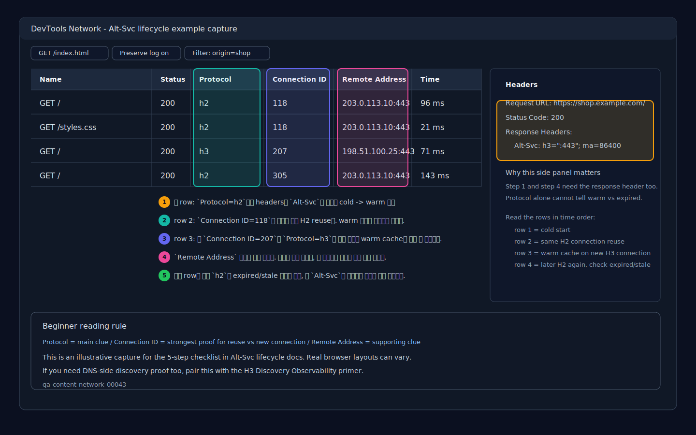

# Alt-Svc Cache Lifecycle Basics


> 한 줄 요약: Alt-Svc Cache Lifecycle Basics는 입문자가 먼저 잡아야 할 핵심 기준과 실무에서 헷갈리는 경계를 한 문서에서 정리한다.
> `Alt-Svc`가 첫 방문을 즉시 HTTP/3로 바꾸는 마법이 아니라, browser가 다음 새 connection에서 쓸 수 있는 H3 힌트를 cache하고 만료시키는 흐름이라는 점을 초급자 눈높이로 설명하는 primer

**난이도: 🟢 Beginner**


관련 문서:

- [카테고리 README](./README.md)
- [우아코스 백엔드 CS 로드맵](../../JUNIOR-BACKEND-ROADMAP.md)
- [연결 입문 문서](../security/session-cookie-jwt-basics.md)

> 이 문서는 H3 `Alt-Svc` 초급 사다리의 **메인 엔트리**다. `Alt-Svc`가 왜 나중에 `421` 이야기로 이어지는지 먼저 짧게 붙이고 싶으면 [Alt-Svc To 421 Timeline Bridge](./alt-svc-to-421-timeline-bridge.md)부터 보고, lifecycle을 잡은 뒤 `ma`/scope/`421` 분기나 stale recovery로 내려가고 싶으면 아래 후속 문서로 이어가면 된다.

> 관련 문서:
> - [Alt-Svc To 421 Timeline Bridge](./alt-svc-to-421-timeline-bridge.md)
> - [Alt-Svc Header Reading Micro-Note](./alt-svc-header-reading-micro-note.md)
> - [브라우저의 HTTP 버전 선택: ALPN, Alt-Svc, Fallback 입문](./browser-http-version-selection-alpn-alt-svc-fallback.md)
> - [Alt-Svc `ma`, Cache Scope, 421 Reuse Primer](./alt-svc-ma-cache-scope-421-reuse-primer.md)
> - [Alt-Svc vs HTTPS RR Freshness Bridge](./alt-svc-vs-https-rr-freshness-bridge.md)
> - [H3 Stale Alt-Svc 421 Recovery Primer](./h3-stale-alt-svc-421-recovery-primer.md)
> - [Alt-Svc와 HTTPS RR, SVCB: H3 discovery와 coalescing bridge](./alt-svc-https-rr-h3-discovery-coalescing-bridge.md)
> - [H3 Discovery Observability Primer](./h3-discovery-observability-primer.md)
> - [HTTP/2와 HTTP/3 Connection Coalescing 입문](./http2-http3-connection-reuse-coalescing.md)
> - [HTTP/2, HTTP/3 Downgrade Attribution, Alt-Svc, UDP Block](./http2-http3-downgrade-attribution-alt-svc-udp-block.md)
> - [HTTP/3 Cross-Origin Reuse Guardrails Primer](./http3-cross-origin-reuse-guardrails-primer.md)

retrieval-anchor-keywords: alt-svc cache lifecycle, alt-svc cache warming, alt-svc expiry, alt-svc stale hint, first visit vs repeat visit h3, first request h2 next request h3, repeat visit http/3, alt-svc ma max age, browser alt-svc cache, alt-svc fallback, alt-svc 뭐예요, 처음 배우는데 alt-svc, alt-svc cache 헷갈려요, 왜 첫 요청은 h2고 다음 요청은 h3예요, alt-svc 언제 h3로 바뀌어요

> [!IMPORTANT]
> 먼저 경계부터 잡자. `Alt-Svc` cache는 "다음 새 connection에서 H3를 시도할 힌트 메모"이고, HTTP response cache는 "응답 본문(HTML/이미지/json) 재사용"이다.
>
> | 구분 | `Alt-Svc` cache | HTTP response cache |
> |---|---|---|
> | 저장 대상 | 다음 protocol/endpoint 힌트 | 응답 body + validator |
> | 바로 보이는 증상 | 다음 새 connection에서 `h3` 시도 가능 | `memory cache`/`disk cache`/`304` |

## 이 문서의 자리: 브리지 -> 메인 -> 후속

| 단계 | 문서 | 언제 들어가면 좋은가 |
|---|---|---|
| 브리지 | [Alt-Svc To 421 Timeline Bridge](./alt-svc-to-421-timeline-bridge.md) | "`Alt-Svc`가 왜 나중에 `421`로 이어지지?"를 1개 타임라인으로 먼저 붙이고 싶을 때 |
| 메인 | [Alt-Svc Cache Lifecycle Basics](./alt-svc-cache-lifecycle-basics.md) | cold -> warm -> expired -> stale 흐름 자체를 처음 잡을 때 |
| 후속 1 | [Alt-Svc `ma`, Cache Scope, 421 Reuse Primer](./alt-svc-ma-cache-scope-421-reuse-primer.md) | `ma`, origin scope, `421` 의미가 한꺼번에 섞일 때 |
| 후속 2 | [H3 Stale Alt-Svc 421 Recovery Primer](./h3-stale-alt-svc-421-recovery-primer.md) | stale hint 뒤 `421 -> 재시도 성공` trace를 더 구체적으로 보고 싶을 때 |

짧게 기억하면:

- 브리지는 "왜 `421`로 이어지나"를 먼저 연결한다
- 이 문서는 lifecycle 자체를 고정하는 메인 읽기다
- 후속 문서는 `ma/scope/421` 분기와 stale recovery 증상을 더 자세히 다룬다

<details>
<summary>Table of Contents</summary>

## 이 문서의 자리: 브리지 -> 메인 -> 후속 (계속 2)

- [먼저 잡는 mental model](#먼저-잡는-mental-model)
- [초급자 빠른 라우팅 (질문별 20초 분기)](#초급자-빠른-라우팅-질문별-20초-분기)
- [Alt-Svc cache, HTTP cache, connection reuse를 먼저 구분하기](#alt-svc-cache-http-cache-connection-reuse를-먼저-구분하기)
- [Alt-Svc cache가 기억하는 것](#alt-svc-cache가-기억하는-것)
- [첫 방문과 반복 방문은 왜 다르게 보이나](#첫-방문과-반복-방문은-왜-다르게-보이나)
- [repeat visit도 모두 같은 뜻은 아니다](#repeat-visit도-모두-같은-뜻은-아니다)
- [warming, expiry, stale hint를 타임라인으로 보기](#warming-expiry-stale-hint를-타임라인으로-보기)
- [강제 무효화와 자연 만료를 먼저 가르기](#강제-무효화와-자연-만료를-먼저-가르기)
- [짧은 비교표](#짧은-비교표)
- [구체적인 예시](#구체적인-예시)
- [흔한 오해](#흔한-오해)
- [오해를 줄이는 30초 진단표](#오해를-줄이는-30초-진단표)
- [DevTools 5단계 체크리스트 (cold/warm/stale)](#devtools-5단계-체크리스트-coldwarmstale)
- [초급자용 판독 순서](#초급자용-판독-순서)
- [관찰할 때 볼 것](#관찰할-때-볼-것)
- [self-check mini quiz](#self-check-mini-quiz)
- [다음에 이어서 볼 문서](#다음에-이어서-볼-문서)
- [한 줄 정리](#한-줄-정리)

</details>

## 먼저 잡는 mental model

`Alt-Svc` cache는 browser 안의 작은 메모장처럼 생각하면 된다.

처음 `https://www.example.com`에 갔을 때 서버가 이렇게 말할 수 있다.

```http
Alt-Svc: h3=":443"; ma=86400
```

헤더 값 모양 자체가 낯설면 먼저 [Alt-Svc Header Reading Micro-Note](./alt-svc-header-reading-micro-note.md)로 가서 `h3`, `:443`, `ma`를 한 줄씩 읽고 돌아오면 된다.

browser는 이것을 이렇게 적어 둔다.

```text
www.example.com은 다음 새 connection에서 h3도 시도해 볼 수 있다.
이 메모는 최대 86400초 동안 유효하다.
```

중요한 감각은 네 가지다.

- `Alt-Svc`는 보통 **이번 응답의 protocol을 바꾸지 않는다**
- 대신 browser가 **다음 새 connection**에서 H3를 시도할 근거를 만든다
- 시간이 지나거나 실패가 반복되면 그 힌트는 만료되거나 덜 신뢰될 수 있다
- 서버가 `Alt-Svc: clear`나 `ma=0`으로 **의도적으로 힌트를 끝내는 경우**도 있다

그래서 입문자가 보는 "첫 방문은 H2, 다음 방문은 H3" 현상은 자연스러운 결과다.

### Retrieval Anchors

- `Alt-Svc cache lifecycle`
- `Alt-Svc cache warming`
- `Alt-Svc expiry`
- `Alt-Svc stale hint`
- `first visit vs repeat visit H3`
- `first request h2 next request h3`
- `repeat visit HTTP/3`
- `same tab refresh still h2`
- `Alt-Svc cache vs connection reuse`
- `Alt-Svc cache vs HTTP cache`
- `warm cache new connection h3`

---

## 초급자 빠른 라우팅 (질문별 20초 분기)

이 문서는 lifecycle(배움 -> 유지 -> 만료 -> stale)을 잡는 entrypoint다.
읽다가 질문이 아래처럼 바뀌면 바로 다음 문서로 넘어가면 된다.

| 지금 막힌 질문 | 먼저 볼 문서 | 왜 그 문서가 맞나 |
|---|---|---|
| "`ma`가 길면 H3 connection도 오래 고정되나요?" | [Alt-Svc `ma`, Cache Scope, 421 Reuse Primer](./alt-svc-ma-cache-scope-421-reuse-primer.md) | `ma`(hint TTL), cache scope(origin), `421`(reuse 교정)을 한 번에 분리해 준다 |
| "`www`가 배운 Alt-Svc를 `api`도 바로 같이 써도 되나요?" | [Alt-Svc `ma`, Cache Scope, 421 Reuse Primer](./alt-svc-ma-cache-scope-421-reuse-primer.md) | "누가 배운 힌트인가"와 cross-origin reuse를 섞지 않게 정리한다 |
| "`421`이 떴는데 Alt-Svc가 완전히 깨진 건가요?" | [Alt-Svc `ma`, Cache Scope, 421 Reuse Primer](./alt-svc-ma-cache-scope-421-reuse-primer.md) | `421`을 전체 실패가 아니라 reuse 경계 교정 신호로 읽게 도와준다 |
| "첫 H3 시도는 `421`인데 바로 다시 성공해요" | [H3 Stale Alt-Svc 421 Recovery Primer](./h3-stale-alt-svc-421-recovery-primer.md) | stale hint/예전 authority -> `421` -> fresh path recovery 패턴을 초급자 타임라인으로 보여준다 |
| "어제는 H3였는데 오늘은 첫 요청이 느리고 H2예요" | [H3 Stale Alt-Svc 421 Recovery Primer](./h3-stale-alt-svc-421-recovery-primer.md) | stale path 시도 뒤 fallback/recovery가 어떻게 보이는지 증상 중심으로 이어진다 |

요약하면:

- lifecycle 자체가 헷갈리면 이 문서에 머문다
- `ma`/scope/`421` 의미가 섞이면 `ma/scope/421` primer로 간다
- stale 힌트 이후 첫 실패-재성공 흐름이 궁금하면 stale-recovery primer로 간다

---

## Alt-Svc cache, HTTP cache, connection reuse를 먼저 구분하기

초급자에게 가장 큰 혼동은 browser가 "무언가를 기억한다"는 말을 모두 같은 cache로 받아들이는 데서 생긴다.

| 이름 | 무엇을 기억하나 | 흔한 착각 |
|---|---|---|
| `Alt-Svc` cache | 다음 새 connection에서 시도할 H3 endpoint 힌트 | "응답이 캐시됐으니 H3가 됐다"라고 생각하기 쉽다 |
| HTTP cache | HTML, 이미지, validator 같은 response 재사용 정보 | `304`, `memory cache`, `disk cache`와 연결된다 |
| existing connection reuse | 이미 열려 있는 H2/H3 연결 자체 | repeat visit이면 무조건 새 protocol을 고른다고 생각하기 쉽다 |

그래서 "repeat visit인데 왜 아직 H2지?"라는 질문은 세 가지를 따로 봐야 한다.

- `Alt-Svc` 힌트가 있는가
- 이미 열려 있는 H2 connection을 재사용 중인가
- HTTP response cache를 본 현상과 섞어 읽고 있지는 않은가

---

## Alt-Svc cache가 기억하는 것

`Alt-Svc` cache는 HTTP 응답 body를 저장하는 일반 HTTP cache와 다르다.
이미지나 HTML을 저장하는 것이 아니라, **다음 연결 후보**를 기억한다.

| 기억하는 항목 | 예시 | 의미 |
|---|---|---|
| 원래 origin | `https://www.example.com` | 이 힌트가 적용되는 사이트 이름 |
| alternative protocol | `h3` | 다음에 HTTP/3를 시도할 수 있음 |
| alternative endpoint | `:443` 또는 `edge.example.net:443` | QUIC/H3로 가 볼 위치 |
| 유효 시간 | `ma=86400` | 이 힌트를 얼마 동안 기억할 수 있는지 |

예를 들어 아래 header는:

```http
Alt-Svc: h3="edge.example.net:443"; ma=3600
```

초급자 관점에서 이렇게 읽으면 된다.

- "`www.example.com` 요청을 다음에 새로 연결할 때"
- "`edge.example.net:443`의 H3 경로도 후보로 삼을 수 있다"
- "이 힌트는 최대 1시간 정도 기억할 수 있다"

단, 이 정보는 **시도 후보**다.
H3 성공, cross-origin connection 공유, certificate/routing 허가는 별도 단계다.

---

## 첫 방문과 반복 방문은 왜 다르게 보이나

가장 흔한 흐름은 아래처럼 보인다.

| 시점 | browser가 아는 것 | 흔한 protocol 결과 |
|---|---|---|
| 첫 방문 전 | 아직 `Alt-Svc` cache가 비어 있음 | H2 또는 H1.1로 시작 |
| 첫 응답 후 | `Alt-Svc: h3=...; ma=...`를 배움 | 아직 이번 응답은 원래 protocol |
| 다음 새 connection | H3 후보를 알고 있음 | H3 시도, 성공하면 H3 |
| H3 실패 | UDP 차단/edge 문제 등을 경험 | H2/H1.1 fallback |
| `ma` 만료 후 | 힌트를 더 이상 신뢰하지 않음 | 다시 H2/H1.1로 시작할 수 있음 |

여기서 "다음 요청"과 "다음 새 connection"은 다를 수 있다.

- 이미 열려 있는 H2 connection이 건강하면 browser가 그대로 재사용할 수 있다
- 그래서 `Alt-Svc`를 배운 직후의 같은 탭 요청이 반드시 H3로 바뀌지는 않는다
- 새 탭, 일정 시간 후, 기존 connection 종료 후에야 차이가 보일 수 있다

큰 흐름은 [브라우저의 HTTP 버전 선택: ALPN, Alt-Svc, Fallback 입문](./browser-http-version-selection-alpn-alt-svc-fallback.md)에서 이어서 보면 된다.

---

## repeat visit도 모두 같은 뜻은 아니다

입문자가 가장 많이 헷갈리는 지점은 `repeat visit`을 언제나 "새 connection이 생긴 방문"이라고 생각하는 것이다.
브라우저는 같은 사이트를 다시 열어도 기존 H2 connection을 그대로 재사용할 수 있고, 이 경우 warm `Alt-Svc` cache가 있어도 화면상 protocol은 계속 `h2`로 보일 수 있다.

connection 재사용 감각을 더 보고 싶으면 [HTTP/2와 HTTP/3 Connection Coalescing 입문](./http2-http3-connection-reuse-coalescing.md)을 이어서 보면 된다.

짧은 안전 규칙:

- `repeat visit`이라는 말만으로는 아직 부족하다.
- 먼저 `새 connection이 필요한 장면인가?`를 확인한 뒤에야 `Alt-Svc` warm/expired/stale를 붙여 읽는다.

| repeat visit 장면 | `Alt-Svc` cache 상태 | connection 상태 | 흔한 protocol 모습 | 초급자 해석 |
|---|---|---|---|---|
| 같은 탭에서 바로 추가 요청 | Warm | 기존 H2 connection 재사용 | 계속 H2 | repeat visit이어도 아직 "새 길"을 탐색하지 않음 |
| 잠시 후 새 connection이 필요해짐 | Warm | 새 connection | H3 시도 후 성공하면 H3 | warm cache가 실제로 힘을 쓰는 순간 |
| 시간이 지나 `ma`가 만료됨 | Expired | 새 connection | 다시 H2/H1.1로 시작 | repeat visit이지만 cold처럼 다시 배움 |
| 힌트는 남았지만 네트워크/edge가 바뀜 | Stale | 새 connection | H3 시도 뒤 H2/H1.1 fallback | 메모는 남았지만 현실의 길이 달라짐 |

그래서 아래 두 질문은 다른 질문이다.

- "repeat visit인데 왜 아직 H2지?" -> 기존 connection 재사용일 수 있다
- "repeat visit인데 왜 다시 H2로 내려갔지?" -> `ma` 만료나 stale hint fallback일 수 있다

---

## warming, expiry, stale hint를 타임라인으로 보기

> [!WARNING]
> 이 타임라인은 `Alt-Svc` 힌트 수명선을 보는 것이다. 여기서 보이는 `Warm`/`Expired`/`Stale`은 HTTP 응답 캐시의 `304 Not Modified`와 같은 뜻이 아니다.
>
> `304`는 "body를 다시 받지 않아도 되는가"를 말하고, `Alt-Svc` lifecycle은 "다음 새 connection에서 H3 힌트를 아직 믿는가"를 말한다.

### 1. Cache warming: 힌트를 처음 배움

```text
1. browser -> https://www.example.com
2. 첫 connection은 H2로 성립
3. response header에 Alt-Svc: h3=":443"; ma=86400
4. browser가 Alt-Svc cache에 H3 후보를 저장
```

이것을 cache warming이라고 볼 수 있다.
아직 "H3 성공"이 아니라, **다음에 H3를 시도할 준비가 됨**에 가깝다.

### 2. Repeat visit: warm cache가 H3 시도를 앞당김

```text
1. 같은 origin에 새 connection이 필요해짐
2. browser가 Alt-Svc cache를 확인
3. h3 후보가 아직 유효함
4. QUIC/H3 시도
5. 성공하면 이번 connection은 H3
```

그래서 같은 사이트라도 clean profile 첫 방문과 평소 방문이 다르게 보일 수 있다.

- clean profile: H2로 시작한 뒤 `Alt-Svc`를 배움
- 평소 profile: 이미 warm cache가 있어 H3를 먼저 시도할 수 있음

짧은 혼동 방지:

- repeat visit = 새 connection 보장 아님
- repeat visit = H3 아님
- warm `Alt-Svc` = 현재 요청 즉시 H3 아님

| DevTools에서 먼저 보인 것 | 바로 내리기 쉬운 오해 | 더 안전한 해석 |
|---|---|---|
| `Status 304` | "`Alt-Svc`도 warm이라서 H3가 보이겠구나" | `304`는 HTTP response cache 재검증 결과다. `Alt-Svc` 힌트 유효성과는 별개다 |
| `Protocol h3` | "응답이 캐시돼서 h3가 됐다" | `h3`는 전송 경로이고, cache hit/`304`는 body 재사용 경로다 |
| `Protocol h2` + `Status 304` | "`Alt-Svc`가 만료됐나 보다" | 기존 H2 reuse, fresh `Alt-Svc` 부재, 또는 단순 HTTP cache 재검증을 따로 나눠 봐야 한다 |

### 3. Expiry: `ma`가 지나면 힌트를 잊음

`ma`는 max age다.

```http
Alt-Svc: h3=":443"; ma=60
```

이 경우 browser는 이 힌트를 짧게만 기억할 수 있다.
만료 후 새 connection에서는 H3 후보를 모르는 상태처럼 행동할 수 있다.

입문 감각으로는:

## warming, expiry, stale hint를 타임라인으로 보기 (계속 2)

- warm cache가 있을 때: "전에 배운 H3 길이 아직 유효하니 먼저 시도"
- expired cache일 때: "예전 메모는 낡았으니 기본 경로부터 다시 확인"

### 3-1. `ma=0`: 서버가 힌트 수명을 지금 끝냄

아래처럼 `ma=0`이 오면 초급자는 이렇게 읽으면 된다.

```http
Alt-Svc: h3=":443"; ma=0
```

- "예전에 배운 이 H3 힌트를 이번 응답으로 종료한다"
- 그냥 시간이 흘러 끝난 것이 아니라, **서버가 수명을 0으로 만든 것**에 가깝다

즉 자연 만료는 "시계가 다 돌아서 끝남"이고, `ma=0`은 "서버가 지금 끝내라고 말함"이다.

### 3-2. `Alt-Svc: clear`: Alt-Svc 메모장을 비우라는 신호

아래 header는 더 직접적인 강제 무효화 신호다.

```http
Alt-Svc: clear
```

- "이 origin에 대해 기억한 Alt-Svc 후보를 비워라"
- 특정 후보 하나의 남은 시간을 줄이는 것보다, **alternative service 메모 자체를 비우는 쪽**으로 이해하면 된다

입문 감각으로는:

- 자연 만료: 메모에 적힌 시간이 그냥 지남
- `ma=0`: 서버가 "이 메모는 지금부터 무효"라고 말함
- `clear`: 서버가 "Alt-Svc 후보 목록 자체를 비워"라고 말함

### 4. Stale hint: 메모는 남았지만 현실이 바뀜

stale hint는 "browser가 아직 힌트를 기억하는데, 실제 서버/네트워크 상태가 바뀐" 상황이다.

예를 들면:

- CDN 설정에서 H3 listener를 내렸는데 browser cache에는 예전 `h3=":443"`가 남아 있음
- 회사망에 들어와 UDP 443이 막혔는데 집에서 배운 H3 힌트가 남아 있음
- edge endpoint가 바뀌었는데 일부 client가 예전 alternative endpoint를 계속 시도함

이때 정상적인 browser는 보통 사용자에게 바로 에러를 보여 주기보다 fallback을 시도한다.

회사망에서 집망으로 옮긴 뒤 첫 H3 시도만 잠깐 흔들리는 식의 현실 예시는 [H3 Stale Alt-Svc 421 Recovery Primer](./h3-stale-alt-svc-421-recovery-primer.md)의 "회사망에서 집망으로 바꿨을 때 타임라인 예시"를 같이 보면 바로 연결된다.

```text
stale Alt-Svc hint로 H3 시도
        ↓
QUIC 연결 실패 또는 timeout
        ↓
TCP+TLS로 fallback
        ↓
ALPN 결과에 따라 H2/H1.1 사용
```

## warming, expiry, stale hint를 타임라인으로 보기 (계속 3)

운영자가 볼 때는 "가끔 첫 요청이 느리다", "특정 네트워크에서만 H3 비율이 낮다"처럼 보일 수 있다.
이 더 깊은 운영 판독은 [HTTP/2, HTTP/3 Downgrade Attribution, Alt-Svc, UDP Block](./http2-http3-downgrade-attribution-alt-svc-udp-block.md)에서 다룬다.

---

## 짧은 비교표

| 상태 | browser 안의 감각 | first/repeat behavior | 주의할 점 |
|---|---|---|---|
| Cold | 아직 H3 힌트를 모름 | 첫 방문은 H2/H1.1일 수 있음 | response의 `Alt-Svc`는 다음을 위한 힌트 |
| Warm | 유효한 H3 힌트를 기억함 | 새 connection에서 H3를 더 빨리 시도 | 기존 H2 connection 재사용이면 바로 안 보일 수 있음 |
| Expired | `ma`가 지나 힌트를 신뢰하지 않음 | 다시 기본 경로로 시작할 수 있음 | 만료 후 새 응답에서 다시 배울 수 있음 |
| `ma=0` | 서버가 이번 응답으로 힌트 수명을 바로 끝냄 | 다음 새 connection은 cold처럼 다시 판단 | 자연 timeout이 아니라 명시적 종료다 |
| `clear` | 서버가 Alt-Svc 후보 메모를 비우라고 함 | 다음 새 connection은 alternative service 없이 다시 시작 | forced invalidation을 가장 직접적으로 보여 준다 |
| Stale | 힌트는 남았지만 현실이 바뀜 | H3 시도 후 fallback 가능 | 짧은 지연이나 H3 비율 하락으로 보일 수 있음 |
| Cleared | profile/cache가 지워짐 | clean first visit처럼 보임 | DevTools의 HTTP cache 끄기와 같다고 단정하지 않음 |

---

## 강제 무효화와 자연 만료를 먼저 가르기

초급자가 가장 많이 헷갈리는 질문은 "`그냥 시간이 지나 끝난 건가`, `서버가 일부러 지운 건가`"다.

| 장면 | 누가 끝내나 | beginner 해석 | forced invalidation인가 |
|---|---|---|---|
| 자연 만료 | 시간(`ma`) | "예전에 배운 메모가 시계 다 돌아서 끝남" | 아니다 |
| `ma=0` | 서버 응답 | "서버가 이 힌트 수명을 지금 0으로 만듦" | 맞다 |
| `Alt-Svc: clear` | 서버 응답 | "서버가 Alt-Svc 후보 목록 자체를 비우라고 함" | 맞다 |

한 줄로 줄이면:

- 자연 만료는 ordinary timeout이다
- `ma=0`과 `Alt-Svc: clear`는 서버가 의도적으로 개입한 강제 무효화다

### 10초 비유

- 자연 만료: 주차권 시간이 그냥 끝남
- `ma=0`: 안내원이 "그 주차권은 지금부터 무효"라고 찍음
- `clear`: 안내원이 "등록된 임시 주차 목록 자체를 비워"라고 말함

### 응답별 빠른 해석

| 응답 header | 안전한 해석 | 다음 새 connection에서 기대할 것 |
|---|---|---|
| `Alt-Svc: h3=":443"; ma=86400` | H3 힌트를 하루 동안 기억 가능 | warm이면 H3를 시도할 수 있음 |
| `Alt-Svc: h3=":443"; ma=0` | 그 H3 힌트를 이번 응답으로 종료 | cold처럼 기본 경로부터 다시 판단 |
| `Alt-Svc: clear` | Alt-Svc 대체 경로 메모를 비움 | alternative service 후보 없이 다시 시작 |

### 흔한 혼동 3개

- `ma=0`을 "곧 만료될 예정"으로 읽으면 안 된다. 이미 이번 응답에서 종료를 지시한 것이다.
- `Alt-Svc: clear`를 HTTP body cache purge처럼 읽으면 안 된다. 지우는 대상은 응답 본문이 아니라 Alt-Svc 힌트다.
- 자연 만료와 forced invalidation은 둘 다 다음 요청이 H2/H1.1처럼 보일 수 있지만, 원인은 다르다.

---

## 구체적인 예시

### 예시 1: 첫 방문은 H2, 두 번째 방문은 H3

1. 새 browser profile로 `https://shop.example.com`에 접속한다.
2. 첫 main document는 `Protocol = h2`로 보인다.
3. response header에 `Alt-Svc: h3=":443"; ma=86400`가 있다.
4. browser를 다시 열거나 새 connection이 필요해진다.
5. 같은 origin 요청이 `Protocol = h3`로 보인다.

이것은 이상한 downgrade/upgrade가 아니라 `Alt-Svc` cache warming의 흔한 모습이다.

### 예시 2: 어제는 H3였는데 오늘은 H2

가능한 beginner 해석은 여러 개다.

| 가능성 | 확인 방향 |
|---|---|
| `Alt-Svc` hint가 만료됨 | response에 새 `Alt-Svc`가 다시 오는지 확인 |
| UDP 443이 막힌 네트워크로 이동 | 다른 네트워크와 protocol 분포 비교 |
| server/edge가 H3 광고를 중단 | response header와 CDN 설정 확인 |
| browser가 실패 후 잠시 H3 시도를 줄임 | 같은 조건에서 시간이 지난 뒤 재확인 |

단정하기보다 "cache 만료", "stale hint fallback", "네트워크별 UDP 차단"을 나눠 본다.

### 예시 3: DevTools에서 `Disable cache`를 켰는데도 결과가 애매함

DevTools의 `Disable cache`는 주로 HTTP response cache 관찰에 쓰인다.
`Alt-Svc` cache, DNS cache, socket pool까지 모두 같은 방식으로 깨끗해진다고 단정하면 안 된다.

초급자용 실험에서는 아래처럼 조건을 분리한다.

- 새 browser profile 또는 시크릿 창으로 cold 상태를 만든다
- 기존 탭과 열린 connection을 닫는다
- 첫 request와 이후 새 connection을 따로 본다
- response `Alt-Svc`, DevTools `Protocol`, DNS HTTPS RR을 함께 본다

관측 절차는 [H3 Discovery Observability Primer](./h3-discovery-observability-primer.md)에서 이어서 보면 된다.

---

## 흔한 오해

### `Alt-Svc`가 있으면 이번 응답이 이미 H3인가

아니다.
`Alt-Svc`는 response header로 보일 수 있지만, 그 response 자체가 H2로 온 것일 수 있다.
핵심은 "다음 새 connection의 후보"다.

### `ma=86400`이면 반드시 24시간 동안 H3를 쓰나

아니다.
`ma`는 힌트의 유효 시간이지 성공 보장이 아니다.
UDP 차단, QUIC 실패, browser policy, edge 설정에 따라 H2/H1.1로 fallback될 수 있다.

### `Alt-Svc` cache는 HTTP cache와 같은가

아니다.
HTTP cache는 response body나 validator를 다루고, `Alt-Svc` cache는 alternative service 힌트를 다룬다.
`Cache-Control`과 같은 문서 캐시 규칙으로만 설명하면 헷갈린다.

특히 `304 Not Modified`는 `Alt-Svc` cache 상태를 직접 말해 주지 않는다.
`304`는 "서버가 body 재전송을 생략했다"는 뜻일 뿐이고, `Warm`/`Expired`/`Stale` 판독은 별도로 해야 한다.

### 오래된 `Alt-Svc` hint가 있으면 장애가 바로 난다는 뜻인가

보통은 아니다.
대부분 client는 실패하면 fallback한다.
다만 fallback까지 걸리는 시간 때문에 첫 요청 latency가 늘거나 H3 성공률이 낮아질 수 있다.

### HTTPS RR이 있으면 Alt-Svc cache lifecycle은 안 봐도 되나

아니다.
두 discovery 입력이 함께 있을 수 있다.
HTTPS RR은 DNS에서 먼저 오는 힌트이고, `Alt-Svc`는 HTTP response 후 cache되는 힌트다.
둘을 구분하는 bridge는 [Alt-Svc와 HTTPS RR, SVCB: H3 discovery와 coalescing bridge](./alt-svc-https-rr-h3-discovery-coalescing-bridge.md)에서 다룬다.

---

## 오해를 줄이는 30초 진단표

| 지금 보이는 장면 | 먼저 볼 것 | 다음 단계 문서 |
|---|---|---|
| repeat visit인데 계속 `h2` | 기존 H2 connection 재사용인지 확인 | [브라우저의 HTTP 버전 선택: ALPN, Alt-Svc, Fallback 입문](./browser-http-version-selection-alpn-alt-svc-fallback.md) |
| 어제 `h3`였는데 오늘 `h2` | `ma` 만료인지, UDP 443 경로가 바뀌었는지 분리 | [HTTP/2, HTTP/3 Downgrade Attribution, Alt-Svc, UDP Block](./http2-http3-downgrade-attribution-alt-svc-udp-block.md) |
| response에 `Alt-Svc`가 있는데 첫 요청은 `h2` | 정상이다. `Alt-Svc`는 보통 다음 새 connection 힌트다 | [브라우저의 HTTP 버전 선택: ALPN, Alt-Svc, Fallback 입문](./browser-http-version-selection-alpn-alt-svc-fallback.md) |
| `Disable cache`를 켰더니 해석이 더 꼬인다 | HTTP cache 실험과 Alt-Svc/discovery 실험을 분리 | [H3 Discovery Observability Primer](./h3-discovery-observability-primer.md) |

이 표로 질문 종류를 먼저 나누면 cache lifecycle, connection reuse, fallback을 한 번에 섞어 해석하는 실수를 줄일 수 있다.

---

## DevTools 5단계 체크리스트 (cold/warm/stale)

아래 5단계만 순서대로 보면 초급자도 `cold`/`warm`/`stale`를 빠르게 판독할 수 있다.
한 단계에서 결론이 나면 다음 단계는 확인용으로만 본다.

아래 예시 캡처는 이 5단계를 실제 DevTools 열에 겹쳐 놓은 한 장짜리 companion이다.
핵심은 `Protocol`을 먼저 보고, `Connection ID`로 "기존 연결 재사용인지 새 연결인지"를 고정한 뒤, `Remote Address`를 보조 증거로 쓰는 순서다.



| 캡처에서 바로 읽는 포인트 | 초급자 해석 |
|---|---|
| row 1이 `h2`이고 headers에 `Alt-Svc`가 있음 | 지금 응답이 H2여도 `Cold -> Warm 준비`일 수 있다 |
| row 2가 같은 `Connection ID`를 유지 | warm cache가 있어도 기존 H2 reuse면 계속 `h2`로 보일 수 있다 |
| row 3이 새 `Connection ID` + `h3` | warm cache가 새 connection에서 실제로 힘을 쓴 장면이다 |
| `Remote Address`가 바뀜 | 읽기 쉬워지지만, 바뀌지 않아도 판독이 틀린 것은 아니다 |
| 나중 row가 다시 `h2` | 바로 실패로 단정하지 말고 `Expired`/`Stale` 후보로 좁힌다 |

| 단계 | DevTools에서 보는 것 | 이렇게 보이면 | 우선 판독 |
|---|---|---|---|
| 1 | `Protocol` (첫 main document) | 첫 방문이 `h2/h1`이고 response에 `Alt-Svc`가 있음 | `Cold -> Warm 준비` |
| 2 | 같은 origin의 다음 **새 connection** 요청 `Protocol` | `h3`로 전환됨 | `Warm` 가능성 높음 |
| 3 | 같은 탭 연속 요청인데 계속 `h2` | `Connection ID`가 동일 | `Warm이어도 기존 H2 재사용` |
| 4 | 어제는 `h3`, 오늘 첫 요청 `h2/h1` | response에 `Alt-Svc`가 다시 보임 | `Expired 후 재학습` 가능성 |
| 5 | 첫 시도 지연/실패 뒤 성공 | `h3` 시도 흔적 + 이후 `h2/h1` 또는 새 `h3` 성공 | `Stale hint 후 fallback/recovery` 가능성 |

특히 같은 URL이 `421 -> retry`처럼 두 줄로 보이면 [H3 Stale Alt-Svc 421 Recovery Primer](./h3-stale-alt-svc-421-recovery-primer.md)로 바로 넘어가면 초급자도 `낡은 힌트 교정`과 `앱 중복 호출`을 덜 섞는다.

짧은 예시:

## DevTools 5단계 체크리스트 (cold/warm/stale) (계속 2)

- 첫 줄: `Protocol=h2`, response `Alt-Svc: h3=":443"; ma=86400`
- 다음 새 connection: `Protocol=h3`
- 며칠 후 다른 네트워크: 첫 시도 느림 -> 결과 `h2`

이 장면은 보통 `Cold -> Warm -> Stale fallback` 흐름으로 읽는다.

### 흔한 혼동 3가지

- `Disable cache`를 켰다고 `Alt-Svc` 상태까지 항상 초기화되는 것은 아니다.
- `Warm`인데도 같은 탭은 기존 H2 재사용으로 계속 `h2`일 수 있다.
- `Stale`은 "즉시 장애"보다 "첫 시도 지연 + fallback 성공"으로 보이는 경우가 많다.
- `Remote Address`는 보조 단서다. `Connection ID`가 더 직접적인 증거이며, address가 같다고 새 connection이 아니라고 단정하면 안 된다.

---

## 초급자용 판독 순서

처음 읽을 때는 위 `DevTools 5단계 체크리스트`를 먼저 적용하고, 아래 순서로 원인을 좁힌다.

1. 현재 request가 실제로 `h2`인지 `h3`인지 DevTools `Protocol`에서 확인한다.
2. response header에 `Alt-Svc`가 있었는지 본다.
3. 이미 열려 있던 connection을 재사용한 장면인지, 새 connection이 필요했던 장면인지 나눈다.
4. `ma` 만료(Expired)인지, 힌트는 남았지만 경로가 달라진 stale hint인지 분리한다.
5. H3 시도 후 fallback된 것인지, 애초에 H3 힌트가 없었던 것인지 마지막에 판단한다.

이 순서를 지키면 `Disable cache`, repeat visit, stale hint, connection reuse가 한꺼번에 섞여도 훨씬 덜 헷갈린다.

---

## 관찰할 때 볼 것

입문 단계에서는 한 화면의 `h3`만 보고 결론 내리지 않는다.

| 질문 | 볼 단서 |
|---|---|
| cold 상태인가 warm 상태인가 | 새 profile인지, 기존 방문 이력이 있는지 |
| 첫 응답이 무엇을 광고했나 | response header의 `Alt-Svc` |
| 실제 요청 protocol은 무엇인가 | DevTools `Protocol` column |
| DNS가 먼저 H3 힌트를 줬나 | `dig HTTPS`의 `alpn="h3"` |
| fallback이 일어났나 | H3 힌트는 있는데 결과가 H2/H1.1인지 |

실험 문장은 이렇게 조심스럽게 쓰는 편이 좋다.

| 표현 | 더 안전한 이유 |
|---|---|
| "첫 clean request는 H2였고, response에서 `Alt-Svc`를 배운 뒤 이후 새 connection이 H3였다" | 시간 순서가 드러남 |
| "`Alt-Svc` driven으로 보이지만 HTTPS RR 여부도 확인해야 한다" | DNS 기반 discovery 가능성을 남김 |
| "H3 힌트는 있지만 이 네트워크에서는 fallback되는 것으로 보인다" | UDP 차단/정책 가능성을 포함 |

---

## self-check mini quiz

문서 끝에서 아래 3문항만 스스로 답해 보면 `warm인데 h2 유지`와 `stale fallback` 오판을 많이 줄일 수 있다.

| 문항 | 스스로 먼저 답할 질문 | 정답 |
|---|---|---|
| 1 | 응답 header에 `Alt-Svc`가 있고 cache도 warm처럼 보이는데, 같은 탭 다음 요청이 계속 `h2`다. 바로 "`warm이 아니다`"라고 결론 내릴까? | 아니다. 기존 H2 connection 재사용이면 warm cache가 있어도 계속 `h2`로 보일 수 있다. 먼저 `Connection ID`가 같은지 본다. |
| 2 | 어제는 `h3`였는데 오늘 첫 요청이 잠깐 느린 뒤 `h2`로 성공했다. 바로 "`Alt-Svc가 아예 사라졌다`"라고 결론 내릴까? | 아니다. `ma` 만료일 수도 있고, stale hint로 H3를 먼저 시도했다가 fallback했을 수도 있다. `Alt-Svc` header 재광고 여부와 첫 시도 흔적을 함께 본다. |
| 3 | 같은 URL이 DevTools에 두 줄 보인다. 첫 줄은 `421 h3`, 둘째 줄은 `200 h2`다. 이것을 앱 중복 호출로 먼저 볼까, stale recovery로 먼저 볼까? | 초급자 1차 가설은 stale recovery다. 첫 줄 `421`은 낡은 path/authority 교정 신호일 수 있고, 둘째 줄은 fresh path fallback 성공일 수 있다. |

### 10초 채점 기준

- 1번을 틀렸다면: `Alt-Svc cache`와 `existing connection reuse`를 아직 섞고 있다. 위의 [repeat visit도 모두 같은 뜻은 아니다](#repeat-visit도-모두-같은-뜻은-아니다)와 [DevTools 5단계 체크리스트 (cold/warm/stale)](#devtools-5단계-체크리스트-coldwarmstale)를 다시 본다.
- 2번을 틀렸다면: `expired`와 `stale`을 한 가지 현상으로 뭉개고 있다. [짧은 비교표](#짧은-비교표)와 [오해를 줄이는 30초 진단표](#오해를-줄이는-30초-진단표)를 다시 본다.
- 3번을 틀렸다면: `421`을 app status로 읽고 있을 가능성이 높다. [H3 Stale Alt-Svc 421 Recovery Primer](./h3-stale-alt-svc-421-recovery-primer.md)와 [Alt-Svc `ma`, Cache Scope, 421 Reuse Primer](./alt-svc-ma-cache-scope-421-reuse-primer.md)로 바로 이어서 본다.

한 줄로 다시 고정하면:

- warm인데 `h2`가 유지될 수 있다. 이유는 기존 connection reuse일 수 있다.
- stale fallback은 "첫 시도에서 잠깐 흔들린 뒤 성공"으로 보일 수 있다.
- `421`은 URL 오타보다 path/reuse 교정 신호로 먼저 읽는 편이 안전하다.

---

## 다음에 이어서 볼 문서

- H1/H2/H3 선택 흐름 전체는 [브라우저의 HTTP 버전 선택: ALPN, Alt-Svc, Fallback 입문](./browser-http-version-selection-alpn-alt-svc-fallback.md)
- `ma`가 hint TTL이고 cache scope가 origin 단위라는 감각을 먼저 고정하려면 [Alt-Svc `ma`, Cache Scope, 421 Reuse Primer](./alt-svc-ma-cache-scope-421-reuse-primer.md)
- stale `Alt-Svc`가 `421` 뒤 fresh path recovery로 보이는 장면을 바로 보려면 [H3 Stale Alt-Svc 421 Recovery Primer](./h3-stale-alt-svc-421-recovery-primer.md)
- 회사망/집망 전환처럼 browser가 stale hint를 잠깐 재사용하는 현실 예시를 바로 보려면 [H3 Stale Alt-Svc 421 Recovery Primer](./h3-stale-alt-svc-421-recovery-primer.md)의 해당 타임라인 섹션
- `Alt-Svc`와 DNS HTTPS RR/SVCB를 나눠 보려면 [Alt-Svc와 HTTPS RR, SVCB: H3 discovery와 coalescing bridge](./alt-svc-https-rr-h3-discovery-coalescing-bridge.md)
- DevTools, DNS, curl trace로 확인하려면 [H3 Discovery Observability Primer](./h3-discovery-observability-primer.md)
- H3 힌트는 있는데 H2로 내려가는 운영 해석은 [HTTP/2, HTTP/3 Downgrade Attribution, Alt-Svc, UDP Block](./http2-http3-downgrade-attribution-alt-svc-udp-block.md)
- H3 connection을 다른 origin과 공유해도 되는지는 [HTTP/3 Cross-Origin Reuse Guardrails Primer](./http3-cross-origin-reuse-guardrails-primer.md)

## 한 줄 정리

`Alt-Svc` cache lifecycle은 "처음 배움(warming) -> 다음 새 connection에서 활용 -> `ma`가 지나 만료 -> 현실이 바뀌면 stale hint로 H3 시도 후 fallback"의 흐름으로 보면 된다. 그래서 첫 방문과 반복 방문의 protocol이 달라질 수 있고, 오래된 힌트가 있어도 browser는 보통 H2/H1.1 fallback으로 서비스를 계속 이용하게 만든다.
