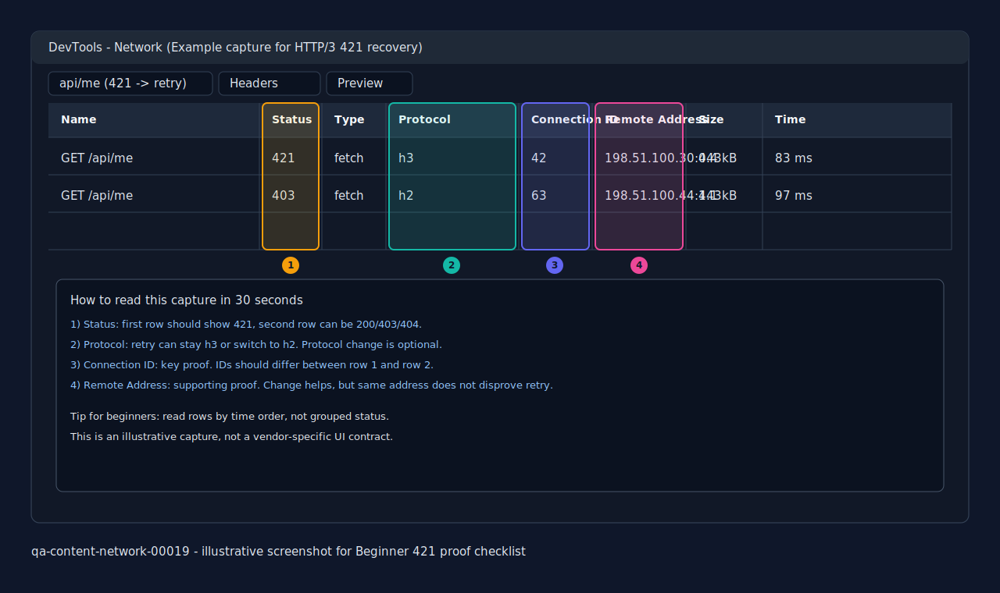

# HTTP/3 421 Observability Primer: DevTools와 Edge Log로 Coalescing Recovery 읽기

> Browser DevTools와 edge log에서 HTTP/3 wrong-connection reuse가 `421 Misdirected Request` 뒤 새 connection recovery로 보이는 흐름을 먼저 잡고, 이를 app-level `403`/`404` 같은 4xx와 섞지 않도록 돕는 beginner primer

**난이도: 🟢 Beginner**

> 관련 문서:
> - [Browser DevTools 첫 확인 체크리스트 1분판](./browser-devtools-first-checklist-1minute-card.md)
> - [HTTP/3 Cross-Origin Reuse Guardrails Primer](./http3-cross-origin-reuse-guardrails-primer.md)
> - [H3 Stale Alt-Svc 421 Recovery Primer](./h3-stale-alt-svc-421-recovery-primer.md)
> - [421 Retry After Wrong Coalescing: H2/H3 브라우저 재시도 입문](./http2-http3-421-retry-after-wrong-coalescing.md)
> - [HTTP 421 Troubleshooting Trace Examples: 403/404와 구분하기](./http-421-troubleshooting-trace-examples.md)
> - [HTTP/2와 HTTP/3 Connection Coalescing 입문](./http2-http3-connection-reuse-coalescing.md)
> - [H3 Fallback Trace Bridge: Discovery Evidence에서 UDP Block과 H2 Fallback 읽기](./h3-fallback-trace-bridge.md)
> - [H3 Discovery Observability Primer: Alt-Svc vs HTTPS RR 확인하기](./h3-discovery-observability-primer.md)
> - [Chrome NetLog H3 421 Drilldown: DevTools로 부족할 때 Coalescing Rejection과 Retry Decision 읽기](./chrome-netlog-h3-421-drilldown.md)
> - [Vendor Edge 421 Field Map](./vendor-edge-421-field-map.md)
> - [Vendor-Specific Proxy Symptom Translation: Nginx, Envoy, ALB](./vendor-specific-proxy-symptom-translation-nginx-envoy-alb.md)

retrieval-anchor-keywords: HTTP/3 421 observability, h3 421 devtools, h3 421 edge log, 421 coalescing recovery, HTTP/3 misdirected request trace, wrong QUIC connection observability, same URL retried after 421 h3, app-level 4xx vs 421, browser 421 retry devtools, response_code_details misdirected_request, upstream_status empty 421, h3 remote address change, h3 connection id change, beginner 421 observability primer, beginner 421 proof checklist, one-pass 421 capture checklist, status protocol connection id remote address, same url two rows, duplicate call vs browser recovery, frontend duplicate call network tab, same url duplicate request vs browser retry, devtools initiator duplicate call, preserve log 421 retry, discovery issue vs permission issue, h3 discovery vs reuse permission, discovery issue vs reuse guardrail issue, 421 not auth error, 421 not resource error, 421 first branch table, 421 2x2 decision table, discovery observability vs misdirected request, 421 200 devtools snapshot, same url 421 200 snapshot, beginner 421 200 four-field example, 421 403 mixed trace, same url 421 403 snapshot, 421 then 403 beginner capture, 421 then 200 beginner capture, mixed trace capture checklist, beginner 421 403 vs 421 200 comparison, 421 vs quic timeout split, quic connect timeout h2 fallback, no 421 silent fallback, h3 timeout no 421, same url one row h2 fallback, edge log misdirected vs timeout, devtools 421 vs h2 fallback, 같은 url 두 줄, 중복호출 vs recovery, 30초 판별 카드, chrome safari 421 checklist, connection id missing fallback, remote address vs ip address, safari web inspector 421, chrome devtools 421 capture, safari connection id 없음, safari ip address waterfall edge log, connection id 없는 브라우저 판독, remote address time edge log fallback, safari alt-svc 어디서 봐요, safari response headers alt-svc, safari web inspector response headers, safari headers panel alt-svc, connection id 없을 때 alt-svc 확인, devtools first checklist, Chrome NetLog H3 421, chrome net-export 421 misdirected request, NetLog coalescing rejection, NetLog retry decision, vendor edge 421 field map, nginx 421 log, envoy 421 log, local reply 421

<details>
<summary>Table of Contents</summary>

- [왜 이 primer가 따로 필요한가](#왜-이-primer가-따로-필요한가)
- [먼저 잡는 mental model](#먼저-잡는-mental-model)
- [먼저 분리: `421` 다음 성공 vs QUIC connect timeout 뒤 H2 fallback](#먼저-분리-421-다음-성공-vs-quic-connect-timeout-뒤-h2-fallback)
- [첫 분기: discovery 이슈인가 reuse guardrail 이슈인가](#첫-분기-discovery-이슈인가-reuse-guardrail-이슈인가)
- [421 recovery와 app-level 4xx를 한 표로 구분하기](#421-recovery와-app-level-4xx를-한-표로-구분하기)
- [Browser DevTools에서 먼저 볼 신호](#browser-devtools에서-먼저-볼-신호)
- [Edge log에서 먼저 볼 신호](#edge-log에서-먼저-볼-신호)
- [헷갈리기 쉬운 mixed trace 예시](#헷갈리기-쉬운-mixed-trace-예시)
- [한눈에 비교: `421 -> 403` vs `421 -> 200`](#한눈에-비교-421---403-vs-421---200)
- [빠른 판단 순서](#빠른-판단-순서)
- [Beginner 421 Proof 캡처 체크리스트](#beginner-421-proof-캡처-체크리스트)
- [Connection ID가 약한 브라우저용 20초 대체 카드](#connection-id가-약한-브라우저용-20초-대체-카드)
- [Safari Header Drilldown Card](#safari-header-drilldown-card)
- [한 장으로 읽는 최소 4필드 스냅샷](#한-장으로-읽는-최소-4필드-스냅샷)
- [실제 컬럼 위치 예시 스크린샷](#실제-컬럼-위치-예시-스크린샷)
- [자주 헷갈리는 포인트](#자주-헷갈리는-포인트)
- [다음에 이어서 볼 문서](#다음에-이어서-볼-문서)
- [한 줄 정리](#한-줄-정리)

</details>

## 왜 이 primer가 따로 필요한가

기존 `421` 문서들을 읽은 초보자는 실제 화면에서 여기서 다시 흔들린다.

- DevTools에 같은 URL이 두 줄 보이면 프런트엔드가 중복 호출한 것인가?
- `421` 뒤 `403`이나 `404`가 이어지면 결국 app 문제인가?
- edge log의 `421` 한 줄과 app log의 `403` 한 줄이 같이 있으면 어느 쪽이 먼저인가?

HTTP/3에서는 이 질문이 더 헷갈리기 쉽다.

- `h3` 자체가 이미 discovery, QUIC connection, coalescing 판단을 같이 끌고 오기 때문이다.
- 잘못된 reuse가 일어나면 첫 실패는 edge/transport 관점의 `421`인데, recovery 뒤에는 진짜 app-level `403`/`404`가 이어질 수도 있다.

즉 초보자가 먼저 배워야 할 것은 status code 이름보다 **trace의 순서**다.

### Retrieval Anchors

- `HTTP/3 421 observability`
- `h3 421 devtools`
- `421 coalescing recovery`
- `app-level 4xx vs 421`
- `response_code_details misdirected_request`

---

## 먼저 잡는 mental model

가장 단순한 그림은 이렇다.

```text
잘못 탄 shared H3 connection
-> edge가 421로 "이 origin은 이 QUIC connection으로 받지 않음"을 알림
-> browser가 다른 connection으로 다시 시도
-> 그 다음 결과가 200일 수도, 403/404일 수도 있음
```

핵심은 `421`이 "이 URL이 틀렸다"보다 **"이 connection 문맥이 틀렸다"**에 가깝다는 점이다.

그래서 한 사용자 클릭 안에서도 두 층이 연속으로 보일 수 있다.

1. transport/edge 층의 `421`
2. recovery 뒤 실제 app 층의 `200`, `403`, `404`

초보자용 한 줄:

- 첫 `421`은 "문을 잘못 탔다"
- 그 다음 `403/404`는 "올바른 문으로 갔더니 그 안에서 거절되거나 못 찾았다"

---

## 먼저 분리: `421` 다음 성공 vs QUIC connect timeout 뒤 H2 fallback

이번 아이템에서 가장 헷갈리는 두 장면은 둘 다 "결국 페이지는 뜬다"는 공통점이 있다.
하지만 초보자 관점에서는 **실패가 보이는 위치**가 다르다.

| 장면 | 실패가 드러나는 위치 | 보통 DevTools 첫 인상 | 보통 edge 첫 인상 |
|---|---|---|---|
| `421` 다음 성공 | 이미 HTTP 요청이 edge까지 가서 `421` 응답으로 돌아옴 | 같은 URL이 두 줄, 첫 줄 `421`, 둘째 줄 `200/403/404` | `status=421`, `protocol=h3`, `misdirected_request`, `upstream_status=-` 같은 local reply가 보이기 쉽다 |
| QUIC connect timeout 뒤 H2 fallback | HTTP 요청 전에 QUIC 연결 시도에서 막힘 | 최종 성공 row만 `h2`로 보이거나, `421` 없이 `h2` 한 줄만 보일 수 있다 | 최종 H2 access log만 보이거나, transport event log에 QUIC connect timeout이 따로 남고 access log에는 `421`가 없을 수 있다 |

초급자용 한 줄로 줄이면:

- `421`은 "**잘못 탄 H3 요청이 edge까지는 갔다**"
- QUIC connect timeout은 "**H3로 말도 꺼내기 전에 연결 단계에서 접혔다**"

### DevTools에서 30초로 가르는 표

| 질문 | `421` 다음 성공 쪽 | QUIC connect timeout 뒤 H2 fallback 쪽 |
|---|---|---|
| 같은 URL이 짧게 두 줄인가 | 자주 그렇다 | 대개 아니다. 최종 `h2` 한 줄만 보일 수 있다 |
| 첫 줄 status가 `421`인가 | 예 | 아니오 |
| 둘째 줄 protocol이 `h3` 또는 `h2`로 바뀌는가 | 그럴 수 있다. 핵심은 새 connection이다 | 보통 최종 row만 `h2`로 보인다 |
| 첫 인상 메모 | "wrong connection recovery 후보" | "silent fallback 후보" |

### Edge log에서 30초로 가르는 표

| 질문 | `421` 다음 성공 쪽 | QUIC connect timeout 뒤 H2 fallback 쪽 |
|---|---|---|
| `421` access log가 실제로 있나 | 있다 | 없는 경우가 많다 |
| `upstream_status`가 비어 있나 | 첫 줄에서 자주 비어 있다 | 최종 H2 요청은 정상 upstream status가 찍힐 수 있다 |
| transport/connection 이벤트가 따로 필요한가 | 없어도 access log만으로 초급 판독이 가능할 때가 많다 | 그렇다. QUIC connect timeout은 access log 바깥의 transport event나 browser-side evidence가 필요할 수 있다 |
| 첫 인상 메모 | "edge가 wrong connection을 직접 거절" | "edge는 H2 성공만 봤고, QUIC 실패는 앞단 연결 이벤트에 숨었을 수 있음" |

### 가장 흔한 오해 하나

- `421 -> 200`을 보고 "`어쨌든 성공했으니 timeout 비슷한 것`"으로 묶으면 안 된다.
- QUIC connect timeout 뒤 `h2` 성공을 보고 "`H2 row가 있으니 앞에 421가 있었겠지`"라고 상상해도 안 된다.

둘의 차이는 이렇다.

- `421` trace는 **실패 row 자체가 HTTP 응답으로 남는다**.
- QUIC connect timeout trace는 **실패가 연결 단계에 숨어서 최종 H2 row만 남을 수 있다**.

timeout/fallback 쪽을 더 깊게 읽어야 하면 [H3 Fallback Trace Bridge: Discovery Evidence에서 UDP Block과 H2 Fallback 읽기](./h3-fallback-trace-bridge.md)로 바로 이어 가면 된다.

---

## 첫 분기: discovery 이슈인가 reuse guardrail 이슈인가

이 문서 초입에서 가장 먼저 갈라야 하는 질문은 둘이다.

- discovery 이슈: 브라우저가 **어디로 H3를 시도할지** 아직 못 찾았거나, 그 힌트를 잘못 읽는 문제
- reuse guardrail 이슈: 브라우저가 H3 path는 찾았지만 **이미 열린 connection을 이 origin에 재사용해도 되는지**에서 거절당하는 문제

여기서 말하는 guardrail은 앱 권한(authz)이나 리소스 존재 여부가 아니다.

- app 권한/리소스 쪽이면 보통 `403`/`404`를 먼저 읽는다.
- 이 문서의 `421`은 그보다 앞단의 shared connection 문맥을 먼저 가르는 신호다.

초보자는 둘을 함께 "H3가 이상하다"로 뭉개기 쉽다.
하지만 `421` 오진을 줄이려면 아래 2x2로 먼저 자른다.

| 첫 관찰 | reuse guardrail 신호 없음 | reuse guardrail 신호 있음 |
|---|---|---|
| discovery 신호도 없음 | 아직 `421` 문서로 바로 오기보다 discovery부터 확인. `Alt-Svc`, HTTPS RR, first visit vs repeat visit, `Protocol` 열부터 본다 | 보통 trace가 덜 모인 상태다. `421`만 봤는데 discovery row를 놓쳤거나 `Preserve log`가 꺼져 있었는지 먼저 확인 |
| discovery 신호 있음 | H3를 찾긴 했지만 이 문서의 핵심 문제는 아닐 수 있다. `421` 없이 `403/404`만 보이면 app/auth/route 쪽을 먼저 본다 | 이 문서의 대표 경로. H3 path는 찾았고, reuse guardrail에서 wrong-connection `421`가 난 뒤 새 connection recovery를 본다 |

짧게 외우면 이렇다.

- `h3`가 아직 안 보이거나 discovery 근거가 약하면 `421`보다 discovery 질문을 먼저 본다.
- `421`이 보이면 "H3를 못 찾았다"보다 "찾은 뒤 재사용 허가에서 막혔다"를 먼저 의심한다.

### discovery vs reuse guardrail 한 줄 비교

| 질문 | discovery 쪽 | reuse guardrail 쪽 |
|---|---|---|
| 초보자 말로 바꾸면 | "어느 문으로 갈지 아직 못 정함" | "문은 찾았는데 이 문을 다른 origin과 같이 쓰면 안 됨" |
| 먼저 보이는 신호 | 첫 방문엔 `h2`, 이후 `h3`, `Alt-Svc`, HTTPS RR | `421`, `misdirected_request`, 새 connection retry |
| 먼저 열어 볼 문서 | [H3 Discovery Observability Primer: Alt-Svc vs HTTPS RR 확인하기](./h3-discovery-observability-primer.md) | 이 문서, [HTTP/3 Cross-Origin Reuse Guardrails Primer](./http3-cross-origin-reuse-guardrails-primer.md) |

### 아주 작은 예시

| 장면 | 더 먼저 물어야 할 질문 |
|---|---|
| 첫 요청이 계속 `h2`이고 `421`도 없다 | "브라우저가 H3 path를 어떻게 발견하는지" |
| `h3` 요청 직후 `421 -> 200`이 붙어 나온다 | "왜 이 origin이 기존 QUIC connection reuse를 거절했는지" |
| `h3` 요청 뒤 바로 `403`만 나온다 | `421` recovery보다 auth/route가 먼저인지 |

자주 섞이는 오해:

- `h3`가 보인다고 곧바로 reuse guardrail 문제는 아니다. discovery가 성공했다는 뜻에 더 가깝다.
- `421`이 보이면 보통 discovery 실패라기보다 reuse guardrail 거절 쪽이다.

---

## 421 recovery와 app-level 4xx를 한 표로 구분하기

| 관찰 장면 | 보통 무엇을 뜻하나 | 초보자가 먼저 볼 것 |
|---|---|---|
| 같은 URL이 `421` 뒤 다른 connection에서 다시 뜸 | coalescing recovery 가능성 큼 | `Protocol`, `Connection ID`, `Remote Address` 변화 |
| 요청이 한 번만 보이고 그대로 `403` 또는 `404` | app-level 4xx 가능성 큼 | response body, route, auth, resource |
| 같은 URL이 두 번 보이는데 첫 줄은 `421`, 둘째 줄은 `403/404` | edge recovery 후 app-level 결과가 이어진 mixed trace | 첫 줄과 둘째 줄을 하나의 오류로 뭉개지 말고 순서대로 읽기 |

조금 더 압축하면:

| 질문 | `421` recovery 쪽 답 | app-level `403`/`404` 쪽 답 |
|---|---|---|
| 실패 owner가 누구에 가까운가 | edge / transport / wrong connection | app / auth / route / resource |
| 같은 URL 재시도가 중요한가 | 매우 중요 | 대개 덜 중요 |
| 새 connection으로 바뀌는가 | 자주 바뀜 | 보통 핵심 신호가 아님 |
| upstream까지 갔는가 | 안 갔을 수 있음 | 대체로 감 |

### 같은 URL 2줄일 때 30초 판별 카드

같은 URL이 두 줄 보이면 초보자는 일단 "프런트가 두 번 쐈나?"부터 떠올린다.
하지만 `421` trace에서는 브라우저가 **같은 요청을 다른 connection으로 복구**하는 장면이 먼저일 수 있다.

먼저 아래 한 표만 보면 "브라우저 recovery인지, 프런트엔드 duplicate call인지" 첫 분기가 빨라진다.

| 구분 | Status | Initiator | connection 필드(`Connection ID`, `Remote Address`) |
|---|---|---|---|
| 브라우저 recovery trace | 첫 줄이 `421`, 다음 줄이 `200/403/404`로 이어질 수 있음 | 비어 있거나 브라우저 내부 재시도로 보여 stack 근거가 약할 수 있음 | 두 줄 사이에 **새 connection** 흔적이 자주 보임 |
| 프런트엔드 duplicate call | 둘 다 `200/204` 또는 같은 app-level `4xx`인 경우가 많음 | 같은 클릭 handler, `useEffect`, interceptor, polling 등 app 쪽 stack이 반복되기 쉬움 | 같은 connection에 연달아 실리거나 connection 변화가 핵심 단서가 아님 |

| 30초 질문 | 브라우저 recovery 쪽 신호 | 프런트엔드 중복 호출 쪽 신호 |
|---|---|---|
| 첫 줄 status가 `421`인가 | 예. wrong-connection 거절 뒤 재시도일 수 있음 | 보통 아님. 둘 다 `200/204` 또는 같은 app-level 4xx인 경우가 많음 |
| 둘째 줄 connection이 바뀌었나 | `Connection ID`나 `Remote Address`가 바뀌면 recovery 쪽 근거가 강함 | 둘 다 같은 connection이면 중복 호출 쪽으로 조금 더 기운다 |
| 두 줄 간격이 매우 짧고 연달아 붙어 있나 | 예. 첫 줄 `421` 직후 바로 둘째 줄이 붙는 패턴이 흔함 | 있을 수는 있지만 이 경우엔 Initiator/stack도 같이 봐야 함 |
| 무엇을 먼저 확인해야 하나 | `Status -> Connection ID -> Remote Address` 순서 | `Initiator`, 클릭/`useEffect`, retry interceptor, polling 여부 |

작게 줄이면 아래 미니 표로도 바로 가를 수 있다.

| 먼저 보이는 조합 | 1차 판독 |
|---|---|
| `421 -> 200/403/404` + 새 connection | 브라우저 recovery 쪽부터 확인 |
| `200 -> 200` 또는 `204 -> 204` + 같은 connection | 프런트엔드 중복 호출 쪽부터 확인 |
| `421` 없음 + Initiator가 둘 다 같은 app 함수 | 프런트엔드 중복 호출 쪽 근거가 더 강함 |
| `421` 있음 + Initiator 정보가 빈약함 | Initiator보다 connection 변화 증거를 우선 |

짧게 외우면 이렇다.

- 첫 줄이 `421`이면 프런트 코드보다 **connection recovery**를 먼저 본다.
- 첫 줄이 `421`가 아니고 둘 다 비슷한 성공/실패면 **중복 호출** 가능성을 더 본다.
- `Connection ID`가 없으면 `Remote Address`와 시간 순서를 대신 본다.

### 30초 예시: 두 줄이 보여도 원인은 다를 수 있다

| 장면 | 초보자 첫 해석 | 더 안전한 해석 |
|---|---|---|
| `/api/me`가 `421` 뒤 `200`으로 바로 한 번 더 보임 | "프런트가 두 번 호출했나?" | 브라우저가 다른 connection으로 복구했을 가능성을 먼저 본다 |
| `/api/me`가 `200`, `200`으로 두 번 보이고 Initiator도 둘 다 `app.tsx` | "브라우저 retry인가?" | 프런트엔드 중복 호출 가능성을 먼저 본다 |
| `/api/me`가 `421` 뒤 `403`으로 보임 | "결국 auth 문제네" | recovery 뒤 auth 거절이 이어진 mixed trace일 수 있다 |

---

## 한눈에 비교: `421 -> 403` vs `421 -> 200`

초보자가 가장 많이 섞는 두 장면은 아래 둘이다.

- `421 -> 200`: wrong-connection recovery 뒤 바로 성공
- `421 -> 403`: wrong-connection recovery 뒤 올바른 경로에 도착했지만 auth가 거절

핵심은 둘 다 **첫 줄 `421`의 의미는 같다**는 점이다.
달라지는 것은 둘째 줄이 말해 주는 "recovery 뒤 실제 app 결과"뿐이다.

| 비교 항목 | `421 -> 200` | `421 -> 403` |
|---|---|---|
| 초급자 한 줄 해석 | 잘못 탄 connection을 고친 뒤 요청 자체는 성공 | 잘못 탄 connection을 고친 뒤, 이번엔 auth/policy에서 막힘 |
| 첫 줄 `421`이 뜻하는 것 | wrong-connection 거절 | wrong-connection 거절 |
| 둘째 줄이 뜻하는 것 | recovery 뒤 정상 처리 | recovery 뒤 app/auth 거절 |
| 초급자 첫 오해 | "중복 호출인가?" | "처음부터 권한 문제였네?" |
| 더 안전한 첫 질문 | "둘째 줄이 새 connection인가?" | "둘째 줄은 recovery 뒤 결과인가?" |

### DevTools 캡처를 한 장으로 붙여 읽는 예시

| 패턴 | row | Status | Protocol | Connection ID | Remote Address | 초급자 판독 |
|---|---|---:|---|---:|---|---|
| `421 -> 200` | 첫 줄 | `421` | `h3` | `42` | `198.51.100.30:443` | shared connection 거절 |
| `421 -> 200` | 둘째 줄 | `200` | `h3` | `51` | `198.51.100.44:443` | 새 connection recovery 후 성공 |
| `421 -> 403` | 첫 줄 | `421` | `h3` | `42` | `198.51.100.30:443` | shared connection 거절 |
| `421 -> 403` | 둘째 줄 | `403` | `h2` | `63` | `198.51.100.44:443` | recovery 뒤 올바른 admin 경로에서 auth 거절 |

이 표를 읽을 때는 status를 세로로 보지 말고, 같은 패턴 안에서 가로로 읽는다.

- 두 패턴 모두 첫 줄은 "왜 이 connection이 틀렸는가"를 본다.
- `421 -> 200`은 둘째 줄에서 app 문제를 더 파지 않아도 되는 경우가 많다.
- `421 -> 403`은 둘째 줄부터 auth/session/role 쪽 문서로 넘어가야 한다.

### Beginner 캡처 메모 한 줄 템플릿

캡처를 남길 때는 아래처럼 한 줄이면 충분하다.

- `421 -> 200`: "첫 줄 `421` 뒤 `Connection ID`가 바뀌며 같은 URL이 `200`으로 재시도돼 recovery로 읽힌다."
- `421 -> 403`: "첫 줄 `421`은 wrong-connection 거절이고, 둘째 줄 `403`은 새 connection recovery 뒤 app/auth 거절로 분리해 읽는다."

### 무엇을 다음 문서로 넘길지 빠르게 고르기

| 지금 보인 패턴 | 다음 초급 문서 |
|---|---|
| `421 -> 200` | [421 Retry After Wrong Coalescing: H2/H3 브라우저 재시도 입문](./http2-http3-421-retry-after-wrong-coalescing.md) |
| `421 -> 403` | [HTTP 421 Troubleshooting Trace Examples: 403/404와 구분하기](./http-421-troubleshooting-trace-examples.md), [HTTP 상태 코드 기초](./http-status-codes-basics.md) |
| `421 -> 404` | [HTTP 421 Troubleshooting Trace Examples: 403/404와 구분하기](./http-421-troubleshooting-trace-examples.md) |

---

## Browser DevTools에서 먼저 볼 신호

DevTools에서는 status 숫자 하나보다 **같은 URL의 두 row를 나란히 읽는 습관**이 더 중요하다.

가능하면 아래 컬럼을 켠다.

- `Status`
- `Protocol`
- `Remote Address`
- `Time` 또는 `Waterfall`
- 브라우저가 제공하면 `Connection ID` 계열 컬럼

### 신호 1: 같은 URL이 짧게 두 번 보인다

가장 전형적인 H3 recovery 모습은 이렇다.

| URL | Status | Protocol | Connection ID | Remote Address | 읽는 법 |
|---|---:|---|---:|---|---|
| `https://admin.example.test/api/me` | `421` | `h3` | `42` | `198.51.100.30:443` | shared QUIC connection에 잘못 실렸을 수 있음 |
| `https://admin.example.test/api/me` | `200` | `h3` | `51` | `198.51.100.44:443` | 새 H3 connection으로 recovery했을 수 있음 |

여기서 초보자가 먼저 읽어야 하는 것은 "같은 URL"보다 **다른 connection**이다.

### 신호 2: Protocol이 같아도 connection이 바뀔 수 있다

입문자는 `h3 -> h2`만 찾다가 같은 `h3` 두 줄을 놓치기 쉽다.

- 첫 줄 `h3`, 둘째 줄도 `h3`여도
- `Connection ID`나 `Remote Address`가 바뀌면
- 여전히 recovery trace일 수 있다

즉 `421` recovery의 핵심은 "프로토콜이 바뀌었나"보다 **"새 connection으로 갔나"**다.

### 신호 3: 둘째 줄이 `403` 또는 `404`여도 첫 줄 `421`이 사라지는 것은 아니다

아래 같은 trace는 매우 흔한 beginner 함정이다.

| URL | Status | Protocol | Connection ID | Remote Address | 읽는 법 |
|---|---:|---|---:|---|---|
| `https://admin.example.test/api/me` | `421` | `h3` | `42` | `198.51.100.30:443` | edge가 wrong connection을 거절 |
| `https://admin.example.test/api/me` | `403` | `h2` | `63` | `198.51.100.44:443` | recovery 뒤 올바른 admin 경로에 갔지만 auth에서 거절 |

이 장면을 "결국 `403`이니까 처음부터 auth 문제"로 읽으면 틀린다.

- 첫 줄은 transport/edge 문제
- 둘째 줄은 app/auth 문제

둘 다 맞을 수 있다.

### DevTools에서 놓치지 않기 위한 작은 습관

- `Preserve log`를 켜서 첫 `421` row가 사라지지 않게 둔다.
- row를 status별로 묶지 말고 시작 시각 순서로 본다.
- 첫 줄과 둘째 줄의 `Headers`에서 같은 `:authority`/`Host`인지도 같이 본다.

---

## Edge log에서 먼저 볼 신호

edge log는 "app까지 갔는지"를 가장 빨리 알려 준다.
vendor마다 필드 이름은 달라도 초보자는 아래 축만 기억하면 충분하다.

실제 vendor field 이름으로 바로 옮겨 읽어야 하면 [Vendor Edge 421 Field Map](./vendor-edge-421-field-map.md)을 같이 보면 된다.

| 필드 축 | 왜 보나 |
|---|---|
| `status` | 사용자에게 보인 첫 결과가 `421`인지 확인 |
| `protocol` | `h3`였는지 확인 |
| `host` 또는 `:authority` | 요청이 목표로 한 origin 확인 |
| `sni` / `server_name` / `vhost` | 실제 connection 문맥이 어느 host 쪽이었는지 확인 |
| `connection_id` | 같은 connection 재사용 문제인지 확인 |
| `upstream_status` / `upstream_cluster` | app까지 전달됐는지 확인 |
| `response_code_details` 또는 유사 필드 | local reply 이유가 misdirected 계열인지 확인 |

### `421` recovery 쪽 log 예시

```text
status=421 protocol=h3 host=admin.example.test sni=www.example.test \
server_name=www-vhost route=- upstream_status=- upstream_cluster=- \
connection_id=quic-42 response_code_details=misdirected_request
```

읽는 법은 단순하다.

- `host=admin...`인데 connection 문맥은 `www...` 쪽이다.
- `upstream_status=-`라서 app까지 안 갔을 가능성이 크다.
- `response_code_details=misdirected_request`면 wrong-connection 가설이 강하다.

### app-level `403`/`404` 쪽 log 예시

```text
status=403 protocol=h2 host=admin.example.test sni=admin.example.test \
server_name=admin-vhost route=admin-api upstream_status=403 \
upstream_cluster=admin-service response_code_details=via_upstream
```

이 경우는 읽는 축이 달라진다.

- `host`, `sni`, `server_name`이 모두 admin 문맥으로 맞다.
- `upstream_status=403`이므로 app/auth upstream이 실제로 거절했다.
- `421` 같은 wrong-connection 신호보다 authz 확인이 우선이다.

### 초보자용 요약 규칙

- `421` + `upstream_status=-` + misdirected 계열 details
  -> edge/local reply를 먼저 의심
- `403/404` + `upstream_status=403/404`
  -> app-level 결과를 먼저 의심

---

## 헷갈리기 쉬운 mixed trace 예시

하나의 사용자 클릭이 아래처럼 끝날 수 있다.

### 1. Browser DevTools

| URL | Status | Protocol | Connection ID |
|---|---:|---|---:|
| `https://admin.example.test/api/me` | `421` | `h3` | `42` |
| `https://admin.example.test/api/me` | `403` | `h2` | `63` |

### 2. Edge logs

```text
status=421 protocol=h3 host=admin.example.test sni=www.example.test \
route=- upstream_status=- connection_id=quic-42 \
response_code_details=misdirected_request

status=403 protocol=h2 host=admin.example.test sni=admin.example.test \
route=admin-api upstream_status=403 connection_id=h2-63 \
response_code_details=via_upstream
```

이 mixed trace의 해석은 한 줄이 아니다.

1. 첫 H3 시도는 shared QUIC connection reuse가 틀려서 edge가 `421`로 거절했다.
2. 브라우저가 새 connection으로 recovery했다.
3. recovery 뒤에는 실제 admin API까지 도달했고, 그 결과가 `403`이었다.

즉 이 incident는 "edge 문제인가 app 문제인가"를 하나만 고르는 문제가 아니라,
**edge recovery가 먼저 있었고 그 다음 app-level 거절이 이어진 사건**이다.

---

## 빠른 판단 순서

1. DevTools에서 같은 URL이 두 줄인지 먼저 본다.
2. 첫 줄이 `421`이면 `Protocol`, `Connection ID`, `Remote Address`가 바뀌는지 본다.
3. edge log에서 `upstream_status`가 비어 있는지, `misdirected_request` 같은 detail이 있는지 본다.
4. 둘째 줄이 `403`/`404`면 recovery 뒤 app-level 결과인지 따로 분리해서 읽는다.
5. 첫 줄 `421`과 둘째 줄 app-level 4xx를 하나의 원인으로 합쳐 설명하지 않는다.

---

## Beginner 421 Proof 캡처 체크리스트

주니어가 한 번에 retry recovery를 증빙할 때는 아래 4개만 캡처하면 충분하다.
그리고 H3 discovery 문맥까지 같이 남기려면 `Response Alt-Svc` 한 줄을 작은 메모로만 덧붙이면 된다.

| 체크 항목 | 첫 줄(실패) 기대값 | 둘째 줄(재시도) 기대값 | 읽는 이유 |
|---|---|---|---|
| `Status` | `421` | `200` 또는 `403/404` | 첫 줄이 wrong-connection 거절인지 먼저 고정 |
| `Protocol` | `h3` (주로) | `h3` 또는 `h2` | protocol 고정관념 대신 재시도 경로를 확인 |
| `Connection ID` | 예: `42` | 첫 줄과 다른 ID | "같은 URL + 다른 연결" 증빙 핵심 |
| `Remote Address` | 예: `198.51.100.30:443` | 같거나 달라도 됨 | 주소 변화는 보조 신호, 연결 변화가 주신호 |

한 줄 판정:

- `Status(421)` + `Connection ID 변경`이 보이면 retry recovery 증거로 충분하다.
- `Remote Address`는 바뀌면 더 강한 근거지만, 안 바뀌어도 recovery가 부정되지는 않는다.

### 새 trace 옆에 두는 미니 체크리스트

새 trace 표나 스크린샷 옆에는 아래 3개만 붙여 두면 초급자가 각 단계를 빨리 검증할 수 있다.

| 미니 체크 | 어디서 보나 | `421` trace에서의 빠른 의미 |
|---|---|---|
| `Protocol` | Network 표의 `Protocol` 열 | `h3` 유지인지 `h2` fallback인지 먼저 구분 |
| `Connection ID` | Network 표의 `Connection ID` 열 | 첫 줄과 둘째 줄이 다른 연결인지 확인 |
| `Response Alt-Svc` | row 클릭 후 `Headers`의 response headers | 서버가 H3 discovery 힌트를 광고했는지 확인 |

초급자용 한 줄:

- trace 표에서는 `Protocol`과 `Connection ID`를 보고,
- row 상세에서는 `Response Alt-Svc`를 보고,
- 셋을 합쳐 "발견(discovery) 힌트가 있었는지"와 "실제 recovery가 있었는지"를 분리한다.

### `421 -> 403`와 `421 -> 200` 중 무엇을 찍었는지 표시하기

캡처만 남기면 초급자는 `421 -> 403`도 `421 -> 200`처럼 "그냥 recovery 성공"으로 읽거나, 반대로 `421 -> 200`도 auth 문제로 끌고 가기 쉽다.
그래서 캡처 메모에 둘째 줄의 의미를 한 번 더 적어 두는 편이 안전하다.

| 캡처 패턴 | 메모에 꼭 남길 문장 | 왜 필요한가 |
|---|---|---|
| `421 -> 200` | "recovery 뒤 정상 처리까지 완료" | 초급자가 중복 호출과 헷갈리지 않게 함 |
| `421 -> 403` | "recovery는 됐고, 그 다음 auth 거절이 이어짐" | 첫 줄 transport 문제와 둘째 줄 app 문제를 분리하게 함 |
| `421 -> 404` | "recovery는 됐고, 그 다음 route/resource 확인이 필요" | `421`을 route 오류로 오독하지 않게 함 |

### Chrome vs Safari 1단 비교

브라우저마다 컬럼 이름이 조금 달라도, 초급자는 "같은 URL의 두 줄"에서 **연결이 바뀌었는지 보여 주는 한 칸**만 바로 고르면 된다.

| 브라우저 | 먼저 찾을 열 | 안 보일 때 바로 고를 대체 열 | 초급자 메모 |
|---|---|---|---|
| Chrome DevTools | `Connection ID` | `Remote Address` + `Time`/`Waterfall` | Chrome은 주소 계열 열 이름이 `Remote Address`다 |
| Safari Web Inspector | `Connection ID` | `IP Address` + `Time`/`Waterfall` | Safari는 같은 역할의 주소 열이 `IP Address`로 보일 수 있다 |

한 줄 규칙:

- `Connection ID`가 보이면 그 열을 최우선으로 쓴다.
- `Connection ID`가 안 보이면 Chrome은 `Remote Address`, Safari는 `IP Address`를 같은 역할의 대체 필드로 고른다.
- 주소 열만으로 애매하면 `Time` 또는 `Waterfall`까지 같이 넣어 "첫 줄 `421` 직후 둘째 줄이 붙어 나온다"는 순서를 남긴다.

### Connection ID가 없을 때 최소 캡처

아래처럼 브라우저마다 이름만 다르고 읽는 법은 거의 같다.

| 브라우저 | row | Status | Protocol | 대체 필드 | Time | 초급자 판독 |
|---|---|---:|---|---|---|---|
| Chrome | 첫 줄 | `421` | `h3` | `Remote Address = 198.51.100.30:443` | `12 ms` | wrong-connection 거절 줄 |
| Chrome | 둘째 줄 | `200` | `h3` | `Remote Address = 198.51.100.44:443` | `21 ms` | 다른 연결/edge로 recovery한 줄 |
| Safari | 첫 줄 | `421` | `h3` | `IP Address = 198.51.100.30` | `12 ms` | wrong-connection 거절 줄 |
| Safari | 둘째 줄 | `200` | `h3` | `IP Address = 198.51.100.44` | `21 ms` | 다른 연결/edge로 recovery한 줄 |

초급자 관점에서는 열 이름을 통일하려고 오래 멈출 필요가 없다.

- Chrome의 `Remote Address`와 Safari의 `IP Address`는 둘 다 "이번 요청이 어느 쪽 연결로 갔는가"를 잡는 대체 단서다.
- 두 줄 모두 주소가 같더라도 `Status(421 -> 200/403/404)`와 시간 순서가 붙어 있으면 recovery 후보로 남겨 두고, 가능하면 `Protocol`과 log 증거를 함께 본다.

자주 하는 실수:

- `Protocol`이 둘 다 `h3`라서 recovery가 아니라고 결론 내림
- `Remote Address`가 같아서 재시도가 아니라고 결론 내림
- Safari에서 `Connection ID`가 안 보인다고 캡처를 멈춤
- Chrome의 `Remote Address`와 Safari의 `IP Address`를 서로 다른 개념으로 오해함

## Connection ID가 약한 브라우저용 20초 대체 카드

Safari처럼 `Connection ID`가 잘 안 보이거나 약한 환경에서는 "연결 이름표" 대신 **주소 + 시간순서 + edge log 한 줄**을 묶어 읽으면 된다.

초급자용 멘탈 모델:

- `Connection ID`는 가장 직접적인 증거다.
- 그게 없으면 `Remote Address` 또는 `IP Address`가 "이번 줄이 어느 쪽 연결/edge로 갔는가"를 대신 보여 준다.
- 주소도 애매하면 `421` 직후 바로 붙는 다음 row와 edge log의 `misdirected_request`/빈 `upstream_status`로 보강한다.

### 20초 판독 순서

| 순서 | Safari/약한 환경에서 볼 것 | 왜 보나 | 초급자 메모 |
|---|---|---|---|
| 1 | 같은 URL 두 줄에서 `Status`가 `421 -> 200/403/404`인지 | 먼저 recovery 후보인지 고정 | 첫 줄이 `421`가 아니면 이 카드보다 중복 호출/앱 오류 쪽을 먼저 본다 |
| 2 | `IP Address` 또는 `Remote Address`가 달라졌는지 | 새 edge 또는 새 연결 후보를 잡음 | Safari는 `IP Address`, Chromium 계열은 `Remote Address`로 보일 수 있다 |
| 3 | `Time`/`Waterfall`에서 둘째 줄이 첫 줄 바로 뒤에 붙는지 | 브라우저 자동 recovery 흐름인지 확인 | 사람이 다시 클릭한 재호출보다 훨씬 촘촘하게 붙는 경우가 많다 |
| 4 | edge log에 `misdirected_request` 계열 detail과 빈 `upstream_status`가 있는지 | app까지 안 간 `421`인지 보강 | 주소가 같아도 log가 이 신호를 주면 wrong-connection 근거가 된다 |

### Safari 예시: `Connection ID` 없이 읽기

| row | Status | Protocol | IP Address | Time | edge log 보조 | 초급자 판독 |
|---|---:|---|---|---|---|---|
| 첫 줄 | `421` | `h3` | `198.51.100.30` | `12 ms` | `response_code_details=misdirected_request`, `upstream_status=-` | 잘못 탄 shared connection 거절 줄 |
| 둘째 줄 | `200` | `h3` | `198.51.100.44` | `21 ms` | 정상 upstream status | 다른 연결/edge로 recovery한 줄 |

이 예시에서 초급자가 먼저 남길 문장은 짧으면 충분하다.

- "`Connection ID`는 없지만, 같은 URL이 `421 -> 200`으로 이어졌고 `IP Address`가 바뀌었으며 edge log 첫 줄이 `misdirected_request`라서 브라우저 recovery 근거가 있다."

### 주소가 안 바뀌어도 멈추지 않는 이유

초급자가 가장 자주 멈추는 지점은 "주소가 같네, 그럼 recovery가 아닌가?"다. 여기서 바로 끊지 않는 편이 안전하다.

| 보이는 장면 | 바로 내리기 쉬운 오판 | 더 안전한 beginner 판독 |
|---|---|---|
| `421 -> 200`인데 주소가 같다 | "같은 서버니까 재시도 아님" | `Time`/`Waterfall`가 바로 붙는지, edge log 첫 줄이 `misdirected_request`인지 추가로 본다 |
| `421 -> 403`인데 주소가 다르다 | "결국 auth 문제만 있다" | 첫 줄은 wrong-connection recovery, 둘째 줄은 recovery 뒤 auth 거절일 수 있다 |
| Safari에서 주소 열만 보인다 | "증거가 부족해서 못 읽음" | 주소 변화, 시간순서, edge log 한 줄이면 초급 판독에는 충분하다 |

## Safari Header Drilldown Card

Safari에서 `Connection ID`가 안 보여도 response header 위치까지 같이 잡아 두면 초급자가 덜 헤맨다.

먼저 멘탈 모델을 아주 짧게 고정하면 이렇다.

- 표 영역: "같은 URL이 두 줄인지", "`IP Address`가 달라졌는지"를 본다.
- 상세 영역: "그 row의 응답이 `Alt-Svc`를 광고했는지"를 본다.
- 즉 Safari에서는 `Connection ID` 대신 `IP Address`, `Alt-Svc`는 row 상세의 response headers에서 읽는다.

### 어디를 정확히 누르면 되나

| 하고 싶은 일 | Safari Web Inspector에서 보는 위치 | 초급자 메모 |
|---|---|---|
| recovery 후보 찾기 | `Network` 탭의 request 목록 | 같은 URL 두 줄과 `Status`/`Protocol`/`IP Address`를 먼저 본다 |
| `Alt-Svc` 확인하기 | 해당 row 클릭 -> `Headers` 탭 -> `Response` 또는 response headers 영역 | `Alt-Svc`는 표 열이 아니라 상세 패널 안에 있다 |
| 두 row 비교하기 | 첫 줄 `421` row와 둘째 줄 `200/403/404` row를 각각 클릭 | 보통 첫 줄에서 discovery 힌트를 보고, 둘째 줄은 recovery 결과를 본다 |

### 15초 체크 순서

1. `Network`에서 같은 URL 두 줄이 `421 -> 200/403/404`인지 본다.
2. `IP Address`가 달라졌는지 본다.
3. 첫 줄 row를 클릭해서 `Headers` 안의 response headers에서 `Alt-Svc`를 찾는다.
4. 못 찾으면 "`Connection ID`가 없어서 못 본다"가 아니라 "이 row 응답에는 `Alt-Svc`가 없거나 다른 row를 보고 있나"를 먼저 의심한다.

### 아주 작은 예시

| row | Safari에서 보는 곳 | 기대값 | 초급자 판독 |
|---|---|---|---|
| 첫 줄 | 목록 표 | `421`, `h3`, `IP Address=198.51.100.30` | wrong-connection 거절 후보 |
| 첫 줄 상세 | `Headers` -> response headers | `Alt-Svc: h3=":443"; ma=86400` | 이 origin이 H3 discovery 힌트를 광고했을 수 있음 |
| 둘째 줄 | 목록 표 | `200`, `h3`, `IP Address=198.51.100.44` | 다른 연결/edge로 recovery했을 수 있음 |

자주 헷갈리는 포인트:

- `Alt-Svc`는 Safari 목록 표에 바로 안 보일 수 있다. row 상세의 `Headers`로 내려가야 한다.
- `Connection ID`가 없어도 `IP Address`와 `Alt-Svc`를 함께 보면 "재시도는 있었는지"와 "H3 힌트는 있었는지"를 분리해서 적을 수 있다.
- `Alt-Svc`가 안 보인다고 `421` 판독이 무효는 아니다. `421` recovery 증거는 여전히 `Status`/`IP Address`/시간순서/edge log로 잡는다.

## 한 장으로 읽는 최소 4필드 스냅샷

같은 URL에서 `421 -> 200`이 보일 때는 아래 4칸만 읽어도 초급자 판독에 충분하다.

URL은 두 줄 모두 같다고 가정한다.

- `https://admin.example.test/api/me`

| row | Status | Protocol | Connection ID | Remote Address | 초급자 판독 |
|---|---:|---|---:|---|---|
| 첫 줄 | `421` | `h3` | `42` | `198.51.100.30:443` | 기존 shared connection이 거절된 줄 |
| 둘째 줄 | `200` | `h3` | `51` | `198.51.100.44:443` | 새 connection으로 다시 가서 성공한 줄 |

이 표를 읽는 순서는 더 줄일 수 있다.

1. `Status`가 `421 -> 200`이면 "같은 URL이 두 번 보이는 이유"를 프런트 중복 호출보다 recovery 쪽에서 먼저 본다.
2. `Protocol`이 둘 다 `h3`여도 괜찮다. 초급자 함정은 `h3 -> h2`만 retry라고 오해하는 것이다.
3. `Connection ID`가 `42 -> 51`처럼 바뀌면 핵심 증거는 이미 충분하다.
4. `Remote Address`는 바뀌면 더 읽기 쉽지만, 안 바뀌어도 recovery는 가능하다.

초급자용 한 줄 결론:

- 같은 URL에서 `421 -> 200`이고 `Connection ID`가 바뀌면 "잘못 탄 connection을 버리고 새 connection으로 다시 갔다"로 읽는다.

## 실제 컬럼 위치 예시 스크린샷

아래 그림은 초급자가 DevTools Network 탭에서 **어느 열을 켜고 어디를 봐야 하는지**를 한 번에 찾기 위한 예시다.



이미지 옆 메모는 길게 쓰지 말고 아래처럼 아주 작게 붙이면 충분하다.

| 빠른 확인 | 확인 위치 | 초급자 체크 포인트 |
|---|---|---|
| `Protocol` | 표 열 | 첫 줄과 둘째 줄의 길이 같은지, fallback이 있었는지 |
| `Connection ID` | 표 열 | 같은 URL이 새 연결로 갈아탔는지 |
| `Response Alt-Svc` | row 상세 `Headers` | 서버가 H3 후보를 광고했는지 |

읽는 순서는 복잡하게 잡지 않아도 된다.

1. `1`번 `Status` 열에서 첫 줄이 `421`인지 본다.
2. `2`번 `Protocol` 열에서 둘째 줄이 `h3` 유지인지 `h2` fallback인지 본다.
3. `3`번 `Connection ID` 열에서 두 줄의 값이 다른지 본다.
4. `4`번 `Remote Address` 열은 보조 증거로만 쓴다.

초급자 기준으로는 아래처럼 기억하면 된다.

| 열 | 꼭 필요한가 | 왜 먼저 보나 |
|---|---|---|
| `Status` | 예 | 첫 줄 `421`인지 먼저 고정해야 trace 해석이 흔들리지 않음 |
| `Protocol` | 예 | retry 뒤 `h3 유지`와 `h2 fallback`을 빠르게 구분 |
| `Connection ID` | 예 | 같은 URL이 다른 연결로 다시 갔다는 핵심 증거 |
| `Remote Address` | 보조 | 바뀌면 근거가 강해지지만, 안 바뀌어도 recovery는 가능 |

컬럼이 안 보일 때는 이렇게 하면 된다.

- Network 헤더 행을 우클릭해서 `Protocol`, `Remote Address`를 먼저 켠다.
- 브라우저가 지원하면 `Connection ID` 계열 열도 함께 켠다.
- Safari/Web Inspector에서는 `Remote Address` 대신 `IP Address`를 찾는다.
- `Connection ID`가 없거나 현재 화면에 안 보이면 주소 열과 row 시간 순서를 같이 본다.

---

## 자주 헷갈리는 포인트

### 같은 URL 두 줄이면 무조건 프런트엔드 중복 호출인가

아니다.
첫 줄이 `421`이고 둘째 줄이 다른 connection이면 browser recovery일 수 있다.

빠른 판별은 아래 한 줄로 충분하다.

- `421 + 새 connection`이면 recovery 쪽
- `421 없음 + Initiator가 둘 다 app 코드`면 중복 호출 쪽

추가로 같이 보면 좋은 보조 신호:

- 둘 다 `200/204`인데 `Connection ID`도 같으면 프런트 중복 호출 쪽으로 더 기운다.
- 첫 줄이 `421`인데 Initiator가 request 라이브러리 내부로만 보여도 이상하지 않다. 이 경우엔 Initiator보다 connection 변화가 더 중요하다.
- `Preserve log`를 끄면 첫 `421` row가 사라져 중복 호출처럼 보일 수 있다.

### 둘째 줄이 `403`이면 첫 줄 `421`은 무시해도 되나

아니다.
첫 줄은 잘못된 H3 reuse를 보여 주는 중요한 transport 신호다.
둘째 줄 `403`은 recovery 뒤에야 보인 실제 app 결과일 수 있다.

### `421` recovery면 둘째 줄은 항상 `200`인가

아니다.
`200`, `403`, `404` 모두 가능하다.
중요한 것은 둘째 줄의 status보다 **첫 줄 `421` 뒤 새 connection recovery가 있었는가**다.

### `Protocol`이 계속 `h3`면 recovery가 아닌가

그렇지 않다.
같은 `h3`라도 QUIC connection이 새로 열렸다면 recovery trace일 수 있다.

---

## 다음에 이어서 볼 문서

- H3에서 왜 이런 guardrail이 필요한지부터 보려면 [HTTP/3 Cross-Origin Reuse Guardrails Primer](./http3-cross-origin-reuse-guardrails-primer.md)
- stale `Alt-Svc`나 예전 authority가 실제로 어떤 `421 -> fresh path success` 흐름을 만드는지는 [H3 Stale Alt-Svc 421 Recovery Primer](./h3-stale-alt-svc-421-recovery-primer.md)
- 브라우저의 same-URL retry 흐름을 더 짧게 보려면 [421 Retry After Wrong Coalescing: H2/H3 브라우저 재시도 입문](./http2-http3-421-retry-after-wrong-coalescing.md)
- `421`을 `403/404`와 더 넓게 비교하려면 [HTTP 421 Troubleshooting Trace Examples: 403/404와 구분하기](./http-421-troubleshooting-trace-examples.md)
- Initiator/캐시/재검증까지 함께 읽으며 "같은 URL 두 줄" 오해를 줄이려면 [Browser DevTools Cache Trace Primer: memory cache, disk cache, revalidation, 304 읽기](./browser-devtools-cache-trace-primer.md)
- H3 discovery와 `Alt-Svc` 관측부터 다시 정리하려면 [H3 Discovery Observability Primer: Alt-Svc vs HTTPS RR 확인하기](./h3-discovery-observability-primer.md)

---

## 한 줄 정리

HTTP/3의 `421 Misdirected Request`는 app-level 4xx보다 "잘못 탄 shared QUIC connection에서 내려 다시 타는 recovery 신호"에 가깝고, DevTools와 edge log에서는 같은 URL의 연속 row, 새 connection 식별값, `upstream_status` 부재, misdirected 계열 detail을 함께 읽어야 헷갈리지 않는다.
