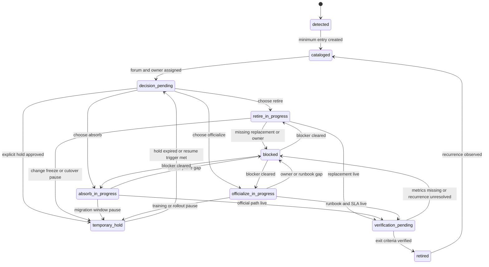

# Shadow Catalog Lifecycle States

> 한 줄 요약: shadow catalog entry는 `detected`에서 끝나지 않고 `cataloged -> decision_pending -> execution path -> verification_pending -> retired`로 움직여야 하며, `temporary_hold`와 `blocked`는 outcome이 아니라 별도 제어 상태로 관리해야 한다.

**난이도: 🔴 Advanced**

> 관련 문서:
> - [Shadow Process Detection Signals](./shadow-process-detection-signals.md)
> - [Shadow Process Catalog and Retirement](./shadow-process-catalog-and-retirement.md)
> - [Shadow Process Catalog Entry Schema](./shadow-process-catalog-entry-schema.md)
> - [Shadow Review Packet Template](./shadow-review-packet-template.md)
> - [Shadow Catalog Review Cadence Profiles](./shadow-catalog-review-cadence-profiles.md)
> - [Shadow Lifecycle Scorecard Metrics](./shadow-lifecycle-scorecard-metrics.md)
> - [Shadow Catalog Reopen and Successor Rules](./shadow-catalog-reopen-and-successor-rules.md)
> - [Temporary Hold Exit Criteria](./shadow-temporary-hold-exit-criteria.md)
> - [Shadow Process Officialization and Absorption Criteria](./shadow-process-officialization-absorption-criteria.md)
> - [Manual Path Ratio Instrumentation](./manual-path-ratio-instrumentation.md)
> - [Override Burn-Down Review Cadence and Scorecards](./override-burndown-review-cadence-scorecards.md)
> - [Shadow Retirement Proof Metrics](./shadow-retirement-proof-metrics.md)
> - [Incident Feedback to Policy and Ownership Closure](./incident-feedback-policy-ownership-closure.md)

> retrieval-anchor-keywords:
> - shadow catalog lifecycle states
> - shadow catalog state machine
> - shadow process lifecycle
> - detected cataloged decision pending
> - temporary hold shadow entry
> - blocked shadow process
> - verification pending retirement
> - shadow state transition
> - shadow review packet template
> - shadow review cadence profiles
> - lifecycle_state aging dashboard
> - shadow reopen rule
> - manual_path_ratio exit gate
> - temporary hold exit criteria
> - hold extension governance
> - shadow retirement proof metrics
> - hold expires_at resume trigger
> - blocker escalation forum
> - shadow successor entry

> 읽기 가이드:
> - 돌아가기: [Software Engineering README - Shadow Catalog Lifecycle States](./README.md#shadow-catalog-lifecycle-states)
> - 다음 단계: [Shadow Catalog Review Cadence Profiles](./shadow-catalog-review-cadence-profiles.md)

## 핵심 개념

shadow catalog entry는 `decision = retire | absorb | officialize | temporary_hold`만 적는다고 끝나지 않는다.
실제로는 "지금 어느 단계에 머물러 있는가"를 나타내는 lifecycle state가 별도로 있어야 한다.

이때 핵심 구분은 두 가지다.

- `retire`, `absorb`, `officialize`는 **목표 경로(decision track)** 다
- `temporary_hold`, `blocked`, `verification_pending`은 **운영 제어 상태(control state)** 다

이 둘을 섞어 쓰면 "무엇을 하려는지"와 "왜 지금 안 움직이는지"가 같이 흐려진다.

---

## 깊이 들어가기

### 1. 권장 상태 집합은 작되 역할이 분명해야 한다

shadow catalog entry에 권장하는 canonical state는 다음과 같다.

| lifecycle_state | 의미 | 이 상태에 들어갈 때 꼭 남길 것 |
|---|---|---|
| `detected` | signal은 관찰됐지만 catalog handoff가 아직 덜 끝났다 | `signal_evidence`, `observed_at`, `confidence` |
| `cataloged` | 최소 schema를 갖춘 entry가 생성됐다 | `catalog_id`, `current_path`, `current_owner`, `review_forum` |
| `decision_pending` | review forum은 잡혔지만 다음 구조 결정이 아직 안 났다 | `next_review_at`, `decision_notes` |
| `temporary_hold` | 의도적으로 잠깐 멈춘 상태다 | `hold_reason`, `expires_at`, `resume_state`, `resume_trigger` |
| `retire_in_progress` | shadow path 제거와 replacement 전환을 진행 중이다 | `replacement_path`, `target_due_at` |
| `absorb_in_progress` | control plane/runbook/tool로 흡수 중이다 | `target_system_or_process`, `integration_owner` |
| `officialize_in_progress` | 공식 절차/runbook/SLA로 승격 중이다 | `official_process_owner`, `training_or_runbook_ref` |
| `blocked` | 진행 상태였지만 prerequisite나 ownership 문제로 멈췄다 | `blocked_from_state`, `blockers`, `blocked_since`, `escalation_forum` |
| `verification_pending` | 공식 경로는 열렸고, shadow path 퇴장을 검증 중이다 | `verification_metric`, `parallel_run_until`, `recurrence_check_at` |
| `retired` | shadow path가 실제로 사라졌다고 검증됐다 | `retired_at`, `verification_evidence_ref` |

핵심은 상태 이름을 늘리는 것이 아니라, **멈춤과 진행을 구분하는 데 필요한 최소 상태만 남기는 것**이다.

### 2. `temporary_hold`와 `blocked`는 비슷해 보여도 완전히 다른 상태다

둘 다 "지금 안 움직인다"는 점은 같지만 성격이 다르다.

- `temporary_hold`: 의도된 지연이다. freeze window, cutover 보호 기간, incident stabilization 같은 이유로 잠깐 멈춘다.
- `blocked`: 의도하지 않은 정지다. owner 부재, control plane 기능 결손, dependency 미해결, 승인 지연 때문에 멈춘다.

그래서 required field도 달라야 한다.

- `temporary_hold`에는 `expires_at`과 `resume_state`가 필수다
- `blocked`에는 `blocked_since`와 `escalation_forum`이 필수다

즉 hold는 "언제 어떻게 다시 움직일지"를 남겨야 하고, blocked는 "누가 구조 문제를 풀지"를 남겨야 한다.
그리고 hold review에서 실제로 `expire / extend / absorb-escalate / officialize-escalate`를 어떻게 가르는지는 [Temporary Hold Exit Criteria](./shadow-temporary-hold-exit-criteria.md)처럼 별도 문서로 고정해 두는 편이 parking lot화를 줄인다.

### 3. 상태 전이는 decision track과 control state를 같이 본다

아래 전이는 shadow catalog entry에서 기본으로 허용할 만한 흐름이다.



이 전이에서 중요한 금지 규칙은 세 가지다.

1. `detected -> temporary_hold`는 금지한다.
   아직 cataloged되지 않은 후보를 hold로 보내면 evidence가 사라진다.
2. `*_in_progress -> retired`를 직접 허용하지 않는다.
   `verification_pending` 없이 닫으면 shadow path 병행 사용이 숨는다.
3. `blocked -> retired`를 허용하지 않는다.
   blocker를 해결하지 않은 채 닫으면 "문서상 종료"만 남는다.

### 4. `decision_pending`은 backlog 대기열이고, 실제 작업 상태가 아니다

많은 catalog가 `target_state = absorb`를 적는 순간 끝난다.
하지만 그건 판단만 끝난 것이지 작업이 시작된 것은 아니다.

그래서 `decision_pending` 다음에는 반드시 explicit execution state로 들어가야 한다.

- 문서와 교육 체계로 올리는 일이라면 `officialize_in_progress`
- registry/control plane/tooling으로 넣는 일이라면 `absorb_in_progress`
- 공식 경로로 전환시키고 우회 경로를 없애는 일이라면 `retire_in_progress`

이 분리가 있어야 review forum이 "결정은 났지만 왜 두 달째 움직이지 않는가"를 추적할 수 있다.

### 5. `verification_pending`은 선택이 아니라 필수 게이트다

shadow entry는 replacement가 나왔다고 바로 retired가 되지 않는다.
최소한 다음이 검증돼야 한다.

- 공식 replacement path가 실제로 사용 가능하다
- off-plane/manual path 사용량이 내려간다
- recurrence가 일정 기간 다시 나타나지 않는다

이때 검증 기준은 [Manual Path Ratio Instrumentation](./manual-path-ratio-instrumentation.md) 같은 공통 계측 문서에 고정해 두는 편이 좋다.

예:

- `manual_path_ratio == 0 for 30d`
- `off_plane_artifact_updates == 0 for 2 review cycles`
- `same signal_family recurrence == none for 1 calendar month`

어떤 metric을 어떤 threshold와 verification window로 retired 판정에 쓸지는 [Shadow Retirement Proof Metrics](./shadow-retirement-proof-metrics.md)처럼 별도 proof 문서에 고정해 두는 편이 좋다.

즉 `verification_pending`은 종료 선언이 아니라 **퇴장 확인 구간**이다.

### 6. reopen 규칙이 없으면 retired entry가 다시 ghost가 된다

retired 뒤 recurrence가 보이면 두 가지 중 하나를 강제해야 한다.

- 같은 entry를 `cataloged`로 되돌려 reopen한다
- successor entry를 새로 만들고 predecessor를 링크한다

중요한 것은 "retired였지만 다시 보였다"는 사실을 state transition으로 남기는 것이다.
그렇지 않으면 조직은 항상 같은 shadow process를 처음 발견한 것처럼 반복한다.
same-entry reopen과 successor entry를 언제 가를지, 그리고 lineage/history를 어떤 방식으로 남길지는 [Shadow Catalog Reopen and Successor Rules](./shadow-catalog-reopen-and-successor-rules.md)처럼 별도 기준으로 고정해 두는 편이 좋다.

### 7. state는 schema, cadence, scorecard와 같이 움직여야 한다

state machine은 문서 한 장으로 끝나지 않는다.
실제 운영에서는 세 가지가 같이 붙어야 한다.

- schema: `lifecycle_state`, `blocked_from_state`, `resume_state` 같은 필드가 entry에 있어야 한다
- cadence: `temporary_hold`와 `blocked`는 `decision_pending`보다 더 촘촘한 review가 필요하고, `detected`와 `verification_pending`도 별도 review clock이 있어야 한다
- scorecard: `verification_pending`과 `retired`는 usage metric과 recurrence signal이 같이 보이는 panel이 있어야 한다

이 상태 묶음을 실제 forum agenda와 minimum packet으로 투영하는 방법은 [Shadow Review Packet Template](./shadow-review-packet-template.md)처럼 별도 template로 고정해 두는 편이 좋다.
또 상태별 기본 review frequency, owner expectation, escalation SLA는 [Shadow Catalog Review Cadence Profiles](./shadow-catalog-review-cadence-profiles.md)처럼 baseline profile로 고정해 두는 편이 운영 일관성을 높인다.
그리고 `lifecycle_state_age`, `blocked_duration`, `hold_time_to_expiry`, `retirement_verification_health`를 어떤 패널로 묶어 보여 줄지는 [Shadow Lifecycle Scorecard Metrics](./shadow-lifecycle-scorecard-metrics.md)처럼 별도 scorecard 문서로 고정해 두는 편이 state machine과 dashboard 해석을 섞지 않게 만든다.

즉 state machine의 목적은 분류를 예쁘게 하는 것이 아니라, **entry가 어디서 멈췄는지 회수 가능한 backlog로 만드는 것**이다.

---

## 상태별 운영 질문

| 상태 | review forum이 바로 물어야 할 질문 |
|---|---|
| `detected` | 이건 anecdote인가, 반복 signal인가 |
| `cataloged` | owner와 review venue가 붙었는가 |
| `decision_pending` | retire / absorb / officialize 중 어떤 경로가 맞는가 |
| `temporary_hold` | 왜 멈췄고, 정확히 언제 어느 상태로 복귀하는가 |
| `blocked` | blocker owner는 누구고, 어느 forum으로 escalation되는가 |
| `*_in_progress` | replacement 또는 공식 경로를 언제 열 수 있는가 |
| `verification_pending` | manual path ratio와 recurrence window가 exit condition을 만족했는가 |
| `retired` | recurrence가 생기면 어떤 reopen 규칙을 적용할 것인가 |

---

## 코드로 보기

```yaml
shadow_catalog_entry:
  catalog_id: shadow-release-approval-001
  title: manual_release_override_via_slack_dm
  decision: absorb
  lifecycle_state: temporary_hold
  current_path: slack_dm
  review_forum: rollout-governance-weekly
  next_review_at: 2026-05-02
  hold_reason: release freeze before quarter-end
  expires_at: 2026-05-03
  resume_state: absorb_in_progress
  resume_trigger: quarter_end_freeze_lifted
  replacement_path: override_registry
  verification_metric: manual_path_ratio
```

중요한 것은 `decision: absorb`만 있는 것이 아니라, 지금 `temporary_hold`인지 `blocked`인지까지 같이 보이게 만드는 것이다.

---

## 트레이드오프

| 선택 | 장점 | 단점 | 언제 선택하는가 |
|---|---|---|---|
| decision만 기록 | 단순하다 | 멈춘 entry가 보이지 않는다 | 피하는 편이 좋다 |
| lifecycle state 추가 | 현재 위치가 선명해진다 | 상태 정의 discipline이 필요하다 | shadow catalog가 backlog화될 때 |
| lifecycle state + verification gate | 종료 품질이 높아진다 | 계측과 review 운영이 필요하다 | shadow retirement를 실제로 닫고 싶을 때 |

state machine의 목적은 status를 늘리는 것이 아니라, **shadow entry가 어디서 멈췄고 언제 진짜 종료되는지 운영적으로 보이게 만드는 것**이다.

---

## 꼬리질문

- `temporary_hold`에는 정말 `expires_at`과 `resume_state`가 붙어 있는가?
- `blocked` 상태가 단순 장기 정체가 아니라 escalation signal로 보이는가?
- `verification_pending` 없이 retired로 가는 지름길이 없는가?
- recurrence가 생겼을 때 reopen 규칙이 명시돼 있는가?

## 한 줄 정리

Shadow catalog lifecycle states는 shadow entry를 `detected`에서 `retired`까지 흐르게 만들고, `temporary_hold`와 `blocked`를 별도 제어 상태로 다뤄 backlog 정체와 가짜 종료를 줄이는 운영 모델이다.
